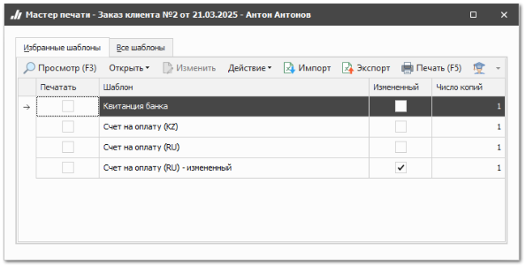
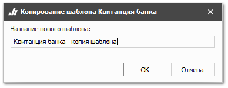

В базе данных доступны стандартные бланки, готовые для использования при отправке уведомлений по **Электронной почте** и **SMS**.

Вы можете изменить шаблоны сообщений через **Мастер печати** в контексте соответствующих документов с возможностью просмотра сообщения.

::: info Примечание

Редактирование доступно только для шаблонов с признаком **Измененный**. Признак назначается тем шаблонам, которые были скопированы (команда **Действие** ► **Копировать**) или импортированы (команда **Импорт**).

:::

Для добавления своего шаблона о создании нового **Заказа клиента** сделайте следующее:

**»** Перейдите в раздел **CRM** ► **Заказ клиента**.

**»** Выберите нужный заказ клиента и нажмите команду **Печать**. Откроется окно мастера печати.

**»** Выберите стандартный шаблон из списка и нажмите **Действие** ► **Копировать**.

**»** Задайте новое название для скопированного шаблона. Название должно отличаться от названия стандартного шаблона.

**»** Нажмите **Ок**.

**»** Выберите созданный шаблон и нажмите команду  **Изменить**. 

**»** Внесите необходимые правки в шаблон и сохраните их.

**»** Перейдите в раздел **Управление ► Настройки программы**, вкладка **Настройки**. Перейдите в группу настроек **CRM ► Уведомления Электронная почта. Шаблоны** / **Сервис отправки SMS. Шаблоны**.

**»** Выберите нужное событие для отправки.

**»** Выберите настроенные шаблоны в полях **Шаблон для отправки клиенту** и **Шаблон для отправки менеджеру**.

**»** Закройте вкладку для сохранения настроек.

Команда  **Просмотр** мастера печати позволяет посмотреть шаблон.

Команда  **Печать** мастера печати позволяет распечатать шаблон.

::: info Примечание

Максимальное количество символов в одном SMS-сообщении при использовании кириллицы – 70, латиницы – 160. Если количество символов сообщения, формируемого по шаблону, превышает допустимое для одного SMS-сообщения, то сообщение разбивается на сегменты.

Максимальное количество символов в сегментированном сообщении:

<table>
  <thead>
    <tr>
      <th rowspan="2">Количество сегментов</th>
      <th colspan="2">Количество символов</th>
    </tr>
    <tr>
      <th>Кириллица</th>
      <th>Латиница</th>
    </tr>
  </thead>
  <tbody>
    <tr>
      <td>1</td>
      <td>70</td>
      <td>160</td>
    </tr>
    <tr>
      <td>3</td>
      <td>134</td>
      <td>306</td>
    </tr>
    <tr>
      <td>3</td>
      <td>201</td>
      <td>459</td>
    </tr>
    <tr>
      <td>4</td>
      <td>168</td>
      <td>612</td>
    </tr>
  </tbody> 
</table>

:::

::: details Читайте также

- [Настройки программы - Настройки - CRM - Уведомления. Электронная почта](../../specification/upravlenie/nastrojki_programmy/nastrojki/crm/uvedomleniya_elektronnaya_pochta.md)

- [Настройки программы - Настройки - CRM - Уведомления. Сервис отправки SMS](../../specification/upravlenie/nastrojki_programmy/nastrojki/crm/uvedomleniya_servis_otpravki_sms.md)

:::