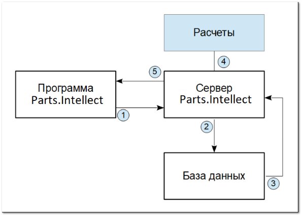

Сервер программы Parts.Intellect позволяет перенести выполнение части функционала из программы пользователя. Сервер взаимодействует с программой следующим образом:

1. Программа Parts.Intellect отправляет запрос на расчет на сервер

2. Сервер отправляет запрос в базу данных

3. Сервер получает данные

4. Производятся необходимые расчеты на стороне сервера.

5. Сервер передает результаты расчетов пользователю в программу.

::: info Примечание

Все это время пользователь может непрерывно работать в программе Parts.Intellect.

:::

::: note Замечание

Сервер Parts.Intellect устанавливается на отдельную вычислительную машину. Например: стационарный компьютер или виртуальный сервер, которые выделены специально под работу сервера. Пользователи смогут подключиться к серверу со других компьютеров и проводить часть расчетов программы Parts.Intellect на стороне сервера. При этом сами пользователи смогут продолжать работать в программе, не ожидая пока произойдет определенный расчет.

:::

::: info Примечание

Запросы на сервере выполняются в порядке очереди. Каждый запрос выполняется с учетом разрешений, пользователя, отправившего запрос.

:::