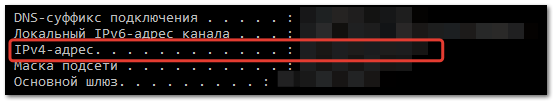
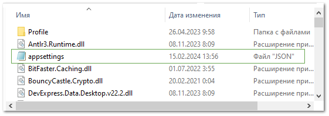
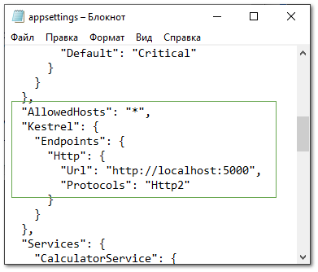
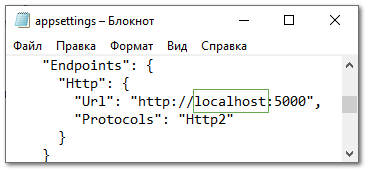
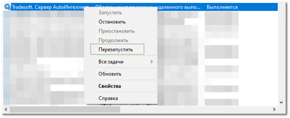

::: info Примечание

Данный способ настройки подойдет если вы установили сервер БЕЗ программы Parts.Intellect. Настройка сервера производится на том же устройстве, на котором он установлен. 

:::

**»** Узнайте IP-адрес устройства, на котором установлен сервер Parts.Intellect.

::: note Замечание

Например, вы можете узнать IP-адрес с помощью команды «ipconfig», прописав ее в командной строке Windows (cmd). Скопируйте адрес «IPv4-адрес».   

:::

**»** На компьютере перейдите в папку «C:\Program Files\Tradesoft\Parts.Intellect\Parts.Intellect.Server»

**»** Откройте файл «appsettings.json» с помощью приложения «Блокнот»:

- нажмите на файл правой кнопкой

- в контекстном меню нажмите **Открыть с помощью...**

- выберите приложение «Блокнот»

**»** Найдите блок «AllowedHosts».

**»** В строчке «Url» замените текст «localhost» на IP-адрес компьютера, на котором установлен сервер.

**»** Сохраните и закройте файл.

::: danger Опасно!

Не изменяйте никакие другие настройки в файле «appsettings.json».

:::

**»** Перейдите в программу Windows «Службы». Программу можно найти через поиск в левом нижнем углу.

**»** Найдите службу **Tradesoft. Сервер Parts.Intellect**

**»** Нажмите правой кнопкой мыши по службе и команду **Перезапустить**. Если команда отключена, то сначала включите ее с помощью команды **Запустить**.

