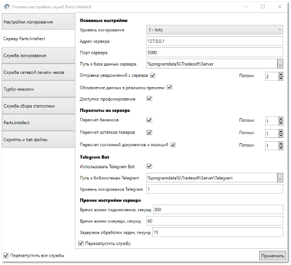

**»** Перейдите в раздел **Управление** ► **Утилита настройки служб** **Parts.Intellect**, вкладка **Сервер Parts.Intellect** для настройки переноса отдельного функционала.

По умолчанию на сервер выполнен перенос следующего функционала, который можно отключить или подключить, а так же изменить параметры через **Утилиту настройки служб** **Parts.Intellect** на вкладке **Сервер** **Parts.Intellect**:

- **Отправка уведомлений с сервера** – регулирует отправку Email и SMS уведомлений через сервер, по умолчанию отключен;

- **Обновление данных в реальном времени** – регулирует автоматическое обновление информации в открытых окнах в реальном времени, по умолчанию включен;

- **Пересчет балансов** – регулирует автоматический пересчет балансов в программе в фоновом режиме, по умолчанию включен;

- **Пересчет остатков товаров** – регулирует автоматический пересчет остатков товаров в программе в фоновом режиме, по умолчанию включен;

- **Пересчет состояний документов и позиций** – регулирует автоматический пересчет состояний документов и позиций в программе в фоновом режиме, по умолчанию включен;

- **Использовать** **Telegram Bot** – регулирует обмен сообщений в чат-боте Telegram, по умолчанию включен.

**»** При необходимости включите или выключите определенные функции нажатием по полю для установки галочки – .

::: danger Опасно!

Не изменяйте другие системные настройки вкладки **Сервер Parts.Intellect**!

:::

::: info Примечание

Для работы сервиса отправки уведомлений через Telegram-Bot необходимо подключение дополнительной услуги. Подробнее о подключении услуги можно узнать в отделе продаж Компании Tradesoft. Подробнее о работе модуля читайте в [руководстве пользователя](https://product-doc.tradesoft.ru/ai/telegram/index.htm). 

:::

::: details Читайте также

- [Утилита настройки службы Parts.Intellect](../../specification/upravlenie/utilita_nastrojki_sluzhby_partsintellect.md)

:::