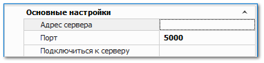
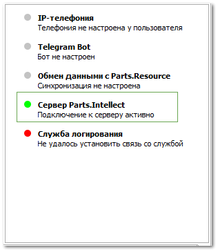

**»** Перейдите в раздел **Управление** ► **Настройки программы**, вкладка **Настройки**, группа настроек **Сервер Parts.Intellect**.

**»** В поле **Адрес сервера** задайте IP-адрес компьютера, на котором установлена программа и сервер Parts.Intellect.

**»** В поле **Подключиться к серверу** нажмите **Подключиться**.

После того, как сервер будет подключен состояние его работоспособности можно увидеть на панели в перечне индикаторов состояний. При корректной работе индикатор отображается зеленым цветом.

::: info Примечание

Если сервер Parts.Intellect не подключен (или был отключен в процессе работы), все запросы выполняются напрямую к базе данных, а расчеты производятся в программе пользователя. Если работа сервера была завершена до окончания выполнения каких-либо задач, то их расчет возобновится после включения сервера (по умолчанию через 15с. после начала работы). 

:::

::: note Замечание

При возникновении сбоев в работе сервера:

- если связь с сервером пропала, то сервер продолжит выполнение всех ранее переданных задач (результаты будут переданы после восстановления работы), а все новые задачи будут выполняться локально в Parts.Intellect до переподключения к серверу. При этом на почту администратору (которая указана в справочнике **Сотрудники**) будет отправлено уведомление; 

- в случае, если сервер отключился или не запускается все новые запросы отправляются напрямую в базу данных, а расчеты производятся в программе пользователя. После включения сервера все незавершенные на сервере задачи будут перезапущены. Информацию об ошибках в работе можно найти в логах (если сервер отключился) и в "Просмотре событий" Windows; 

- если функционал на сервере был выполнен с ошибкой, то в Parts.Intellect будет возвращена ошибка, а функционал в самом Parts.Intellect не будет запущен повторно. При этом Parts.Intellect отправит информация об ошибке специалистам техподдержки в сервис SDESK. Ошибки во время выполнения задачи не приводят к сбоям в работе сервера.

:::

::: details Читайте также

- [Общие аппаратные требования к рабочим местам](../../guide/tipovye_konfiguratsii_programmy/obschie_apparatnye_trebovanija_k_rabochim_mestam.md)

- [Установка программы и компонентов](../../guide/installing/ustanovka_programmy_i_komponentov.md)

- [Утилита настройки службы Parts.Intellect](../../specification/upravlenie/utilita_nastrojki_sluzhby_partsintellect.md)

- [Настройки программы - Настройки - Сервер Parts.Intellect](../../specification/upravlenie/nastrojki_programmy/nastrojki/server_parts_intellect.md)

- [Нижнее меню - Панель индикаторов состояний](../../specification/obshchie_printsipy/window/nizhnee_menju.md)

- [Справочник Сотрудники](../../specification/upravlenie/spravochniki/sotrudniki.md) 

:::