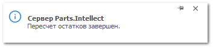

После того, как установлен и настроен, на него можно перенести выполнение функционала:

- Пересчет балансов контрагентов (полный пересчет по команде **Пересчитать балансы**, а также пересчет после проводки документов) и последующее обновление данных во всех запущенных экземплярах программы;

- Пересчет товарных остатков (из справочника и после проводки документов);

- Пересчет состояний документов и позиций и последующее обновление данных во всех запущенных экземплярах программы (после проведения документов и ручном изменении);

- Автоматическое обновление информации (в онлайн режиме) в открытых справочниках, журналах и инспекторах документов, данных на панели Фирма/Склад/Торговая точка, планировщике постов (раздел **Автосервис ► Планировщик постов**), а также отправка всплывающих информационных уведомлений по определенным событиям в программе для ответственных менеджеров клиентов (создание документов **Заказы клиента** и **VIN-запросы**) и исполнителей по документам (**Разбор товара** и **Отгрузка товара**) и задачам (раздел **CRM ► Задачи**).

- Отправка уведомлений по Email и SMS и последующее обновление данных во всех запущенных экземплярах программы;

- Отправка уведомлений через Telegram Bot.

::: warning Внимание!

Для работы автоматической отправки уведомлений по Email, SMS и Telegram по настроенным событиям, шаблоны сообщений должны быть выбраны в разделе **Управление ► Настройки программы ► Настройки**, группа настроек **CRM ► Уведомления**.

:::

::: note Замечание

Функционал отправки уведомлений по умолчанию отключен. Для работы сервиса отправки уведомлений через Telegram Bot необходимо подключение дополнительной услуги. Подробнее о подключении услуги можно узнать в отделе продаж Компании Tradesoft.

:::

Все действия на сервере логируются. Также у службы есть своя база данных с информацией обо всем, что было отправлено на сервер (с параметрами и временем выполнения задач).

После выполнения расчета на сервере, пользователю выводится уведомление с информацией о внесенных изменениях.

