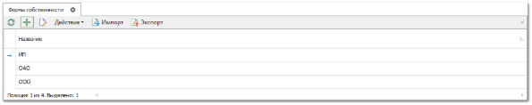
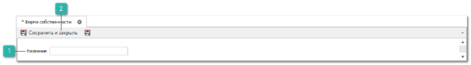
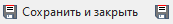

Чтобы добавить новую форму собственности контрагента в справочник выполните следующие действия:

**»** Выберите в главном меню раздел **Управление** ► **Справочники** ► **Формы собственности**. В **Рабочей области** появятся элементы выбранного пункта.

**»** Нажмите кнопку **Новый**. Откроется форма инспектора для добавления формы собственности.

 **Название**

Позволяет указать форму собственности.

 **Сохранить и закрыть/Сохранить** 

Позволяет сохранить и закрыть/сохранить запись в справочник **Формы собственности**.

**»** В поле **Название** введите название вида деятельности контрагента, отражающее ее суть.

**»** Нажмите кнопку **Сохранить и закрыть**. Окно инспектора закроется, и новая запись отобразится в таблице справочника.