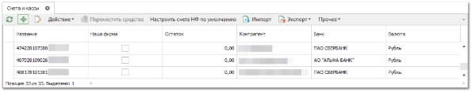
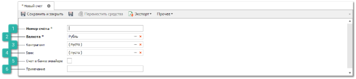

C помощью справочника **Счета и Кассы** есть возможность задавать счета контрагентов и касс наших фирм. Счета/кассы выбираются в платежных документах в качестве счета-получателя или счета-плательщика.

Для добавления нового счета/кассы выполните следующие действия:

**»** Выберите раздел **Финансы** ► **Счета и кассы**. В **Рабочей области** появятся элементы выбранного пункта.

**»** Нажмите кнопку **Новый**. Откроется форма инспектора для добавления нового счета/кассы.

 **Номер счета**

Позволяет задать номер добавляемого счета/кассы.

 **Валюта**

Позволяет выбрать валюту из справочника **Валюты и курсы**.

 **Контрагент**

Позволяет выбрать клиента/Наша фирма, для которой будет использоваться счет/касса.

 **Банк**

Позволяет выбрать банк, для которого будет использоваться счет/касса.

 **Счет в банке эквайере**

Позволяет поставить отметку о использовании промежуточного (буферного) счета между Вашим счетом в банке и счетом карты клиента.

Счет в банке-эквайере является обязательным полем для заполнения при настройке эквайрингового терминала и в дальнейшем используется при создании документов **Оплата по банковской карте** и **Возврат по банковской карте** (в случае ОБК – заполняется поле **Счет получателя**, ВБК – **Счет плательщика**), оплаченных с помощью данного терминала.

::: info Примечание

Счет в банке эквайере оформляется в случае работы с эквайрингом и не равен счету **Нашей** **Фирмы**. Для того, чтобы эти средства оказались на счету Нашей фирмы, необходимо выполнять **Перемещение денежных средств**.

:::

 **Примечание**

Позволяет указать дополнительную справочную информацию о счете/кассе.

**»** Заполните поля необходимые для добавления нового счета/кассы. 

**»** Для сохранения изменений нажмите кнопку **Сохранить и закрыть**.