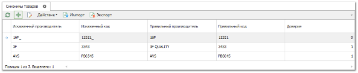
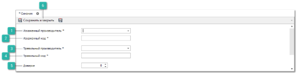
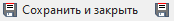

Справочник **Синонимы** используется для добавления связи искаженных артикулов и их реальных написаний. Каждая запись справочника содержит "Искаженные код/производитель – Правильные код/производитель".

Для создания нового синонима выполните следующие действия:

**»** В **Главном меню** выберите раздел **Товары и цены ► Синонимы товаров**. Отобразятся элементы выбранного пункта.

**»** Нажмите кнопку **Новый** на панели инструментов. Возникнут элементы для добавления нового синонима.

 **Искаженный производитель** 

Позволяет указать некорректное написание производителя товара.

 **Искаженный код** 

Позволяет указать некорректное написание кода товара.

 **Правильный производитель** 

Позволяет указать правильное написание производителя товара.

 **Правильный код** 

Позволяет указать правильное написание кода товара.

 **Доверие** 

Если доверие установлено в "1": при поиске в синонимах, находится не только прямой синоним искомой детали, но и синоним ее синонима. 

 **Сохранить и закрыть/Сохранить** 

Позволяет сохранить и закрыть/сохранить запись в справочник **Синонимы товаров**.

**»** Заполните поля в форме добавления нового синонима.

**»** Для сохранения изменений нажмите кнопку **Сохранить и закрыть**. После чего отобразится новая запись в таблице справочника.