Сотрудников в программе можно назначать ответственными за клиентами и заказами от них. Менеджер ответственный за клиента или менеджер-автор заказа будет получать системные уведомления о ходе выполнения заказа. Сотрудники в программе привязываются к пользователям базы данных, что позволяет контролировать администратору работу сотрудников в программе, а также формировать некоторые отчеты по их работе.

Для создания нового сотрудника выполните следующие действия:

**»** В **Главном меню** выберите раздел **Управление** ► **Справочники ► Сотрудники** отобразятся элементы выбранного пункта.

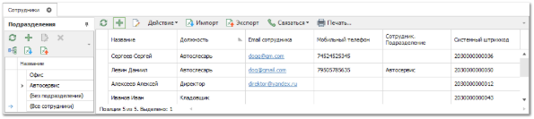

**»** Нажмите кнопку **Новый** на панели инструментов. Возникнут элементы для добавления нового сотрудника.

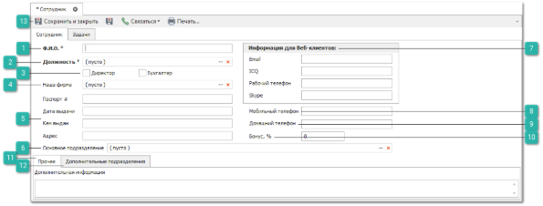

 **ФИО**

Позволяет указать данные сотрудника.

 **Должность**

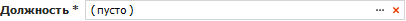

Позволяет выбрать должность работника из справочника **Должности**.

 **Директор Бухгалтер**

Если сотрудник является **Директором** или **Бухгалтером**, то необходимо установить соответствующий флаг, чтобы при выводе некоторых печатных форм программа могла идентифицировать точно значение.

 **Наша фирма** 

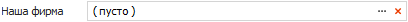

Позволяет выбрать контрагента типа **Наша фирма**, к которой относится работник.

 **Паспортные данные**

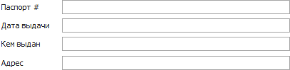

Поля ввода: **Паспорт**, **Дата выдачи**, **Кем выдан**, **Адрес** – позволяют указать паспортные данные сотрудника.

 **Основное подразделение**

Позволяет выбрать подразделение, к которому относится сотрудник из справочника **Подразделения**.

 **Информация для Веб-клиентов**

На текущий момент блок не используется. Но поля **Email** и **Рабочий телефон** используются для отправки уведомлений сотруднику и связи с сотрудником по телефонии.

 **Мобильный телефон**

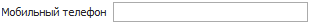

Позволяет указать личный контактный телефон сотрудника.

::: info Примечание

Ввод мобильного телефона осуществляется согласно заданной маске ввода по умолчанию.

:::

 **Домашний телефон**

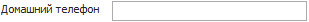

Позволяет указать домашний контактный телефон сотрудника.

 **Бонус**

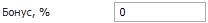

Позволяет указать бонус сотрудника в % – может быть использовано в формах отчетов.

 **Прочее**

Содержит поле **Дополнительная информация**.

 **Дополнительные подразделения**

Позволяет указать дополнительные подразделения, к которым относится работник.

 **Сохранить и закрыть/Сохранить** 

Позволяет сохранить и закрыть/сохранить карточку сотрудника и добавить ее в справочник **Сотрудники**.

**»** Заполните необходимые поля вкладки **Сотрудник**. 

**»** При необходимости укажите дополнительные подразделения на одноименной вкладке.

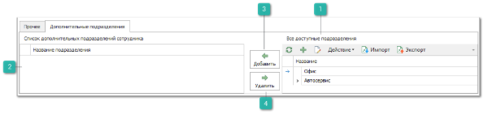

 **Все доступные подразделения**

Содержит список доступных подразделений, в которые можно добавить сотрудника.

::: info Примечание

Подразделение сотрудника можно использовать при назначении прав на те или иные действия в меню **Управление ► Настройки программы ► Роли пользователей**. Доступ может быть разрешен для выполнения действий не только со своими документами, но и с документами, где авторами являются сотрудники его основного и дополнительных подразделений.

:::

 **Список дополнительных подразделений сотрудника**

Содержит список подразделений в которые добавлен сотрудник.

 **Добавить**

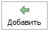

Позволяет добавить сотруднику доступ к дополнительному подразделению.

 **Удалить**

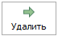

Позволяет удалить доступ сотрудника к дополнительному подразделению.

**»** Для сохранения изменений нажмите кнопку **Сохранить и закрыть**. Окно инспектора закроется, и новая запись отобразится в таблице справочника.