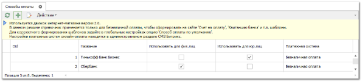
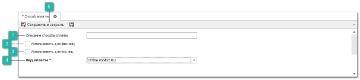
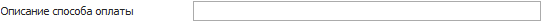
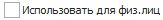
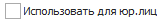
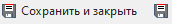

Чтобы добавить и настроить новый способ оплаты, выполните следующие действия:

**»** Выберите раздел **Управление** ► **Интернет-магазин Parts.Resource ►** **Способы оплаты**. В **Рабочей области** появятся элементы выбранного пункта. 

**»** Нажмите кнопку **Новый**. Откроется форма инспектора для добавления нового способа оплаты.

 **Описание способа оплаты** 

Позволяет указать наименование способа платежа.

 **Использовать для физ.лиц** 

Позволяет задать разрешение на использование данного типа платежа физическими лицами.

 **Использовать для юр.лиц** 

Позволяет задать разрешение на использование данного типа платежа юридическими лицами.

 **Вид оплаты** 

Позволяет выбрать соответствующий вид оплаты.

 **Сохранить и закрыть/Сохранить** 

Позволяет сохранить и закрыть/сохранить запись в справочник **Способы оплат**.

::: info Примечание

Установить счетчики для нумерации документа **Счет на оплату** можно в разделе Главного меню **Управление ► Справочники ► Счетчик номеров документов**.

:::

**»** Для сохранения изменений нажмите кнопку **Сохранить и закрыть**.