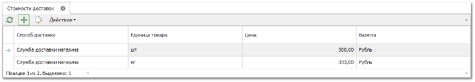
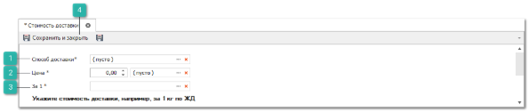
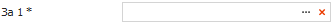

Справочник **Стоимости доставок** содержит различные условия поставки вашей организации и/или поставщиков.

Для добавления новой записи выполните следующие действия:

**»** В **Главном меню** выберите раздел **Управление ► Справочники ► Стоимости доставок**. Отобразятся элементы выбранного пункта.

**»** Нажмите кнопку **Новый** на панели инструментов. Возникнут элементы для добавления нового синонима.

 **Способ доставки**

Позволяет выбрать способ доставки из справочника **Способы доставки**.

 **Цена**

Позволяет стоимость доставки в выбранной валюте за единицу товара.

 **За 1 единицу**

Позволяет указать единицу измерения, за которую указаны **Цена**.

 **Сохранить и закрыть/Сохранить** 

Позволяет сохранить и закрыть/сохранить запись в справочник **Стоимость доставки**.

**»** Заполните поля в форме добавления новой стоимости доставки.

**»** После чего отобразится новая запись в таблице справочника.

::: info Примечание

Данная стоимость доставки может быть выбрана для позиции документа в колонке **Цена доставки**.

:::