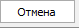

Мастер слияния автомобилей используется в случае, если в процессе работы со справочником **Автомобилей клиентов** были созданы дубли карточек.

Мастер позволяет избавиться от дублей, заменив их на исходную карточку автомобиля во всех документах и связанных с дублями операциях (при этом дубли карточек для автомобиля будут удалены). Вызвать мастер можно на панели инструментов справочника **Автомобили**, либо в контекстном меню таблицы карточек автомобилей.

::: warning Внимание!

Если для пользователя в разрешениях для работы со справочником **Автомобили** в меню **Управление ►** **Настройки программы ► Роли пользователей ► Справочники ► Автомобили** и/или **Журналы ► Автомобили** **контрагентов** установлен запрет на удаление (отключено разрешение **Можно удалять**), то при использовании **Мастера слияния автомобилей** данный запрет игнорируется.

:::

Для слияния двух и более карточек автомобилей выполните следующие действия:

**»** Перейдите в раздел **CRM ►** **Автомобили**.

**»** Для запуска мастера, выберите требуемые для слияния карточки автомобилей и на **Панели инструментов** нажмите на кнопку **Действие ► Открыть мастер слияния автомобилей** . 

**»** Ознакомьтесь с особенностями мастера и перейдите на второй шаг мастера, установив галку **С информацией ознакомлен** и нажав кнопку **Далее**.

::: info Примечание

Доступность команды **Действие ► Открыть мастер слияния автомобилей** определяется разрешением для пользователя **Можно вызывать** "**Мастер слияния автомобилей**" (меню **Управление ►** **Настройки программы ► Роли пользователей ► Справочники ► Автомобили**).

:::

 **С информацией ознакомлен**

Позволяет подтвердить ознакомление с информацией о работе с мастером.

 **Далее**

Позволяет перейти к следующему шагу.

::: info Примечание

Кнопка становится доступной после установки отметки об ознакомлении с информацией о работе с мастером.

:::

**»** На втором шаге необходимо выбрать в списке оригинальную карточку автомобиля, в которую будут слиты остальные карточки. Для этого установите курсор в нужной строке и нажмите кнопку **Выбрать** (по умолчанию оригинальной считается первая в списке карточка). Добавить дополнительно карточки автомобилей можно с помощью кнопки **Добавить**. Удалить лишние карточки автомобилей можно с помощью кнопки **Исключить**.

::: warning Внимание!

В ходе слияния поля с типом "Информация отсутствует" будут заменяться заполненными значениями из сливаемых карточек.

:::

 **Добавить**

Позволяет добавить к слиянию автомобили из справочника **Автомобили**.

 **Исключить**

Позволяет удалить выделенную карточку из списка на слияние.

 **Выбрать**

Позволяет указать оригинальную карточку автомобиля, в которую будут объединены остальные карточки автомобилей в списке.

::: note Замечание

Оригинальная карточка товара будет выделена бледно-зеленым цветом.

:::

 **Начать**

Позволяет приступить к следующему шагу процедуры слияния карточек автомобилей.

**»** Чтобы приступить к процедуре слияния карточек автомобилей, необходимо нажать кнопку **Начать!**

**»** При несовпадении у выбранных карточек автомобилей Марок, Моделей, VIN-кодов, Гос. номеров и/или Клиентов выводится предупреждение. Для продолжения работы нажмите кнопку **Продолжить процесс слияния**. Для прекращения процесса нажмите кнопку **Отмена**.

 **Продолжить процесс слияния**

Позволяет продолжить процесс слияния.

::: info Примечание

Рекомендуется проверить корректность данных указанных в карточках автомобилей на слияние и карточки автомобилей являются дублями.

:::

 **Отмена**

Позволяет остановить процесс слияния карточек автомобилей.

**»** На следующем шаге отображается ход выполнения процедуры слияния карточек автомобилей. По завершению процедуры слияния оригинальная карточка подменит в базе данных все карточки-дубли (в документах, контрагентах и т.д.). Информация о подмене автомобиля в документах отобразится на вкладке **Журнал действий** соответствующего документа.

**»** Для завершения работы мастера нажмите кнопку **Закрыть**.