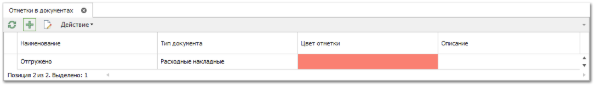
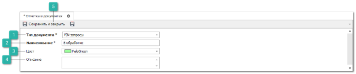
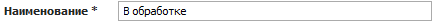
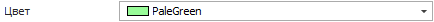
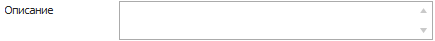
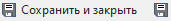
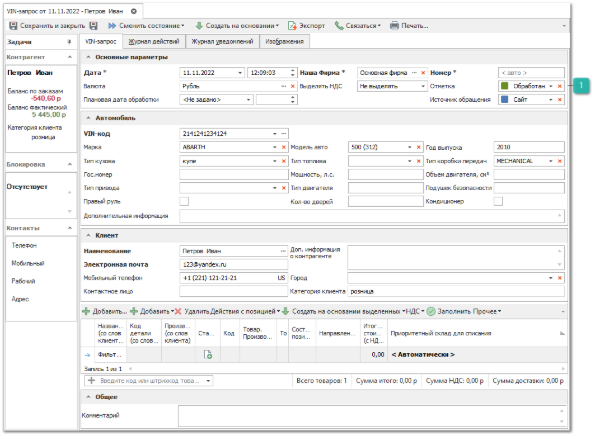
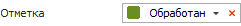
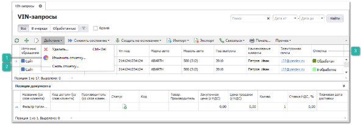
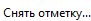

С помощью справочника **Отметки в документах** для любого типа товарных документов есть возможность задать свой уникальный набор статусов.

Рассмотрим создание и использование отметок на примере документа VIN-запрос. Данный документ не имеет типовых статусов и для мониторинга за состоянием документа целесообразно воспользоваться отметками.

**»** Для этого необходимо самостоятельно определить необходимые статусы, которые будут использоваться в системе и добавить их в справочник **Отметки в документах**.

**»** Выберите раздел **Управление** ► **Справочник** ► **Отметки в документах**. Отобразятся элементы выбранного пункта. 

**»** Нажмите кнопку **Новый**. В Рабочей области отобразятся инспектор с элементами для добавления новой записи.

 **Тип документа**

Позволяет из выпадающего списка выбрать тип документа для которого необходимо создать отметку.

 **Наименование**

Позволяет задать наименование отметки.

 **Цвет**

Позволяет указать цвет отметки.

 **Описание**

Позволяет указать краткое описание отметки.

 **Сохранить и закрыть/Сохранить** 

Позволяет сохранить и закрыть/сохранить запись в справочник **Отметки в документах**.

**»** Заполните параметры, необходимые для создания новой отметки.

**»** Для сохранения изменений нажмите кнопку **Сохранить и закрыть/Сохранить**. 

После добавления отметок в справочник, в каждом документе появится возможность в поле **Отметка** в **Основных параметрах** выбрать одну из них, соответствующую заданному типу документа (в данном случае в VIN-запросах).

 **Отметка**

Позволяет остановить необходимую отметку документу.

Так же сменить отметку документа возможно в разделе с списком документов используя команду **Изменить отметку**, снять текущую отметку с документа **Снять отметку**.

 **Изменить отметку**

Позволяет изменить отметку у выбранных документов.

 **Снять отметку**

Позволяет снять отметку у выбранных документов.

 **Отметка**

Отображает установленные в документе отметки из справочника **Отметки**, что позволяет отслеживать статус документа в списке документов.