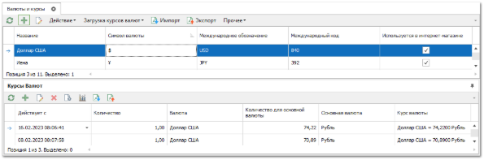
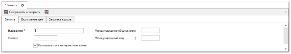
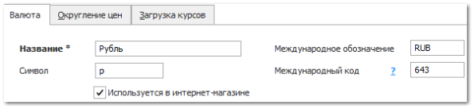

Чтобы добавить новую валюту выполните следующие действия:

**»** Выберите раздел **Финансы** ► **Валюты и курсы**. В отобразятся элементы выбранного пункта.

**»** Нажмите кнопку **Новый**. Откроется форма инспектора для добавления новой валюты.

**»** Заполните параметры валюты:

- **Название** – укажите наименование валюты. Наименование валюты будет отображаться в журналах документов, самих документах, в параметрах отчетных форм и при их формирований с выбранной валютой; 

- **Символ**, **Международное обозначение** – параметры заполняются по необходимости. **Символ** так же может использоваться в отчетных формах, при их формировании с валютой;

- **Международный код** – необходимо указать при настройке автоматической загрузки курсов валют. В параметре указывается код валюты по стандарту ISO 4217:2012;

::: note Замечание

Установите опцию **Используется в интернет-магазине**, если необходимо передавать валюту в интернет-магазин **Parts.Resource** при настройке режима синхронизации.

:::

**»** Для сохранения изменений нажмите кнопку **Сохранить и закрыть**. Окно инспектора закроется, и новая запись отобразится в таблице справочника.