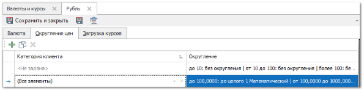
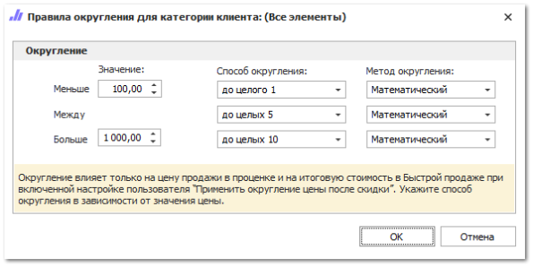

::: info Примечание

Правило для категории клиента **Все элементы** является универсальным и срабатывает, если нет других правил, подходящих под условия.

:::

Для создания нового правила округления для категории клиента выполните следующие шаги:

**»** Перейдите в инспектор необходимой валюты раздела **Финансы ► Валюты и курсы.**

**»** На панели инструментов вкладки **Округление цен** нажмите на кнопку **Добавить**. В таблице добавится новая запись.

**»** В колонке **Категория клиента** выберите из выпадающего списка категорию, для которой создаете правило.

::: info Примечание

Для каждой категории клиентов можно добавить только одно правило округления.

:::

**»** Для изменения условий округления нажмите на кнопку  в колонке **Округление.** Откроется окно для редактирования условий округления.

**»** В открывшейся форме укажите уровни округления цен товаров в зависимости от ценового диапазона, а так же способы и методы округления.

**»** Нажмите кнопку **Ок** для сохранения изменений.

**»** Сохраните карточку валюты с помощью команд **Сохранить и закрыть**.