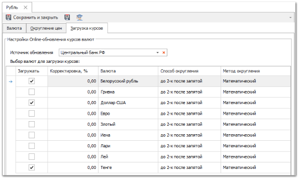
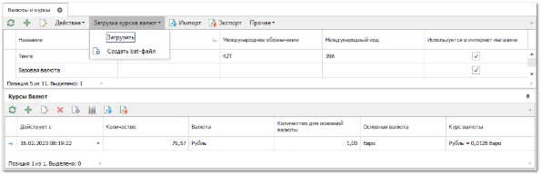
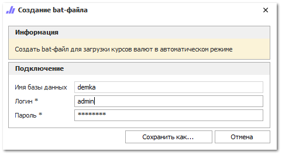

Для настройки автоматического обновления курсов валюты выполните следующие действия:

**»** Перейдите в инспектор необходимой валюты раздела **Финансы ► Валюты и курсы.**

**»** На вкладке **Загрузка курсов** укажите **Источник обновления** из списка доступных.

**»** Установите галочки в колонке **Загружать** напротив тех валют, курсы которых по отношению к текущей необходимо загружать.

**»** При необходимости, в поле **Корректировка курса** **(%)** введите величину в процентах, на которую должны быть скорректированы курсы валют в системе относительно исходного курса с сайта-источника курсов.

**»** В колонках **Способ** и **Метод округления** укажите способы округления для загружаемых значений курсов.

**»** Для сохранения изменений нажмите кнопку **Сохранить и закрыть**.

Для валют, по которым указаны настройки онлайн-загрузки курсов валют можно воспользоваться командой **Загрузка курсов валют** **►** **Загрузить** в справочнике **Валюты**. При наличии доступа к интернету и корректным настройкам программа произведет загрузку курсов для всех настроенных валют. В случае успешной загрузке выйдет уведомление и курсы валют станут доступны в справочнике **Курсы валют**. 

::: warning Внимание!

Если для одной и той же пары валют существует более одного заданного курса, то всегда будет срабатывать курс, загруженный позднее (колонка **Действует с** в списке курсов валют в справочнике **Валюты и курсы**).

Необходимо учитывать этот момент, при настройке автоматической загрузке курсов с национальных банков и выбирать только один источник загрузки курса для пары валют.

:::

Команда **Загрузка курсов валют** работает в ручном режиме. Для настройки автоматической загрузки курсов валют необходимо создать bat-файл по команде **Создать bat-файл**. При нажатии отобразиться окно с вводом логина/пароля. После сохранения и запуска файла будет работать автоматическое обновление курсов, в зависимости от установленных настроек запуска в **Планировщике задач** системы Windows. 

::: note Замечание

Автоматическую загрузку курсов так же можно настроить с помощью настройки **Автоматически загружать курсы валют при входе в программу** в разделе **Управление ►Настройки программы ►Настройки** в группе настроек **Системные настройки**. Настройка активирует механизм автоматической загрузки курсов валют при входе в базу данных. Загрузка курсов производится только для валют, по которым задан **Источник обновления**.

:::
 
::: details Читайте также

[Справочник Валюты и курсы](../../../specification/finansy/valjuty_i_kursy/README.md)

:::