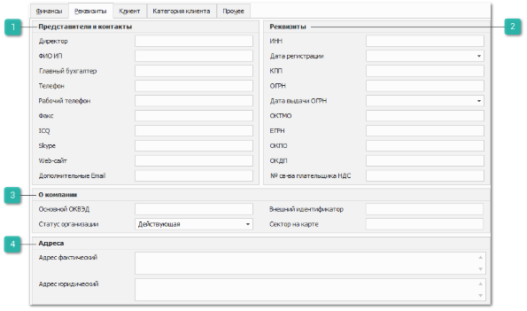
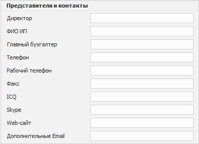
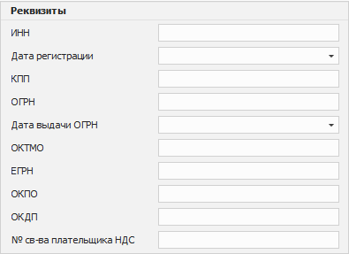
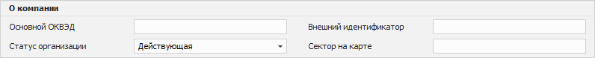
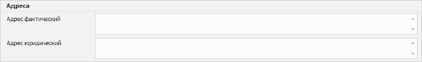

**»** Перейдите на вкладку **Финансы** в карточке контрагента.

**»** Заполните необходимые данные:

**Представители и контакты**

- **Директор** – позволяет задать фамилию, имя и отчество директора;

- **ФИО ИП** – позволяет заполнить фамилию, имя и отчество** индивидуального предпринимателя;

- **Главный бухгалтер** – позволяет задать фамилию, имя и отчество главного бухгалтера.

Следующие опции позволяют задать контактные данные организации:

- **Телефон**;

- **Рабочий телефон**;

- **Факс**;

- **ICQ**;

- **Skype**;

- **Web-сайт**;

- **Дополнительные Email**.

**Реквизиты**

Блок позволяет заполнить реквизиты компании.

::: info Примечание

В программе доступна возможность заполнения реквизитов с помощью сервиса DaData. Для заполнения/обновления реквизитов введите **ИНН** организации и нажмите команду **Обновить реквизиты** на панели инструментов.

:::

**О компании**

Содержит следующие поля:

- **Основной ОКВЭД** – позволяет ввести код основного вида экономической деятельности компании;

- **Внешний идентификатор** – позволяет заполнить внешний идентификатор контрагента. Идентификатор используется при интеграции с сервисом emex.ru;

::: info Примечание

Подробнее о работе с сервисом **Emex** читайте в [отдельном руководстве пользователя](https://product-doc.tradesoft.ru/ai/emex/index.htm).

:::

- **Статус организации** – позволяет указать состояние дееспособности организации. Доступные значения:

    - **Действующая**;

    - **Ликвидируется**;

    - **Ликвидирована**;

    - **Реорганизация**;

    - **Банкротство**;

- **Сектор на карте** **–** позволяет задать значение, по которому можно задать фильтрацию в разделе **CRM ► Анализ клиентской базы ► ABC-анализ**.

**Адреса**

Поля в блоке позволяют заполнить фактический и юридический адреса фирмы.

