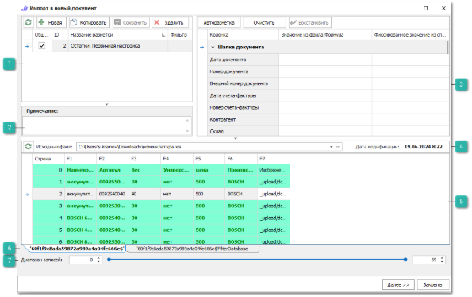
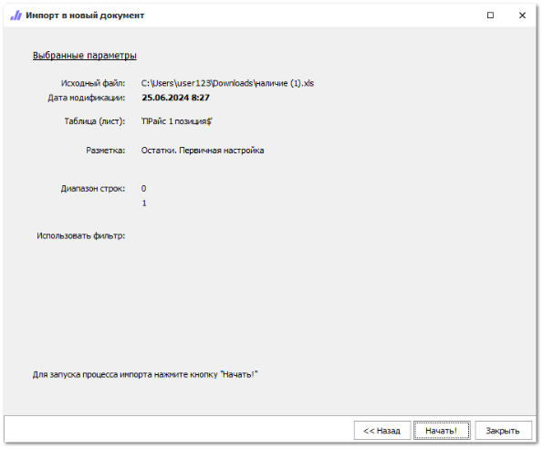
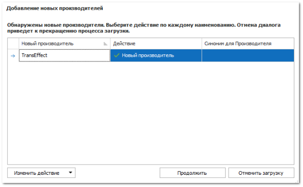
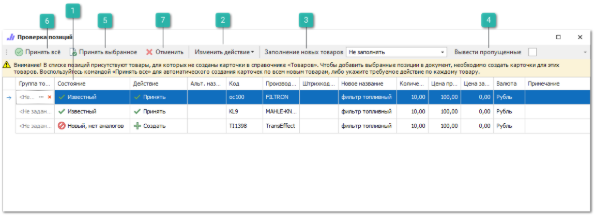
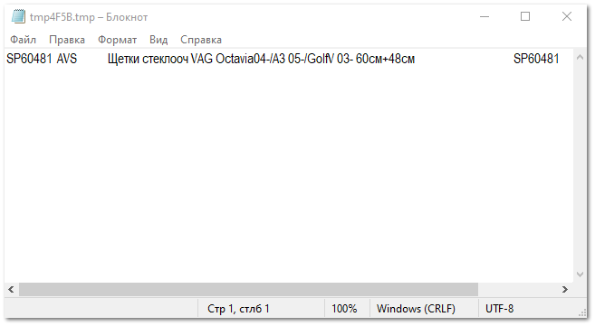

В программе присутствуют три способа выполнения импорта данных в **Приходные накладные**:

- Прямой импорт в новый документ **Приходная накладная** (рассматривается ниже). Импорт в новый документ имеет смысл, когда позиции из файла приходуются в качестве свободных остатков, без предварительно оформленных **Заказов поставщикам**. Например, в случае первичного оприходования остатков, при проводке новой **Приходной накладной** ее позиции не будут связаны с какими-либо заказами клиентов/поставщикам.

::: info Примечание

При включенной в разрешениях пользователя опции **Автоматически связывать транзакции** (меню **Управление ►** **Настройки программы ► Роли пользователей ► Разрешения для роли пользователей ► Документы ► Приходные накладные** **►** блок **Проводка**, программа при проводке **Приходной накладной** проанализирует ее позиции и позиции **Заказов поставщикам** в состоянии "заказ поставщику". Если будут найдены товары (совпадение Код/Производитель) от того же поставщика с ценой, отличающейся не более чем на +-5%, то программа свяжет позиции прихода с такими позициями из заказов поставщикам.

:::

- Подбор позиций в **Мастере создания Приходной накладной** с помощью импортируемого файла. Автоматический импорт приходных документов по настроенным правилам в разделе Склад и закупки **► Автоимпорт приходных документов**.

- Импорт в **Мастер Приходной накладной** позволяет автоматически связать позиции из файла с ожидаемыми от поставщика позициями в программе.

Рассмотрим импорт позиций в новый документ прихода. Чтобы импортировать позиции в приходную накладную, выполните следующие действия:

**»** Предварительно подготовьте файл для импорта, содержащий список позиций.

**»** В **Главном меню** выберите раздел **Склад и закупки ► Приходные накладные** отобразятся элементы выбранного пункта.

**»** Нажмите кнопку **Импорт** на панели инструментов и выберите пункт **В новый документ** (Ctrl+I). Если импортируемый файл необходимо загрузить в разные документы выберите действие **Импорт** **► Сложные документы**.

**»** Появятся элементы, для выбора файла с компьютера, который содержит импортируемые данные.

::: info Примечание

Системой поддерживаются следующие форматы файлов для загрузки:
- Файла MS Access (\*.mdb);
- Microsoft Excel 95-2003 (\*.xls);
- Microsoft Excel 2007-2013 (\*.xlsx, \*.xlsm);
- Файлы dBase (\*.dbf);
- Текстовые файлы с разделителями "точка с запятой", "запятая", "табуляция" (\*.txt, \*.csv).

:::
**»** После выбора файла откроется окно разметки файла для импорта. Выполните разметку файла используя подходящую ранее созданную разметку, либо выполните разметку файла вручную.

 **Ранее созданные разметки**

Блок  **Ранее созданные разметки**, содержит ранее созданные и сохраненные разметки документов. Если импорт в приход из аналогично размеченного файла уже осуществлялся, и в программе сохранена эта разметка, то рекомендуется выбрать ее в списке, не создавая новую. Блок содержит **Панель действий** с командами:

- **Обновить** – позволяет обновить список разметок;

- **Новая** – позволяет добавить новую разметку;

- **Копировать** – позволяет копировать существующую разметку, для дальнейшего редактирования;

- **Сохранить** – позволяет сохранить созданную или отредактированную разметку, которая будет доступна для последующего использования;

- **Удалить** – позволяет удалить существующую разметку.

 **Примечание**

Блок позволяет оставить текстовое примечание для разметки.

 **Разметка колонок**

Позволяет установить соответствия колонок в файле с типом данных в программе в колонке **Значение из файла/формула**. Некоторые значения (валюта, страна и т.п.) можно установить из соответствующего справочника в программе в колонке **Фиксированное значение из справочника**.

::: info Примечание

Обязательными полями для разметки при импорте приходя являются: **Базовая валюта** (лучше выбрать фиксированное значение из справочника валют), **Товар. Код** и **Товар. Производитель**.

:::

 **Информация об импортируемом файле**

Блок содержит:

- **Обновить** – которая позволят обновить данные о загруженном документе; 

- **Исходный файл** – содержит полный путь на компьютере до импортируемого файла, при необходимости его можно заменить;

- **Дата модификации** – отображается последняя дата изменения документа.

 **Табличная часть** 

Содержит список записей импортируемых из документа, с названием колонок для установки разметки.

 **Таблицы/листы документа**

Отображаются вкладки таблиц/листов документа, который хранит импортируемые данные. При необходимости, выберите необходимую вкладку.

 **Диапазон записей**

Позволяет указать количество верхних/нижних строк, данные из которых не будут импортированы. Обычно данный параметр используется для того, чтобы предотвратить загрузку заголовка и названия колонок импортируемой таблицы.

::: info Примечание

При разметке импорта из файлов можно использовать предустановленные в программе специальные формулы для упрощения процесса импорта.

:::
**»** После задания разметки файлу, для продолжения загрузки нажмите кнопку **Далее.** Откроется окно с параметрами загрузки, для повторной проверки импорта. Для изменения параметров импорта нажмите кнопку **Назад**,** для начала процесса импорта нажмите **Начать!**

**»** В процессе импорта программы проверит наличие производителей из файла в справочнике **Производителей** и выдаст диалоговое окно с возможностью выбрать **Действие** для новых **Производителей**. При необходимости вы можете добавить новых производителей в справочник, задать синонимы для уже существующих записей или пропустить записи для неизвестных производителей, воспользовавшись командой **Изменить действие**.

**»** В процессе импорта программа так же проверяет наличие загружаемых позиций в справочнике **Товаров**. Если в загружаемых данных присутствуют новые товары, карточек которых нет в базе, появится окно **Проверка позиций**. 

 **Состояние**

Колонка носит информационный характер и позволяет оценить, есть ли товар в справочнике **Товаров**, и есть ли у него аналоги.

 **Изменить действие**

Позволяет указать действие с новым товаром: **Создать** карточку, либо **Пропустить**. Указанное действие отобразится в колонке **Действие**, где его так же можно изменить вручную для отдельных позиций.

 **Заполнение новых товаров**

Позволяет указать источник (из списка доступных) для заполнения дополнительных свойств. Получении дополнительной информации доступно из сервиса **Веб-инфо** (подключение сервиса к программе производится через менеджеров отдела продаж).

 **Вывести пропущенные**

Позволяет после завершения завершения проверки вывести список позиций с установленным в колонке **Действие** значением **Пропустить**.

 **Принять выбранное**

Позволяет создать карточки товаров для выбранных новых товаров и осуществить импорт товаров.

 **Принять все**

Позволяет создать карточки товаров для всех новых товаров и осуществить импорт товаров.

 **Отменить**

Позволяет прервать загрузку и вернуться к окну импорта.

**»** После завершения импорта откроется документ **Приходная накладная** с импортируемыми позициями.

**»** Для вступления документа прихода в силу его необходимо провести. Для этого нажмите кнопку **Сменить состояние** и выберите пункт **Провести** (Ctrl+E).

**»** Для того чтобы сохранить и закрыть документ (можно и без проведения) воспользуйтесь кнопкой **Сохранить и закрыть** (F2).

