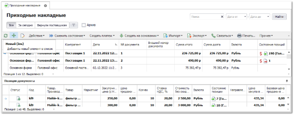
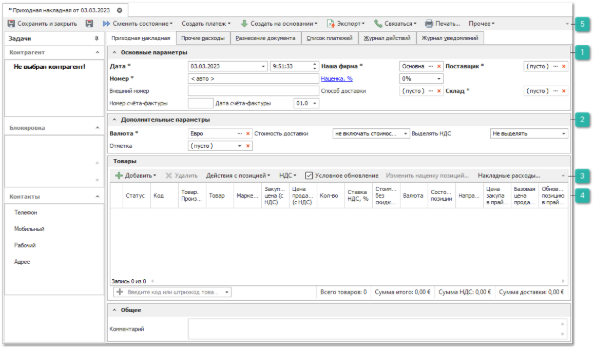
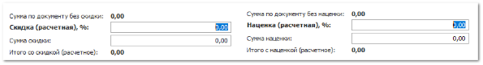
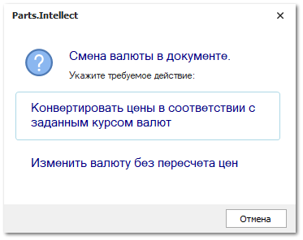
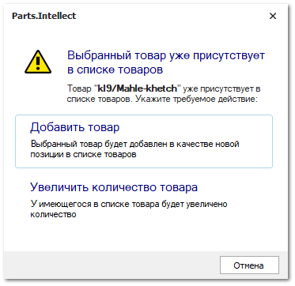
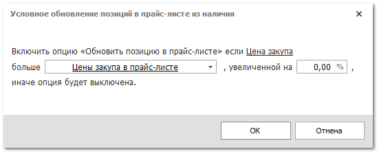
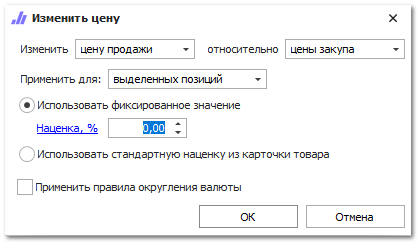

Для внесения остатков на склад в программе необходимо сформировать и провести документ **Приходная накладная**. В документ товары могут быть добавлены вручную из справочника **Товары** или импортированы их файла.

Для создания нового документа **Приходная накладная** выполните следующие действия:

**»** В **Главном меню** выберите раздел **Склад и закупки ► Приходные накладные**. Отобразятся элементы выбранного пункта, описанные в разделе **Приходные накладные**.

**»** Нажмите кнопку **Новый** на панели инструментов. Откроется окно инспектора для оформления приходной накладной.

**»** Заполните параметры документа и добавьте товары в приход.

**Основные параметры**

Блок содержит поля для задания параметров:

- **Дата \*** – дата и время создания документа;

::: info Примечание

Для определения даты и времени программа использует данные компьютера пользователя или время компьютера, где расположена база данных, при активной настройке **Использовать локальное время сервера БД** в разделе меню **Управление ► Настройки программы ► Настройки** блок **Системные настройки**.

:::

- **Номер \*** – порядковый номер документа задается как автоматически так и вручную. Формат и текущий счетчик для формирования номера документа определяется правилом в разделе меню **Управление ► Справочники ► Счетчик номеров документов**;

::: info Примечание

Возможность ручного редактирования **Даты** и **Номера** документа для пользователя определяется опциями **Можно редактировать дату и время документа** и **Можно редактировать номер документа** в разделе меню **Управление ► Настройки программы ► Роли пользователей** ► **Разрешения для роли пользователей** ► **Документы ► Приходные накладные**.

:::

- **Внешний номер** – внешний номер документа;

::: info Примечание

Для пользователя может быть разрешено изменения поля **Внешний номер** даже после проводки документа. Разрешение регулируется опцией **Можно изменять внешний номер документа после проводки** в разделе меню **Управление ► Настройки программы ► Роли пользователей ► Разрешения для роли пользователей ► Документы ► Приходные накладные**.

:::

- **Номер счета-фактуры** и **Дата счета-фактуры** – номер и дата документа счет-фактура, по которому пришел товар. Данные значения используются в печатных шаблонах;

- **Наша фирма** – текущее значение из поля **Фирма** на панели главного меню;

- **Скидка/Наценка, %** (значение меняется при нажатии на имя поля) – значение процента скидки или наценки, которое применяется на все позиции документа. Доступ к полю определяется разрешением пользователя **Можно изменять скидку/наценку** в разделе меню **Управление ► Настройки программы ► Роли пользователей ► Разрешения для роли пользователей ► Документы ► Приходные накладные**.

::: info Примечание

Значение можно указывать в процентах в поле **Скидка (расчетная), %** или непосредственно в сумме в поле **Сумма скидки**.

:::

- **Способ доставки** – способ доставки деталей от поставщика;

- **Поставщик \*** – поставщик, от которого пришли детали. Если вы приходуете первичные остатки, то в качестве поставщика укажите **Нашу фирму**;

- **Склад \* –** склад, на который будет зачислен товар из накладной;

- **Прайс-лист из наличия \*** (только для **Гибкой** схемы ценообразования) – выберите **Прайс-лист из наличия**, в который попадут товары из документа (для остальных схем нет необходимости указывать прайс-лист, так как он единственный).

**Дополнительные параметры**

Блок содержит поля для задания параметров:

- **Валюта \*** – валюта цен в документе. Если изменить валюту документа, программа предложит сконвертировать цены на позиции по текущему курсу для валют.

- **Отметка** – отметка для документа из справочника;

- **Стоимость доставки** – стратегия учета стоимости доставки в итоговой цене закупа:

   - **Не включать стоимость доставки** – суммарное значение по колонке **Стоимость доставки** не будет влиять на сумму итого по документу;

   - **Включать стоимость без учета скидки** – сумма колонки **Стоимость доставки** будет прибавлена к сумме итого по документу;

   - **Включать стоимость с учетом скидки** – сумма колонки **Стоимость доставки** будет прибавлена к сумме итого по документу с учетом скидки поля **Скидка/Наценка, %** документа.

- **Выделять НДС** – стратегия выделения НДС в документе. По умолчанию значение берется из карточки **Нашей фирмы**.

::: info Примечание

В случае создания документа **Приходная накладная** из **Проценки**, значение поля **Выделять НДС** возьмется из карточки поставщика.

:::

**Панель действий блока Товары**

Содержит ряд действий которые можно осуществить с позициями документа:

- **Добавить** – позволяет добавить позиции в табличную часть накладной из различных источников.

   - **Из справочника** – позиция будет добавлена в документ без цен из справочника **Товары**;

   - **Из справочника через проценку** – позицию можно будет выбрать вначале в справочнике **Товары**, а затем она будет передана в **Проценку** для подбора предложений;

   - **Из проценки** – программа откроет окно **Проценки** для подбора позиций в документ;

   - **Из корзины** – позиции будут добавлены из корзины;

   - **Из мастера** – добавление позиций будет происходить из **Мастера Приходной накладной**;

   - **Из документа** – позиции можно будет копировать из других **Приходных накладных**;

   - **Копия позиции** – создастся копия выделенной позиции документа.

   Если добавляемый товар уже присутствует в документе, то откроется диалоговое окно с выбором действия над позицией:

   

   - **Добавить товар** – товар будет добавлен в качестве новой позиции;

   - **Увеличить количество товара** – для товара в списке, будет увеличено количество.

- **Удалить** – позволяет удалить выбранные позиции из табличной части;

- **Действия с позицией** – содержит команду **Добавить в корзину**, которая позволяет добавить, выделенные в табличной части позиции, в корзину;

- **НДС** – содержит ряд команд:

   - **Изменить ставку НДС** – позволяет изменить ставку НДС для выбранных позиций;

   - **Установить приоритет цен с НДС/Снять приоритет цен с НДС ** – позволяет установить/снять приоритет цен с НДС, который определяет ключевую цену, на основании которой будет высчитываться вторая цена при переключении в параметрах документа значения **Выделять НДС**:

      - если для позиции активирована опция **Установить приоритет цен с НДС**, то при включении переключателя **Выделять НДС** значение в колонке **Цена с НДС** не изменится, а **Цена без НДС** рассчитается на ее основании; 

      - убрать приоритет цен можно с помощью опции **Снять приоритет цен с НДС**, если приоритет снят, то при включении переключателя **Выделять НДС** значение в колонке **Цена без НДС** не изменится, а **Цена с НДС** рассчитается на ее основании.

- **Условное обновление** – позволяет автоматически включать опцию **Обновить позицию в прайс-листе**. Команда работает для выделенных позиций документа, вызывая диалоговое окно для указания условия обновления цен.

::: info Примечание

Важным моментом при оприходовании товара является тот факт, что если в **Приходной накладной** есть товар из **Заказа клиента**, то цены в прайс-листе из наличия по данному товару не обновляются. Но, если в прайс-листе из наличия нет данного товара, то информация по нему заносится в обычном порядке.

:::

В диалоге указываются тип цены (Цена закупа в прайс-листе или Базовая цена продажи в прайс-листе), относительно которого допустим рост **Цены закупа** в **Приходной накладной** на указанный процент без обновления прайс-листа.

Например, текущая цена закупа в прайс-листе из наличия равна 100р. Выбираем **включение** опции, если **Цена закупа** больше **Цены закупа в прайс-листе**, увеличенной на 10 %. Максимальное допустимое повышение цены закупа без обновления цены в прайс-листе: 100р + 10% = 110р. Тогда:

- При цене закупа в **Приходной накладной** 150р опция будет включена, цена закупа будет обновлена, т.к. 150р *больше* 110р;

- При цене закупа в **Приходной накладной** 70р – опция будет выключена, цена закупа не будет обновлена, т.к. 70р *меньше* 110р.

::: info Примечание

На обновление **Цены закупа** в прайс-листе наличия также влияет опция **Не уменьшать цену закупа при обновлении прайс-листа из наличия** (меню **Управление ►** **Настройки программы ► Настройки ►** группа **Товары и цены ► Прайс-листы и ценообразование**.

В случае активной опции **Использовать средневзвешенную цену закупа** (только для **Расширенной схемы** ЦО) цена закупа в прайс-лист будет рассчитываться и передаваться из прихода по средневзвешенному алгоритму.

:::

- **Изменить наценку позиций** – позволяет установить наценку, либо скидку на выделенные позиции. На форме указывается от какой цены необходимо начислять наценку или скидку, а также размер скидки/наценки: фиксированный; из карточки товара. Далее с помощью опции **Применить правила округления валюты** можно округлить полученное значение. 

- **Накладные расходы** – позволяет распределить накладные расходы по всем позициям.

**Табличная часть**

::: info Примечание

Данные по позициям в **Табличной части** заполняются автоматически на основании информации в источнике, из которого происходило добавление. Для проведения **Приходной накладной** достаточно заполненной информации в колонках **Код**, **Товар**, **Производитель**, **Количество** и **Цена** **закупа**. При необходимости, заполните/измените данные по позициям накладной вручную.

:::

Доступные данные (колонки) по позициям в **Приходной накладной**:

::: note Замечание

Набор колонок в позициях документа может быть самостоятельно отрегулирован пользователем базы данных.

:::

- **№ ГТД** – номер грузовой таможенной декларации, если деталь была импортирована в страну;

- **Oid** – уникальный номер позиции документа в базе данных. Присваивается после проведения документа;

- **Базовая валюта** – валюта, в которой были указаны цены, на момент добавления позиции в документ;

- **Базовая закупочная цена** – цена закупа из "источника" добавления на момент добавления позиции в документ (обычно цена от поставщика);

- **Базовая цена продажи** – цена продажи из "источника" позиции на момент добавления позиции в документ;

- **Базовая цена продажи в прайс-листе из наличия** (только для **Расширенной** и **Партионной** схемы ЦО) – значение Базовая цена продажи из Прайс-листа из наличия на момент добавления позиции в документ;

- **В наличии на доступных складах** – общее наличие по товару на всех складах, доступных пользователю для работы;

- **В резерве на доступных складах** – общее количество зарезервированного товара на всех складах, доступных пользователю для работы;

- **Валюта** – валюта, в которой указаны цены на позицию;

- **Веб-инфо** – колонка содержит команду вызова окна, содержащего общую информацию и изображения детали из сервиса веб-инфо (по вопросу подключения сервиса можно уточнить информацию в отделе продаж);

- **Внутренний код** – внутренний код товара из карточки товара.

- **Внутренний код поставщика** – внутренний код товара из прайс-листа поставщика;

- **Внутренний штрихкод** – внутренний штрихкод из карточки товара;

- **Группа** **товара** – Основная группа товара из карточки;

- **Дополнительные свойства товара** – дополнительные свойств товара из карточки;

- **Закупочная цена (без НДС)** – цена закупа детали у поставщика;

- **Закупочная цена (с НДС)** – цена закупа детали у поставщика с учетом значения колонки **Ставка НДС, %**;

- **Закупочная цена со скидкой и доставкой (без НДС)** – цена закупа с учетом **Скидки/Наценки, %** по документу и значения колонки **Стоимости доставки** (если включен ее учет);

- **Закупочная цена со скидкой и доставкой (с НДС)** – цена закупа с учетом **Скидки/Наценки, %** по документу, значения колонок **Стоимости доставки** (если включен ее учет) и **Ставка НДС,** % (если выделяется НДС);

::: info Примечание

При расчете значений колонок **Закупочная цена со скидкой и доставкой (без НДС) / (с НДС)** всегда учитывается значение поля **Скидка/Наценка, %**.

Если в параметре документа **Стоимость доставки** выставлено значение **Включать стоимость с учетом скидки** и по позиции есть стоимость доставки, то **Скидка/Наценка, %** применится еще раз.

:::

- **Замены товара** – поле заполняется информацией об исходном замененном коде товара в документе (например, если в заказе поставщику был отличный артикул);

- **Итоговая стоимость (без НДС)** – стоимость товара с учетом **Скидки/Наценки, %** по документу и значения колонки **Стоимости доставки** (если включен ее учет);

- **Итоговая стоимость (с НДС)** – стоимость товара с учетом **Скидки/Наценки, %** по документу, значения колонок **Стоимости доставки** (если включен ее учет) и **Ставка НДС,** % (если выделяется НДС);

- **Категория клиента из маркетинга** – категория клиента из **Маркетинга** (если к позиции применен маркетинг);

- **Код** – артикул детали. В поле доступна кнопка , при нажатии на которую открывается окно **Проценки** по данному коду;

- **Код ТНВЭД** – код ТНВЭД из карточки товара;

- **Код ТНВЭД от поставщика** – код ТНВЭД из прайс-листа поставщика;

- **Кол-во** – количество товара по документу;

- **Количество по доставке** – количество товаров, партий и т.п. для расчета **Стоимости доставки**;

- **Короткое место хранения** – место хранения товара. Устанавливается после проведения документа;

- **Маркетинг** – информация о **Маркетинге**, который применился к позиции при добавлении из **Проценки** или **Корзины**;

- **Наименование товара от поставщика** – название товара из прайс-листа поставщика;

- **Направление/склад** – значение присутствует, если товар был добавлен из "наличия";

- **Наценка, %** – наценка на товары в отношении закупочной цены к цене продажи по документу;

- **Не уменьшать цену продажи** – значение одноименной галки в карточке товара (если товар присутствует в справочнике, иначе галка снята);

- **Подакцизный товар** – значение одноименной опции из карточки товара;

- **Полное место хранения** – место хранения товара. Устанавливается после проведения документа;

- **Последняя цена продажи из РН** – цена продажи из последней **Расходной накладной** по товару;

- **Примечания** – примечание к позиции;

- **Прочие расходы** – сумма разнесения по позиции из суммы накладных расходов (принцип работы описан на следующем шаге ниже);

- **Себестоимость** – значение, рассчитываемое по формуле: Закупочная цена с НДС + (Стоимость доставки / Кол-во товара) + Прочие расходы;

::: info Примечание

Значение колонки **Стоимость доставки** участвует в расчете себестоимости товара только при включенной опции **Включать стоимость доставки в себестоимость товара** в меню **Управление ► Настройки программы ► Настройки**, группа **Товары и цены ► Прайс-листы и ценообразование**. и выставленной опции **Включать стоимость с учетом скидки/ Включать стоимость без учета скидки** в параметрах документа.

:::

- **Системный штрихкод** – штрихкод позиции документа, присваиваемый системой;

- **Состояние позиции** – состояние (и подсостояние) позиции;

- **Список клиентов** – перечень клиентов, для которых пришел товар (при наличии связанных документов);

- **Ставка НДС, %** – ставка НДС в процентах из карточки товара;

::: info Примечание

Изменить значение **Ставки НДС, %** на позиции в документе можно с помощью команды **Изменить ставку НДС** на панели инструментов блока **Товары**.

:::

- **Статус** – статус позиции документа (не путать с **Состоянием**);

- **Стоимость без скидки (с НДС)** – закупочная цена на товар с НДС с учетом количества;

- **Стоимость доставки** – сумма по доставке товара (Цена доставки \* Количество по доставке);

- **Страна** – страна происхождения товара и карточки;

- **Сумма НДС** – сумма НДС по позиции с учетом скидки поля **Скидка/Наценка, %**;

- **Товар** – наименование детали (из источника позиции);

- **Товар. Альтернативное наименование** – альтернативное название из карточки товара;

- **Товар. Производитель** – производитель детали (из источника позиции);

- **Товар. Стандартная наценка** – значение наценки и карточки товара;

- **Торговая** **точка** – склад/торговая точка, на которую поступил товар. Заполняется после проведения документа;

- **Цена доставки** – значение из справочника **Стоимости доставок**;

- **Цена закупа в прайс-листе из наличия** (только для **Расширенной** схемы ценообразования) – **Цена закупа** в прайс-листе из наличия;

- **Цена продажи (без НДС)** – цена продажи, если она присутствовала в "источнике" позиции или была введена вручную;

- **Цена продажи (с НДС)** – цена продажи, если она присутствовала в "источнике" позиции или была введена вручную, с учетом значения колонки **Ставка НДС,** % (если выделяется НДС);

- **Цена продажи из прайс-листа** (только для **Гибкой** схемы ЦО) *–* **Базовая цена продажи** из прайс-листа наличия, который выбран в параметрах документа **Приходная накладная**;

- **Цена продажи со скидкой и доставкой (с НДС)** – цена продажи, если она присутствовала в "источнике" позиции или была введена вручную, с учетом **Скидки/Наценки, %** по документу, значения колонки **Стоимости доставки** (если включен ее учет);

- **Цена продажи со скидкой и доставкой (без НДС)** – цена продажи, если она присутствовала в "источнике" позиции или была введена вручную, с учетом **Скидки/Наценки, %** по документу, значения колонок **Стоимости доставки** (если включен ее учет) и **Ставка НДС,** % (если выделяется НДС);

- **Обновить позицию в прайс-листе** (только **Расширенной** схемы ЦО) – регулирует обновление **Цены закупа** и **Базовой цены продажи** в прайс-листе наличия из соответствующих значений в **Приходной накладной** (берутся значения **Закупочной цены (с НДС)** и **Цены продажи (с НДС)**).

::: info Примечание

Колонка **Обновить позицию в прайс-листе** доступна в случае, если в меню **Управление ►** **Настройки программы ► Настройки ►** группа **Товары и цены ► Прайс-листы и ценообразование** отключена опция **Использовать средневзвешенную цену закупа**.

Значение по умолчанию для колонки **Обновить позицию в прайс-листе** можно установить в настройках пользователя в разделе главного меню **Управление ► Настройки пользователя ►** вкладка **Ценообразование ►** опция **Позиции ПН. Обновить позицию в прайс-листе (по умолчанию)**.

:::

Для автоматического обновления позиции в прайс-листе используется команда на панели действий блока **Товары**.

**»** Для вступления документа в силу, его необходимо провести. Для этого нажмите кнопку **Сменить состояние** и выберите пункт **Провести** (Ctrl+E).

**»** Для того, чтобы сохранить и закрыть документ (доступно также без проведения), воспользуйтесь кнопкой **Сохранить и закрыть** (F2).

::: info Примечание

Проведение документа прихода может быть заблокировано программой при наличии одного или нескольких ограничений:

- **Склад/торговая точка**, на который оформляется приход, находится в данный момент на инвентаризации;

- **Склад/торговая точка**, выбранный в параметрах документа, отсутствует в **Списке складов/ТТ, на которые доступно оприходование товара** в разрешениях пользователя;

- Установлены иные ограничения для пользователя в разделе главного меню **Управление ►** **Настройки программы ► Роли пользователей ► Разрешения для роли пользователей ► Документы ► Приходные накладные**.

:::

После проведения документа прихода товара будет числиться в наличии на складе. 

**Панель действий**  

Содержит ряд действий которые можно осуществить с документом:

- **Сохранить и закрыть** – позволяет выполнить сохранение документа с последующим закрытием;

- **Сохранить** – позволяет  сохранить документ;

- **Сменить состояние** – позволяет выполнить проведение документа;

- **Создать платеж** – позволяет создать на основании **Приходной накладной** платежи типа: **Расходный кассовый ордер**, **Платежное поручение**;

- **Создать на основании** – позволяет создать на основании **Приходной накладной** документы типа: **Задание на разбор товара**, **Отказ клиента**, **Возврат поставщику**, **Перемещение**, **Перемещение товаров по торговым точкам**, **Перемещение на места хранения по умолчанию**, **Перемещение по местам комплектации клиентов, Корректировка приходной накладной**, **Приходная накладная (копия)**, **Расходная накладная**, **Приходная накладная (мастер)** и **Списание товаров**.

Для перемещения и распределения товара на другие склады, торговые точки или места хранения необходимо воспользоваться документом **Перемещение**.

Отчеты по наличию товара на складе содержатся в разделе меню **Отчеты и анализ** ► **Складские отчеты**.

Для печати этикеток на пришедшие товары необходимо воспользоваться командой **Прочее** ► **Печать** **этикеток** на панели инструментов накладной.

Печать доступна как из списка документов, так и в инспекторе документа. Если команду вызвать из списка документов **Приходные накладные**, то на печать будут переданы все позиции выделенных документов, но группировка позиций будет осуществляться в рамках каждого документа независимо. А если из инспектора документа, то на печать уйдут выделенные позиции документа.

В опции **Способ печати этикеток** указывается стратегия печати:

- **Одна этикетка на каждую транзакцию** – печатается одна этикетка на каждую транзакцию, связанную с печатаемой позицией;

- **Одна этикетка на каждую единицу товара** – печатается одна этикетка на каждую единицу товара;

- **Одна этикетка на весь принимаемый товар** – позиции группируются по товару, количество складывается;

- **Пропорционально партии принимаемого товара** – печать осуществляется пропорционально партии, которая указывается в свойстве **Размер партии**;

- **Одна этикетка на товар под каждого контрагента** – позиция разбивается для каждого клиента, под которого пришел данный товар;

- **Способ печати из карточки товара** – в этом случае программа будет брать информацию о стратегии печати из карточки товара. Если товара нет в справочнике **Товары**, то будет использоваться стратегия **Одна этикетка на каждую единицу товара**.

В опции **Состояние транзакций для печати этикеток** указываются состояния позиций, которые необходимо отправлять на печать. По умолчанию это состояния, указывающие на наличие. При необходимости, можно включить печать этикеток для позиций в состоянии "расход" и т.д.

В опции **Сколько этикеток пропустить** указывается значение количества этикеток, которые будут напечатаны пустыми (без данных).

Для печати необходимо нажать кнопку **Печать**. Также печать возможна из окна **Предварительный просмотр**, которое открывается при нажатии на кнопку **Просмотр...F3**.

Информация о печати этикеток заносится в поле **Комментарий** по документу.

