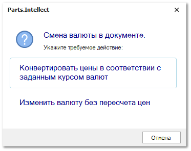

При необходимости можно формировать несколько прайс-листов из наличия и затем в **Приходной накладной** выбирать в какой прайс-лист из наличия добавлять позиции. Можно контролировать цены продажи и цены закупа для того, чтобы цены в прайс-листе не изменялись в меньшую сторону при оприходовании. В алгоритме добавления/обновления позиции прайс-листа при проводке ПН не участвуют позиции документа, которые пришли под клиентов.

Возможности **Гибкой** схемы ценообразования:

- Контроль уменьшения цен закупа в прайс-листе:

    Обновление цены закупа зависит от настройки **Не уменьшать цену закупа при обновлении прайс-листа наличия** в меню **Управление ► Настройки программы ► Настройки**, группа **Товары и цены ►  Прайс-листы и ценообразование**.  Если ценообразование настроено от закупочной цены, то данную настройку нужно включить. При поступлении товаров по более низкой цене, в прайс-листе обновление не произойдет. Если данная настройка выключена, велика вероятность, что товар будет продан в убыток.

    ::: note Пример

    В ПН №1 kl9 Knecht 5 шт. цена закупа = 690 р.В ПН №2 kl9 Knecht 3 шт. цена закупа = 600 р.В прайс-листе из наличия при включенной настройке цена закупа будет равна = 690 р., при выключенной – 600 р.

    :::

- Контроль уменьшения цен продажи в прайс-листе:

    На данной схеме также доступен контроль цены продажи при проводке документа **Приходная накладная**, с заданной **Ценой продажи**. Настройка **Не уменьшать продажную цену** из раздела **Управление** **► Настройки программы ► Настройки**, группа **Товары и цены ► Товары** при активном значении позволяет не уменьшать цену продажи на товары в прайс-листе из наличия при проводке приходного документа, если ранее цена продажи была выше. Например: 

    ::: note Пример

    Была цена 100 р., новая цена на товар в приходной накладной 50р, при активации опции товар останется в прайс-листе из наличия со старой ценой продажи 100р.

    :::

    Аналогичная настройка **Не уменьшать цену продажи** доступна в карточке товаров в разделе **Товары и цены ► Товары**, она позволяет контролировать цену продажи на отдельные товары при оприходовании.

- Использование **Себестоимости** позиций в качестве цены закупа:

    Доступно использование настройки **Использовать себестоимость товара в прайс-листе наличия** из раздела **Управление ► Настройки программы ► Настройки ►** группа **Товары и цены ► Прайс-листы и ценообразование**. Если настройка активна в прайс-лист из наличия передается значение из колонки **Себестоимость** товара вместо **Цены закупа**.

- Автоматическое обновление **Базовой цены продажи** в прайс-листе из наличия:

    Доступно использование настройки **Обновлять базовую цену продажи при обновлении прайс-листа из наличия** в меню **Управление ► Настройки программы ► Настройки**, группа **Товары и цены ►  Прайс-листы и ценообразование**.

    ::: info Примечание

    Если ценообразование настроено от цены продажи в приходной накладной (каждый раз при оприходовании цены продажи задаются в документе вручную, через наценку, либо другим способом), то необходимо отключить настройку **Обновлять базовую цену продажи при обновлении прайс-листа из наличия**.

    :::

- Изменение валюты прайс-листа:

    Для изменения валюты прайс-листа необходимо выбрать валюту в соответствующем поле в разделе **Товары и цены** **► Прайс-лист наличия** на **Панели инструментов**.

    Пользователю будет выведено окно для подтверждения конвертации цен.

Цены конвертируются в соответствии с курсом валют, заданным в разделе **Финансы** **► Валюты и курсы**. Это позволяет приходовать товар в валюте поставщика и конвертировать цены по актуальному курсу.
