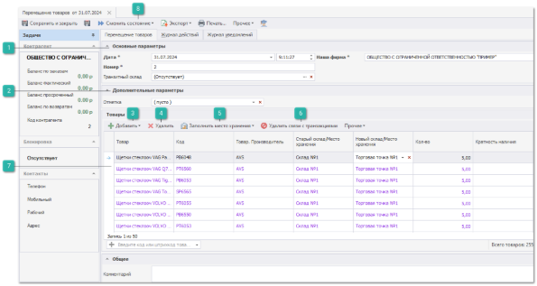
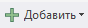
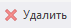
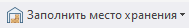
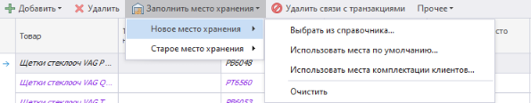
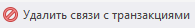

Документ **Перемещение** позволяет фиксировать в программе перемещение товара с одного склада/места хранения на другой. Документ можно создать следующими способами:

- из списка документов **Перемещения товаров**;

- при помощи **Мастера создания перемещения**;

- на основании документа **Приходные накладные**.

Инспектор документа содержит:

 **Основные параметры**

Блок отображает информацию с основными параметрами документа:

- **Дата \*** – дата и время создания документа;

- **Номер \*** – порядковый номер документа (доступен ручной ввод). Формат и текущий счетчик для формирования номера документа определяется правилом в разделе меню **Управление ► Справочники ► Счетчик номеров документов**;

::: note Замечание

Возможность ручного редактирования **Даты** и **Номера** документа для пользователя определяется опциями **Можно редактировать дату и время документа** и **Можно редактировать номер документа** в меню **Управление ► Настройки программы ► Роли пользователей** ► **Разрешения для роли пользователей** ► **Документы ► Перемещения товаров ►** блок **Редактирование**.

:::

- **Наша фирма** – текущее значение из поля **Фирма** на панели главного меню;

- **Транзитный склад** – используется, если перемещение осуществляется между складами и необходимо выделить фазу доставки. В качестве транзитных складов можно завести автомобили, которые развозят товар между складами.

::: note Замечание

Для каждого пользователя можно задать **Транзитный склад по умолчанию**, который будет автоматически подставлять при создании документа (меню **Управление ► Настройки программы ► Роли пользователей** ► **Разрешения для роли пользователей** ► **Документы ► Перемещения товаров ►** блок **Создание**).

:::

::: warning Внимание!

Не рекомендуется выполнять списание, резервирование или возврат товаров, расположенных на транзитных складах. Настроить ограничения действий для склада можно в разделе **Управление ► Настройки программы ► Роли пользователей** ► **Разрешения для роли пользователей** ► **Словари ► Склады/Торговые точки ►** блок **Видимость**, указав, что транзитный склад доступен для работы и перемещения, но не доступен для списания, оприходования, резервирования.

:::

 **Дополнительные параметры**

Блок отображает информацию с дополнительными параметрами документа:

- **Отметка** – отметка для документа из справочника **Отметки в документах** (меню **Управление ► Справочники**).

 **Добавить**

Позволяет добавить позиции в документ из источников:

- **Из справочника** – выбор производится из справочника **Товары** (меню **Товары и цены ► Товары**);

- **Из проценки** – выбор производится из результатов проценки (меню **Продажи ► Проценка**);

- **Из корзины** – выбор производится из **Корзина** пользователя;

- **Из мастера** – производится открытие окна **Мастер создания перемещения** с фильтрацией по **Наша фирма**. Выбранные позиции из **Доступные позиции** будут добавлены в документ.

 **Удалить**

Удаляет выбранную(-ые) позицию(-ии) из табличной части.

 **Заполнить место хранения**

Позволяет задать **Новый склад/Место хранения** как одной позиции, так и всем выделенным в документе. Доступны следующие команды для массового заполнения **Нового склада/Места хранения**:

- **Выбрать из справочника** – открывает справочник **Склады/Торговые точки** (меню **Склад и закупки ► Склады \ торговые точки**) для выбора места хранения товара, на которое его необходимо переместить;

- **Использовать места по умолчанию** – новое место хранения подбирается на основании **Места хранения по умолчанию** в карточке товара для выбранного склада. **Новый склад/Место хранения** не будет заполнено, если для выбранного склада в карточке товара не указано **Место хранения по умолчанию**;

- **Использовать места комплектации клиентов** – новое место хранения подбирается на основании **Места комплектации в** карточке клиента. **Новый склад/Место хранения** не будет заполнено, если позиция не связана с **Заказом клиента**, а также если в карточке клиента не указано **Место комплектации**;

- **Очистить** –** очищает поле **Новый склад/Место хранения.**

**Старый склад/Место хранения** для позиций, добавленных из справочника **Товары**, из **Проценки** или из **Корзины**, будет подбираться автоматически. Также он может быть задан вручную. Для этого необходимо:

- в ячейке **Старый склад/Место** хранения для каждой позиции выбрать место хранения в выпадающем списке. Также в ячейке можно набрать наименование или идентификатор нового места хранения. По мере набора список складов/мест хранения будет отфильтровываться по вхождению набранной строки в наименование или идентификатор;

- с помощью команды **Заполнить место хранения ► Старое место хранения** на панели инструментов списка товаров. Таким образом **Старый склад/Место хранения** можно проставить как одной позиции, так и всем выделенным в документе. Доступны следующие команды для массового заполнения **Старого склада/Места хранения**:

   - **Выбрать из справочника** – открывает справочник **Склады/Торговые точки** (меню **Склад и закупки ► Склады \ торговые точки**) для выбора места хранения товара, с которого его необходимо переместить;

   - **Очистить** – очищает поле **Старый склад/Место хранения**.

::: note Замечание

Для управления процессом автоподбора присутствует возможность указать приоритетный склад либо место хранения, в рамках которого осуществлять подбор. И/или в разрешениях пользователя для документа **Перемещение** включить опцию **Предлагать выбор приоритета на связывание с документами-родителями**. Если опция включена, то при смене состояния документа, программа будет предлагать выбрать приоритет товаров в свободном наличии либо под клиентов. Но только если среди подходящих родительских транзакций найдены как свободные транзакции, так и транзакции с товаром под клиентов.Благодаря этой возможности, можно просто указать, что надо *товар1* переместить со *склада1* на *склад2*. А программа сама подберет транзакции для выполнения перемещения. Но если отменить перемещение, то итоговые позиции не "сгруппируются" обратно.

:::

 **Удалить связи с транзакциями**

Удаляет связи с транзакциями.

 **Товары**

Отображает список товаров с информацией о коде, производителе, старом и новым складом/местом хранения и его количестве.

::: note Замечание

Отображение колонок может быть настроено индивидуально для каждого пользователя. Для этого необходимо в табличной части нажать правой кнопкой мыши по наименованию колонки и выбрать опцию **Выбор колонок**. Отобразится окно со списком всех колонок данной таблицы, в котором можно настроить их видимость.

:::

Доступные колонки табличной части **Товары**:

- **В наличии на доступных складах** – общее наличие по товару на всех складах, доступных пользователю для работы;

- **Веб-Инфо** – колонка содержит команду вызова окна, содержащего общую информацию и изображения детали из сервиса веб-инфо (по вопросу подключения сервиса можно уточнить информацию в отделе продаж);

- **Внутренний код** – значение поля **Внутренний код** из справочника **Товары** или из прайс-листа от поставщика;

- **Единица измерения** – значение поля **Единица измерения** из справочника **Товары**;

- **Код** – артикул детали;

- **Кол-во** – количество товара;

- **Кратность наличия** – коэффициент, согласно которому может быть выбрано количество для внесения в документ. Также выполняет роль минимального количества к перемещению;

- **Маркетинг** – информация о **Маркетинге**, который применился к позиции при добавлении из **Проценка** или **Корзина**;

- **Не соответствует кратности наличия** – отметка о несоответствии кратности из наличия товара;

- **Новый склад/Идентификатор места хранения** – отображает **Идентификатор места хранения** нового склада указанный в справочнике **Склады/Торговые точки**;

- **Новый склад/Место хранения** – указывается склад из выпадающего списка, на который необходимо переместить товар;

- **Общее наличие на складах** – общее наличие по товару на всех складах;

- **Примечания** – примечание к позиции;

- **Системный штрихкод** – штрихкод позиции документа, присваиваемый системой;

- **Состояние позиции** – состояние (и подсостояние) позиции;

- **Старый склад/Идентификатор места хранения** – отображает **Идентификатор места хранения** старого склада указанный в справочнике **Склады/Торговые точки**;

- **Старый склад/Место хранения** – склад, на котором товар находится в наличии;

::: note Замечание

При проведении документа **Старый склад/Место хранения** будет указан автоматически на основании текущего места хранения** товара.

:::

- **Товар** – наименование детали (из источника позиции);

- **Товар. Альтернативное название** – **Альт. наименование** указанное в справочнике **Товары**;

- **Товар. Производитель** – **Производитель** товара из карточки товара.

 **Сменить состояние**

Позволяет сменить состояние и произвести операции с архивированием документа:

- **Черновик** – в данном состоянии есть возможность редактировать документ;

- **Товары отгружены** – производится отгрузка на указанный **Транзитный склад**. Недоступно к выбору если **Транзитный склад** не был указан;

- **Товары приняты** – завершающее состояние документа;

- **Добавить в архив** – добавляет документ в архив. Доступно для состояния **Товары приняты**;

- **Извлечь из архива** – извлекает документ из архива. Доступно для документов добавленных в архив.

::: info Примечание

При переводе в состояние **Товары отгружены** осуществляется проверка количества товара на соответствие кратности. Если данное состояние не используется, то при переводе в состояние **Товары приняты**.

:::