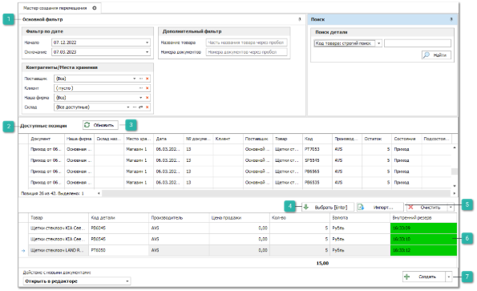
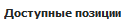
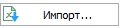
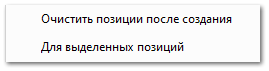
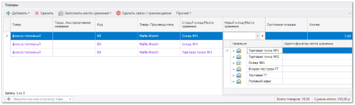
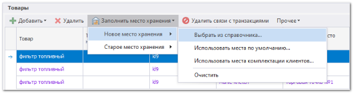
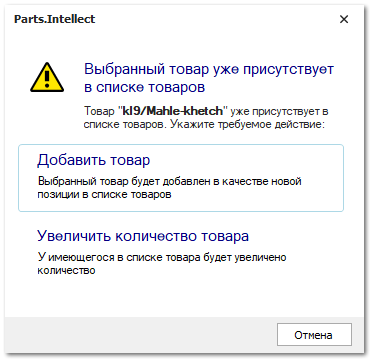
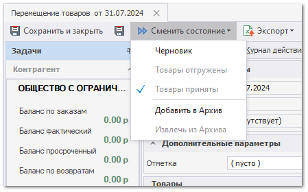

Рассмотрим процесс создания документа **Перемещение товаров** при помощи **Мастер создания перемещения**. Для создания документа выполните следующие действия:

**»** В **Главном меню** выберите раздел **Склад и закупки ► Мастер создания ► Перемещение товара**. Откроется окно **Мастер создания перемещения**.

**Основной фильтр**

Позволяет отфильтровать, при необходимости, доступные для перемещения позиции:

- **Фильтр по дате** – позволяет отфильтровать позиции по выбранному временному промежутку, указав дату **Начала** и **Окончания**;

- **Дополнительный фильтр** – позволяет осуществить фильтрацию по значениям:

   - **Название товара** – фильтрация по части названия товара;

   - **Номера документов** – фильтрация по номерам документов, которые необходимо указать через разделитель ";"

- **Контрагенты/Места хранения** – позволяет осуществить фильтрацию по значениям:

   - **Поставщик** – фильтрация по поставщику, позволяет выбрать поставщика из справочника **Контрагентов**;

   - **Клиент** – фильтрация по клиенту, позволяет выбрать клиента из справочника **Контрагенты**;

   - **Наша фирма** – фильтрация по нашей фирме;

   - **Склад** – фильтрация по месту хранения, позволяет выбрать место хранения из справочника **Склады/Торговые точки**.

**Доступные позиции**

Содержит список доступных для перемещения позиций и позволяет выбрать необходимые. 

**Обновить**

Позволяет обновить список **Доступных позиций**.

**Выбрать**

Позволяет переместить выделенные позиции в табличную часть **Выбранные позиций**.

**Импорт**

Позволяет импортировать позиции в табличную часть **Выбранные позиций** из документа.

**Выбранные позиции**

Содержит список выбранных для перемещения позиций.

**Создать**

Позволяет передать сформированный список **Выбранные позиций** в документ **Перемещение товаров** и создать его.

В выпадающем списке доступны следующие действия:

- **Очистить позиции после создания** - после создания документа(-ов) очищает список **Выбранные позиции** от позиции попавших в документ;

- **Для выделенных позиций -** при активировании функций создание документа будет производится только для выделенных позиции в табличной части **Выбранные позиции**.

**»** В созданном документе заполните обязательные параметры **Дата**, **Наша фирма** и **Номер**. Остальные параметры заполняются по необходимости.

::: note Замечание

При создании документа параметры **Дата**, **Наша фирма** заполняются автоматически на основании даты создании документа и **Фирмы**,** указанной на **Панели активных НФ/ТТ/Склад** находящейся в верхней части окна программы. **Номер** заполняется автоматически при проведении документа, либо ручным вводом в состоянии документа **Черновик**.

:::

**»** Для товаров укажите **Новый склад/Место хранения**. Его можно указать** двумя способами:

- Указать в ячейках позиции в колонке **Новый склад/Место хранения**;

- С помощью команды **Заполнить место хранения**.

::: note Замечание

Значение **Старый склад/Место хранения** у всех позиции при этом заполнится автоматически на основании текущего **Место хранения** указанного в **Доступные позиции** мастера.

:::

**»** Если требуется одну и ту же позицию добавить в **Перемещение** несколько раз (разнести на разные Склады/места хранения), то необходимо:

 - выбрать позицию из источника, добавить в документ с необходимым количеством;

- затем снова добавим эту позицию в документ, в открывшемся окне нажмем на кнопку **Добавить товар**. В этом случае повторно позиция добавится новой строкой.

**»** Для вступления документа в силу, выполните команду **Сменить состояние ► Товары приняты** на панели инструментов документа. 

::: note Замечание

Если транзитный склад не задан, то документ из состояния **Черновик** можно перевести только в состояние **Товары приняты**. Если же транзитный склад указан, то появляется возможность сначала перевести **Перемещение** в состояние **Товары отгружены**, а уже затем в **Товары приняты**.

:::

::: info Примечание

**Сумма итого** в документе до проводки показывает сумму перемещения в закупочных ценах из **Мастера создания перемещения**. После проводки документа сумма вычисляется на основании информации из **Приходных накладных**, связанных с позициями документа **Перемещение**.

:::
