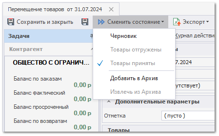

Рассмотрим процесс создания документа **Перемещение товаров** на основании документа **Приходная накладная**. Для создания документа выполните следующие действия:

**»** В **Главном меню** выберите раздел **Склад и закупки ► Приходные накладные** (сочетание клавиш Ctrl+Alt+P). Отобразится список документов приходных накладных;

**»** Создайте документ перемещения с помощью следующих пунктов команды **Создать на основании:**

- **Перемещение** - позволяет создать одноименный документ, в котором **Новый склад/Место** **хранения** необходимо указать самостоятельно;

- **Перемещение товаров по торговым точкам** позволяет создать перемещение товаров по Складам/ТТ. При этом на каждый **Новый склад/Место хранения** будет создан отдельный документ **Перемещение**:

   - Если для позиции **Приходной накладной** в родительских документах есть **Заказ клиента** или **Наш заказ на склад**, то **Новый склад/Место хранения** будет взят из них (поле **Место выдачи** для заказа клиента и **Торговая точка** для **Нашего заказа**);

   - Если же в родительских документах есть только **Заказ поставщику**, то **Новый склад/Место хранения** будет взят из поля **Склад назначения заказа**.

- **Перемещение на места хранения по умолчанию** позволяет создать документ **Перемещение**, в котором **Новый склад/Место хранения** возьмется из поля **Место хранения по умолчанию** карточки товара для данного склада. В новый документ перемещение попадут только те позиции, для которых в карточке товара для текущего склада задано **Место хранения по умолчанию**;

- **Перемещение по местам комплектации клиентов** позволяет создать документ **Перемещение**, в котором **Новый склад/Место хранения** возьмется из поля **Место комплектации** карточки клиента. В новый документ перемещение попадут только те позиции, которые привезены для клиентов и если в карточке клиента задано **Место комплектации**;

::: note Замечание

Команда работает только для проведенных документов. Возможно создание перемещений сразу для нескольких выделенных **Приходных накладных**, при этом на каждую **Нашу фирму**+**Торговую точку – автора** будет создан свой документ **Перемещение**.

:::

**»** Заполните обязательные параметры **Дата**, **Наша фирма** и **Номер**. Остальные параметры заполняются по необходимости.

::: note Замечание

При создании документа параметры **Дата**, **Наша фирма** заполняются автоматически на основании даты создании документа и **Фирмы,** указанной на **Панели активных НФ/ТТ/Склад** находящейся в верхней части окна программы. **Номер** заполняется автоматически при проведении документа, либо ручным вводом в состоянии документа **Черновик**.

:::

**»** Для товаров укажите **Новый склад/Место хранения**, если он не был установлен автоматически. Его можно указать** двумя способами:

- Указать в ячейках позиции в колонке **Новый склад/Место хранения**;

- С помощью команды **Заполнить место хранения**.

::: note Замечание

Значение **Старый склад/Место хранения** у всех позиции при этом заполнится автоматически на основании **Склад** указанного в документе **Приходная накладная**.

:::

**»** Для вступления документа в силу, выполните команду **Сменить состояние ► Товары приняты** на панели инструментов документа. 

::: note Замечание

Если транзитный склад не задан, то документ из состояния **Черновик** можно перевести только в состояние **Товары приняты**. Если же транзитный склад указан, то появляется возможность сначала перевести **Перемещение** в состояние **Товары отгружены**, а уже затем в **Товары приняты**.

:::

