**Мастер заказов на склад** (МЗМО) позволяет сформировать документ **Наш заказ** **на склад** для пополнения остатков на складах. Вызов мастера осуществляется с помощью команды **Открыть мастер заказов на склад**, из:

- справочника **Товары** по выделенным позициям, либо по **Группе товара**;

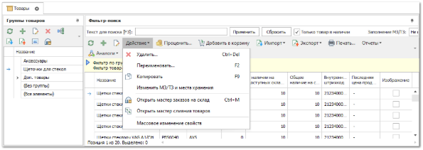

- справочника **Прайс-листы наличия** для **Гибкой** СЦО;

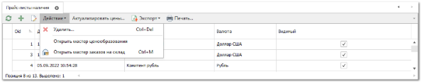

- справочника **Склады/Торговые точки**.

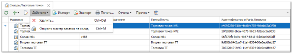

Мастер оперирует значениями **Минимальный заказ/Точка заказа** у товаров, остатками и уже заказанным количеством (товары заказаны у поставщика) по каждому товару в рамках анализируемого склада. Для формирования заказа на недостающий товар на складе с помощью **Мастера заказов** **на склад** необходимо:

**»** Запустить **Мастер заказов на склад** из необходимого раздела.

**»** Программа отобразит перечень позиций, сгруппированных по коду/производителю. Данные в колонки табличной части заносятся по мере выполнения основных шагов, расположенных на панели инструментов мастера.

**»** Перед тем как выполнить основные шаги в левой части окна установите необходимые настройки и параметры для работы мастера:

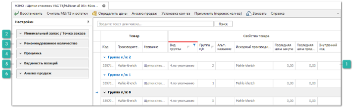

 **Табличная часть** 

Табличная часть содержит блок колонок **Товар** со следующими данными, которые заполняются уже при запуске мастера:

- **Вид группы** – отображает включенные в настройках мастера **Виды групп** позиций после выполнения шага **Определить цены**,

- **Группа п/п** – номер группы позиции по порядку.

- **Группа товара** – группа товара по справочнику.

- **Код и Внутренний код, Производитель, Исходный производитель, Название и Альтернативное название** – данные о товаре из справочника.

- **Количество дней с последней продажи** – количество дней с последней продажи товара (учитывая все склады и наши фирмы). Колонка заполняется после **Определения цен** на позиции.

- **Последняя цена закупа** – цена закупа на товар из последнего прихода (учитывая все склады и наши фирмы). Колонка заполняется после **Определения цен** на позиции.

- **Последняя цена продажи** – цена продажи из последней отгрузки товара (учитывая все склады и наши фирмы). Колонка заполняется после **Определения цен** на позиции.

 **Минимальный запас/Точка заказа**

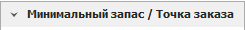

Блок содержит настройки:

- **Анализируемый склад** **–** склад, для которого считывается текущее наличие товара и значения Минимальные остатки/Точка заказа из карточек товара.

- **Расчет МЗ-ТЗ** – определяет способ расчета минимального запаса и точки заказа товара:

    - **Автоматически** – значение минимального запаса и точки заказа будет рассчитываться на основании продаж товара автоматически.

    - **Из карточки товара** – значение минимального запаса и точки заказа будет наследоваться из карточки товара, с вкладки **Минимальные остатки и места хранения**.

При выборе пункта **Автоматически** в **Расчет МЗ-ТЗ** доступен ряд настроек, влияющих на результаты расчетов:

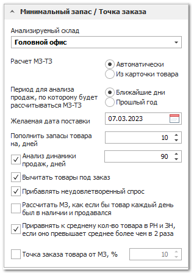

- **Период для анализа продаж, по которому будет рассчитываться МЗ-ТЗ** – позволяет рассчитать количество товара к заказу, анализируя данные за выбранный период:

    - **Ближайшие дни** – для анализа используется прошедший период, сформированный от даты, предшествующей текущей (дата вчерашнего дня) по продолжительности равный значению настройки **Пополнить запасы товара на, дней**;

    ::: note Пример

    Текущая дата – 31.12.2020.

    Пополнить запасы товара на, дней = 10.

    Период для анализа – 21.12.2020-30.12.2020.

    :::

    - **Прошлый год** – для анализа используется период предыдущего года, равный по датам периоду, начиная с Желаемая дата поставки (только день и месяц, год используется предыдущий) и продолжительностью значения настройки **Пополнить запасы товара на, дней**;

    ::: note Пример

    Желаемая дата поставки – 07.01.2021.Пополнить запасы товара на, дней = 10.Период для анализа – 07.01.2020-16.01.2020.

    :::

- **Желаемая дата поставки** – дата, с которой начинается период, заданный в настройке **Пополнить запасы товара на, дней**, соответствует дате, с которой планируется начало продаж товара;

- **Пополнить запасы товара на, дней** – период времени, для которого будет рассчитано среднее количество продаж за анализируемый промежуток времени, соответствует количеству дней, в течение которого планируется продавать товар со склада (с даты, заданной настройкой Желаемая дата поставки) до следующей поставки;

::: info Примечание

Устанавливается значение от 1 до 365 дней.

:::

- **Анализ динамики продаж, дней** – период вычисления коэффициента динамики продаж, помогает определить динамику роста, либо падения продаж в будущем. При использовании настройки среднее количество продаж за период будет умножаться на значение настройки **Пополнить запасы товара на, дней** и на коэффициент динамики продаж. Количество дней, заданное в настройке, определит продолжительность периода для анализа данных;

::: info Примечание

Устанавливается значение от 1 до 365 дней.

:::

::: info Примечание

**Коэффициент динамики продаж** – отношение количества продаж за текущий период, указанный в настройке **Пополнить запасы товара на, дней** к предыдущему. Значение коэффициента не может быть меньше **0.5** и больше **2**.

:::

- **Период для анализа продаж, по которому будет рассчитываться МЗ-ТЗ** – влияет на способ расчета динамики продаж:

    - **Ближайшие дни** – для анализа используется два прошедших периода. Первый период (текущий) формируется от даты, предшествующей текущей (дата вчерашнего дня) по продолжительности равный значению настройки **Анализ динамики продаж, дней**. Второй период (предыдущий) формируется от даты, предшествующей дате начала первого периода по продолжительности равный значению настройки **Анализ динамики продаж, дней**.

    ::: note Пример

    Текущая дата – 31.12.2020.
    
    Анализ динамики продаж, дней – 90.
    
    Текущий период для анализа – 02.10.2020-30.12.2020.
    
    Предыдущий период для анализа – 04.07.2020-01.10.2020.

    :::

    - **Прошлый год** – для анализа используется два прошедших периода (промежуток времени в этом и прошлом году). Первый период (текущий) формируется от даты, предшествующей текущей (дата вчерашнего дня) по продолжительности равный значению настройки **Анализ динамики продаж, дней**. Второй период (предыдущий) формируется от даты, предшествующей текущей, но в прошлом году, по продолжительности равный значению настройки **Анализ динамики продаж, дней**.

    ::: note Пример

    Текущая дата – 31.12.2020.
    
    Анализ динамики продаж, дней – 90.
    
    Текущий период для анализа – 02.10.2020-30.12.2020.
    
    Предыдущий период для анализа – 02.10.2019-30.12.2019.

    :::

- **Вычитать товары под заказ** – определяет, будут ли учитываться продажи заказных товаров при подсчете среднего количества продаж. При активации настройки позволяет минимизировать товарные запасы, вычитая из количества проданного товара количество, привезенное под заказ покупателя;

- **Прибавлять неудовлетворенный спрос** – определяет, будет ли учитываться неудовлетворенный спрос клиентов при подсчете среднего количества продаж. При активации настройки позволяет восполнить неудовлетворенный покупательский спрос. Прибавляет к количеству проданного, товары, добавленные менеджером в неудовлетворенный спрос (формируется в проценке вручную);

- **Рассчитать МЗ, как если бы товар каждый день был в наличии и продавался** – при расчетах из заданного периода исключаются те дни, когда товар не продавался по причине отсутствия на складе. Настройка рассчитает продажи, как если бы товар каждый день периода был на складе и продавался бы с такой же периодичностью, как продавался фактически. За счет этого происходит повышение среднего уровня продаж за период;

::: info Примечание

Единовременно может использоваться только одна из настроек **Прибавлять неудовлетворенный спрос** или **Рассчитать МЗ, как если бы товар каждый день был в наличии и продавался**.

:::

- **Приравнять к среднему кол-во товара в РН, если он превышает среднее более чем в 2 раза** – позволяет повысить точность расчетов при использовании настройки **Рассчитать МЗ, как если бы товар каждый день был в наличии** **и продавался**. Если за выбранный период есть расходные накладные и заказ-наряды, в которых количество проданных единиц товара превышает среднее значение за год более чем в 2 раза, то для них при расчетах количество будет уменьшено до среднего значения за год;

- **Точка заказа товара от МЗ, %** – позволяет осуществить автоматический расчет значения **Точка заказа** как заданный процент от значения **Минимальный запас** с округлением до целого в большую сторону;

При выборе пункта **Из карточки товара** в **Расчет МЗ-ТЗ**  доступен ряд настроек:

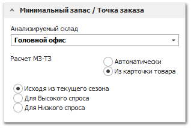

- **Исходя из текущего сезона** – значение минимального запаса и точки заказа будет наследоваться из группы колонок **Высокий спрос** либо **Низкий спрос**. Группа колонок определяется на основании того, к какой группе месяцев высокого/низкого спроса на вкладке **Сезонность товара** относится текущий месяц.

- **Для Высокого спроса** – значение минимального запаса и точки заказа будет наследоваться из группы колонок **Высокий спрос**;

- **Для Низкого спроса** – значение минимального запаса и точки заказа будет наследоваться из группы колонок **Низкий спрос**.

 **Рекомендованное количество**

Блок содержит опции:

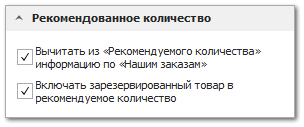

- **Вычитать из** "**Рекомендуемого количества**" **информацию по** "**Нашим заказам**" **–** при включенной опции, из рекомендуемого для заказа количества будет исключено количество товара, которое уже присутствует в проведенных документах **Наш заказ на склад**.

- **Включать зарезервированный товар в** "**Рекомендуемое количество**" **–** рекомендуемое количество вычисляется от всего наличия товара (свободного и в резерве). Если опция выключена, то рекомендуемое количество товара отталкивается только от свободного наличия товара.

 **Проценка**

Блок содержит опции, позволяющие указать особенности определения цен на требуемые к заказу позиции:

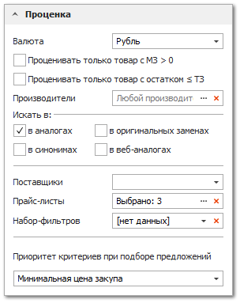

- **Валюта** – валюта в которой будут подбираться цены на позиции;

- **Проценивать только товар с МЗ>0** – фильтр позиций с незаполненными в карточке товара или колонке **Автоматический МЗ-ТЗ** минимальным запасом для выбранного склада;

- **Проценивать только товар ≤ ТЗ** – позволяет определить цены только на те позиции, остатки по которым меньше либо равны **Точке заказа** в карточке товара или колонке **Автоматический МЗ-ТЗ**;

- **Производители** – определяет перечень производителей, позиции которых будут процениваться;

- **Искать в: аналогах, синонимах, оригинальных заменах, веб-аналогах** – установите флаги напротив необходимых источников поиска предложений;

- **Поставщики** – определяет перечень поставщиков предложения, от которых (поставщик будет указан в маркетинге) будут использоваться в мастере;

- **Прайс-листы**– при необходимости, укажите перечень прайс-листов, ограничивающий область поиска предложений;

- **Набор фильтров** – позволяет задать набор фильтров для проценки;

- **Приоритет критериев при подборе предложений** – определяет порядок приоритетов при подборе предложений поставщиков: цены закупа, сроков поставки и остатков.

В **Приоритете критериев при подборе предложений** указывается порядок важности критериев цены/срок/наличиепри подборе предложений. Программа каждому предложению поставщика устанавливает вес, учитывая эти критерии. А затем сортирует от лучшего предложения к худшему (по убыванию веса). Алгоритм расчета веса:

- **Цена**. Разница между минимальной и максимальной ценой разбивается на 10 отрезков. Отрезок с минимальной ценой имеет вес 9, с максимальной – 0. Остальные предложения располагаются в промежутке от 0 до 9 в зависимости от того, в какой отрезок попала цена;

- **Срок**:

    - 0 дней имеет вес 5;

    - 1 день имеет вес 4;

    - До 2-7 дней включительно имеет вес 3;

    - До 14 дней включительно имеет вес 2;

    - Более 14 дней либо срок не задан/не распознан имеет вес 1.

- **Наличие**:

    - Наличие у поставщика число и его недостаточно для планируемого количества – вес 0;

    - Наличие у поставщика не задан или задан в нечисловом виде – вес 1;

    - Наличие у поставщика число и его достаточно для планируемого количества – вес 2.

Затем программа в соответствии с выбранным порядком важности критериев формирует вес. Например, порядок Цена/Срок/Остаток и цена имеет вес 7, срок 4, остаток 1: значит итоговый вес позиции 741. И так по каждому предложению на товар.

::: info Примечание

При выборе в критерии **Приоритет критериев при подборе предложений** варианта **Минимальная цена закупа** отбор наилучшего предложения происходит по цене закупа товара. И лишь при равенстве цен нескольких предложений происходит дальнейшее сравнение по сроку и наличию.

:::

 **Видимость позиций**

Блок содержит опции:

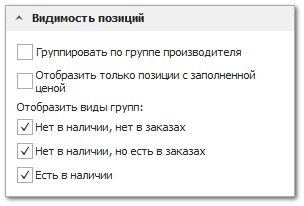

- **Группировать по группе производителя** – объединяет позиции в группы по производителю детали;

- **Отобразить только позиции с заполненной ценой** – будут скрыты позиции с незаполненной **Ценой закупа**;

- **Отобразить виды групп** – позволяет отрегулировать отображения товаров по группам исходя из:

    - Нет в наличии, нет в заказах;

    - Нет в наличии, но есть в заказах;

    - Есть в наличии.

 **Анализ продаж**

Блок **Анализ продаж** служит для настройки анализа объемов продаж, распределенных во времени. На основе заданных настроек формируется два дополнительных блока колонок в позициях мастера: **Продажи** с отдельными колонками по каждому периоду **Временной группировки** анализируемого **Периода**, и **Общие итоги** сколько **Всего продано** товара.

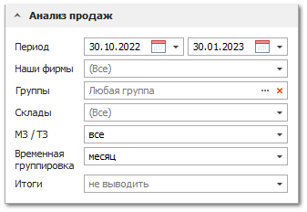

Рассмотрим каждую настройку для анализа отдельно:

- **Период** – интервал дат за который будут анализироваться продажи (отгрузки, заказ-наряды) товара. Данные значения сохраняются для каждого пользователя;

- **Наши фирмы** – определяет перечень фирм, по которым будут отбираться документы для анализа;

- **Группы** – группы товара по позициям, которых будет производится анализ;

- **Склады** – склады продажи;

- **МЗ/ТЗ** – фильтрация товаров по значениям минимального запаса/точке заказа. При значении **Все** при запуске анализа будет выполнен автоматический расчет МЗ-ТЗ, если он установлен в настройке **Расчет МЗ-ТЗ**;

- **Временная группировка** – период, по которому будут сгруппированы данные анализа для блока колонок **Продажи**;

- **Итоги** – дополнительная группировка для блока **Общие итоги**.

**»** После установки необходимых настроек перейдем к панели инструментов мастера и выполним основные шаги: 

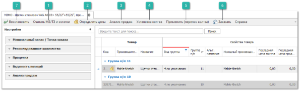

 **Считать МЗ/ТЗ и остатки**

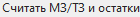

**»** Нажать кнопку **Считать МЗ/ТЗ и остатки** чтобы вычислить значения для блока колонок **Минимальный заказ** – **Точка заказа** по каждой позиции анализируемого склада:

Колонки **Высокий спрос** и **Низкий спрос** отображают через тире значения МЗ-ТЗ из карточки товара для анализируемого склада.

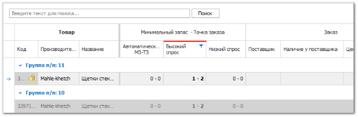

 **Определить цены**

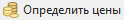

**»** Нажмите кнопку **Определить цены** для подбора предложений на позиции. Программа выполнит проценку позиций по прайс-листам от поставщиков в соответствии с установленными настройками в блоке **Проценка** и фильтрами (см. выше) и подберет **Цены закупа** и **Цены продаж**. Предложения по позициям и их аналогам, с учетом видов групп и группировкой по коду/производителю отобразятся в табличной части.

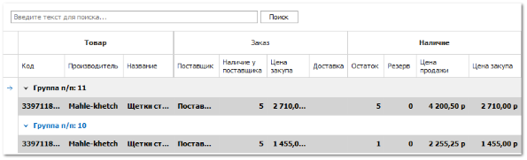

::: info Примечание

Исходные позиции будут выделены жирным шрифтом.

:::

::: warning Внимание!

При **определении цен** значения **Минимального запаса** и **Точки заказа** будут рассчитаны заново, если выбран автоматический расчет.

:::

::: info Примечание

Позиции, по которым не было подобрано цен или отфильтрованные предложения, не попадут в документ **Наш заказ на склад**.

:::

::: info Примечание

Использование веб-проценки для определения цен на позиции в **Мастере заказов на склад** активируется опцией **Возможность использования веб-проценки в МЗМО** в разделе меню **Управление ► Настройки программы ► Настройки**, группа **Склад и закупки ► Закупки**.Подключение веб-проценки производится через отдел продаж компании "Tradesoft".

:::

 **Анализ продаж**

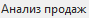

**»** При нажатии кнопки **Анализ продаж** табличная часть мастера дополняется секцией **Продажи** и **Общие итоги** с объемами продаж по каждой позиции, как суммарными, так и в динамике за указанные интервалы времени в блоке настроек **Анализ продаж**. На основании этой информации пользователь может принять решение об изменении значения минимального запаса/точки заказа в большую или меньшую сторону, прекратить поддерживать запас какого-либо товара в пользу его аналога и т.д..

 **Установка количества**

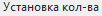

**»** Следующим обязательным шагом в работе мастера является команда **Установка количества**, при выполнении которой заполняется колонка **Рекомендуемое количество** в блоке **Количество товара для заказа**. На данном этапе вычисляется рекомендуемое количество: из минимального запаса вычитается количество товара в наличии, а также вычитается количество товара, который находится в **Заказах поставщику** не под клиентов и в **Наших заказах**. Если получившееся значение меньше нуля, оно сбрасывается в ноль (т.е. данный товар заказывать не требуется). При необходимости, можно произвести корректировку значений по заказываемому количеству.

 **Применить (перенос количества)**

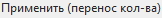

**»** После установки **Рекомендуемого количества** нажмите кнопку **Применить (перенос кол-ва) ** для переноса значения количества в колонку **Заказать**.

 **Заказать** 

Команда позволяет создать документ **Наш заказ на склад** для позиций со значением в колонке **Заказать** больше нуля. На основании данного документа в последствии можно сформировать заказы поставщикам.

 **Восстановить**

Команда позволяет вернуться к исходному состоянию мастера на момент загрузки в него позиций.

Рассмотрим колонки табличной части, которые теперь заполнены:

- Блок колонок **Наличие**:

    - **Остаток** – текущий остаток на анализируемом складе;

    - **Резерв** – количество товара в резерве на анализируемом складе;

    - **Остаток на других складах** – остаток товара на других складах, отличных от анализируемого, в том числе недоступных;

    - **Общее наличие** – общее наличие товара на всех складах, в том числе недоступных пользователю;

    - **Цена продажи** – подобранная цена продажи на позицию;

    - **Цена закупа** – подобранная закупочная цена на позицию.

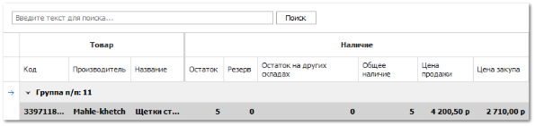

- Блок колонок **Уже заказано на анализируемый склад**:

    - **В Наших заказах** – общее количество товара в проведенных Наших заказах на анализируемый склад;

    - **В Заказах поставщикам** – общее количество товара, заказанное у поставщиков на анализируемый склад.

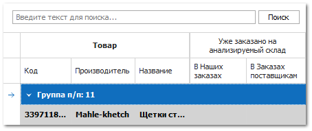

- Блок колонок **Уже заказано на другие склады**:

    - **В наших заказах на другие склады** – заказанный товар на склады, отличные от анализируемого;

    - **В Заказах поставщикам на другие склады** – заказанный товар у поставщиков на склады, отличные от анализируемого.

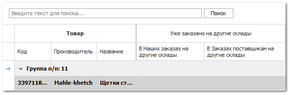

- Блок колонок **Заказ**:

    - **Поставщик** – наименование поставщика от которого было найдено предложение;

    - **Направление (склад)** – направление от поставщика (если известно);

    - **Наличие у поставщика** – количество товара в прайс-листе поставщика;

    - **Внутренний код поставщика** – внутренний код товара из прайс-листа поставщика;

    - **Цена закупа** – закупочная цена от поставщика;

    - **Доставка** – срок доставки в днях из маркетинга;	

    - **Примечания** – поле может быть заполнено вручную;

    - **Валюта** – валюта прайс-листа поставщика.

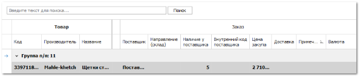

::: info Примечание

Найденные позиции сортируются в порядке возрастания **Цены закупа**. Позиции без цены попадают в конец списка.

:::

- Блок колонок **Кол-во товара для заказа**:

    - **Рекомендуемое количество** – количество, которое высчитывается после выполнения шага **Установка кол-ва**;

    - **Кратность от поставщика** – коэффициент, согласно которому выбирается количество для заказа от поставщика;

    - **Не соответствует кратности от поставщика** – отметка о несоответствии кратности поставщика;

    - **Заказать** – количество, которое устанавливается после выполнения шага **Применить (перенос кол-ва)**;

    - **Сумма заказа** – сумма исходя из цены закупа и количества в колонке **Заказать**.

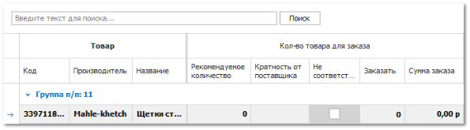

- Блок **Общие итоги** содержит колонку **Всего продаж** по позиции за заданный **Период** на всех складах.

- Блок **Продажи** содержит итоги продаж по товару, сгруппированные в зависимости от заданных настроек **Временная группировка** и **Итоги** в блоке **Анализ продаж**.

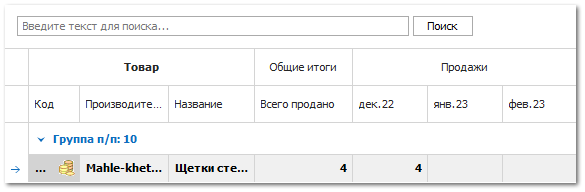