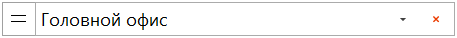

Для добавления информации о фактическом количестве при помощи формы **Ввода** необходимо:

**Настройка действий, вызываемых после ввода**

**»** Установить **Настройки действий, вызываемых после ввода**, нажатием кнопку настроек, откроется панель со следующими настройками:

- Блок **Режим ввода**:

    - **поштучный** – при вводе фактическое количество найденного товара в документе будет увеличено на единицу, при этом поле **Поиск товара** будет очищено для поиска следующего товара;

    - **запрос количества** – при вводе в поле **Общее количество товара** пользователю необходимо вручную ввести фактическое количество и нажать кнопку **Ввод** (Enter) для переноса информации в документ.

::: note Замечание

Горячая клавиша F9 переключает **Режим ввода** "по кругу".

:::

- Блок **Данные на форме**:

    - **Очищать** – очищаются данные на форме после клика на кнопку **Ввод**;

    - **Не очищать** – после клика на кнопку **Ввод** очищается только поле для ввода кода товара.

**Выбор места хранения**

**»** В поле **Выбор места хранения** указать склад/ТТ/МХ для поиска товара, а также выбрать стратегию поиска товара на местах хранения:

-  – режим подбора строго на выбранном МХ;

-  – режим подбора на выбранном МХ и вложенных в него. В данном режиме доступен выбор конкретного МХ товара в поле **Место хранения товара**.

**Поиск товара**

**»** В поле **Поиск товара** ввести информацию по позиции. Поиск для ввода товара можно вести по коду детали, внутреннему штрихкоду или штрихкоду производителя, которые указаны в карточке товара, а также системному штрихкоду. Поиск ведется по текущему документу и справочнику **Товары**.

::: info Примечание

Если товар не найден на выбранном месте хранения, но найден в справочнике **Товары**, выведется окно с действиями для добавления товара на форму **Ввода** либо для добавления нового товара в справочник.

Если товар не найден ни на выбранном месте хранения, ни в справочнике **Товары**, выведется окно с действиями для перехода к новому поиску либо для добавления товара в справочник.

:::

