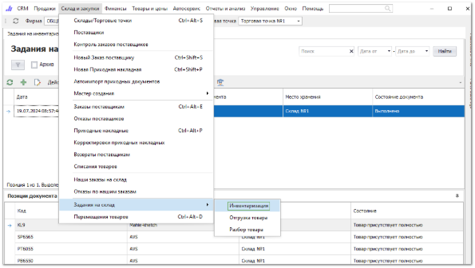
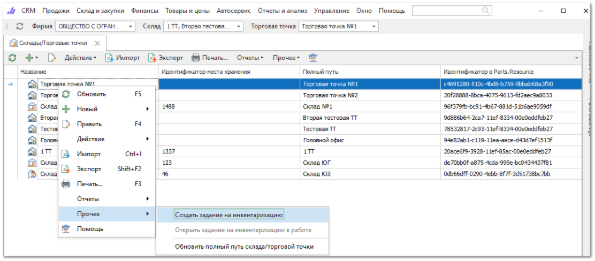
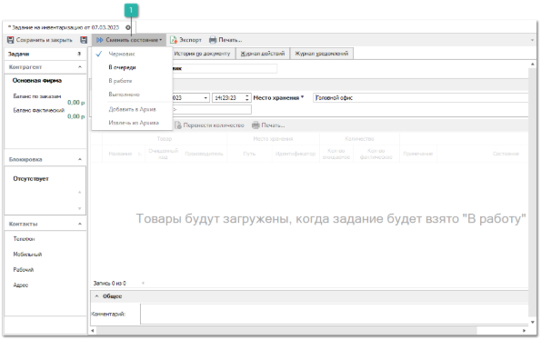
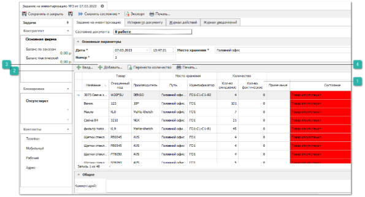
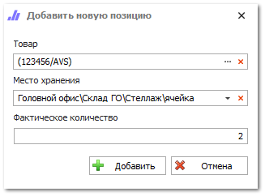

Документ **Задание на инвентаризацию** служит для проведения и фиксации результатов инвентаризации на складе. В результате выполнения задания программа автоматически создает документ расхода/прихода/перемещения для корректировки фактического наличия товара на складе.

Возможные источники создания документа:

- создать новое задание в меню **Склад и закупки ► Задания на склад ► Инвентаризация**;

- выполнить команду **Создать задание на инвентаризацию** (пункт **Прочее**) в разделе **Склад и закупки ► Склады/Торговые точки**. Откроется окно инспектора для создания задания.

**»** Откройте окно инспектора для создания документа.

**Сменить состояние**

**»** Произведите перевод документа из состояния **Черновик** в состояние **В очереди**, а затем в состояние **В работе**.

Состояния:

- **Черновик**. Это состояние присваивается при создании и первом сохранении документа. В данном состоянии доступен выбор **Места хранения** для проведения инвентаризации;

- **В** **очереди**. Это состояние служит для передачи задания на склад. В этом состоянии отсутствует возможность изменять документ;

- **В работе**. В момент присвоения состояния программа считывает остатки по выбранному МХ и вложенным в него и товары появляются в документе. Параллельно с этим склад/ТТ/МХ, указанные в шапке задания, помечается как "*на инвентаризации*". Тем самым до окончания инвентаризации блокируются любые операции, перемещающие товар на/с выбранного МХ (расход, приход, возвраты, перемещения). Инвентаризация товара сводится к вводу информации о найденных на складе товарах;

::: info Примечание

При переводе документа из состояния **В работе** в состояние **Черновик** вся ранее заполненная информация сохраняется в документе, для предотвращения потери данных.При необходимости начать инвентаризацию заново, нужно создать новый документ.

:::

- **Выполнено**. Перевод в это состояние означает, что инвентаризация по заданию завершена, создаются документы **Расходная накладная** на не найденный товар, **Приходная накладная** на излишки товара и **Перемещение** для фиксации товара на новом МХ.

**»** После перевода задания в состояние **В работе**, в нем необходимо указать фактическое количество товара на каждом МХ.

**Кол-во фактическое**

Колонка позволяет вручную указать фактическое количество, путем редактирование значений в ячейках позиций.

**Ввод**

Позволяет открыть форму **Ввода**, для указания фактического количества позиций.

**Добавить**

Позволяет добавить новую позицию в задание на инвентаризацию. В окне **Добавить новую** заполняется информация о найденном товаре, его месте хранения и фактическом количестве.

**Перенести количество**

Позволяет установить для выбранных позиций, в колонке **Кол-во фактическое**, значения равные значениям колонки **Кол-во ожидаемое**.

**»** По завершению инвентаризации задание переводится в состояние **Выполнено**. Тем самым запускается механизм анализа и создания корректирующих документов:

- Товары, потерянные на одних МХ и найденные на других, попадают в документ **Перемещение**. Причем перемещается оттуда, где не найден товар в МХ, туда где он был найден;

::: info Примечание

Документ **Перемещение** создаться при условии, что товар был оприходован **Нашей фирмой**, которая используется в документе **Задание на инвентаризацию**.

В случае, если был найден товар, оприходованный другой Нашей фирмой, создастся **Расходная накладная** с этой фирмы и **Приходная накладная** на фирму из задания.

:::

- Товары, полностью утерянные на выбранном складе/ТТ/МХ в шапке задания, попадают в **Списание товаров**. Документ открывается в инспекторе для редактирования (указывается контрагент, на которого списывают товары);

- Товары, найденные на выбранном складе/ТТ/МХ в шапке задания, попадают в **Приходную накладную**. Документ открывается в инспекторе для редактирования (указывается контрагент, от которого приходуются товары).

