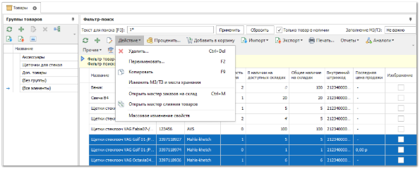
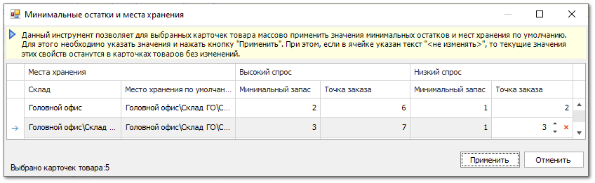

Для изменения значений минимальных остатков и мест хранения сразу для нескольких карточек товаров на панели инструментов справочника **Товары** доступна команда **Массовое редактирование**.

**»** Для этого необходимо в справочнике **Товары** выделить несколько карточек товаров и вызвать на панели команду **Изменить МЗ/ТЗ и места хранения** пункт **Действие**. 

**»** Откроется окно для изменения значений для выделенных записей. В открывшемся диалоговом окне для каждого доступного склада можно указать новые места хранения товаров по умолчанию и значения **Минимально запаса** и **Точки заказа** или оставить имеющиеся данные без изменений. Для применения изменений необходимо нажать на кнопку **Применить**. После завершения операции все указанные значения сохранятся в карточках товаров и отобразятся на вкладке **Минимальные остатки и места хранения**.

Формирование **Нашего заказа** на основании введенных данных о минимальных остатках с использованием **Мастера заказа по минимальным остаткам** описано в разделе **Формирование заказов с использованием Мастера заказов на склад**.

