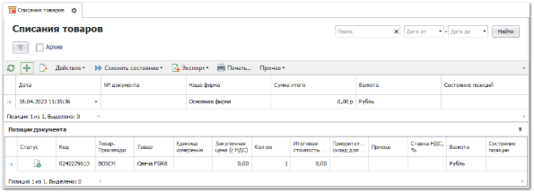
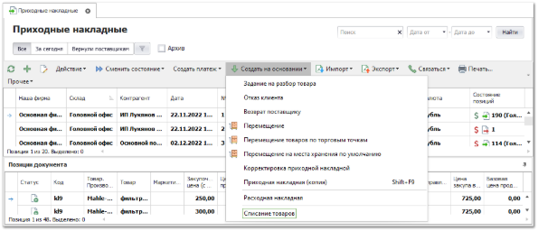
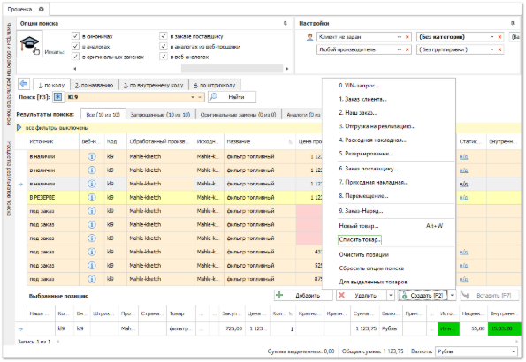
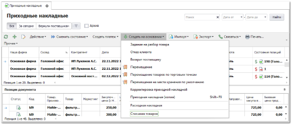
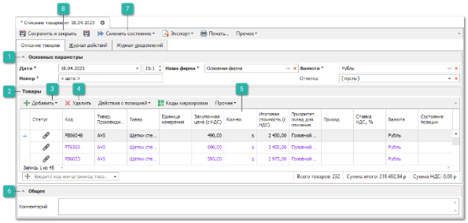
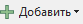
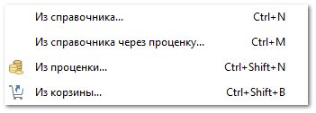
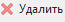
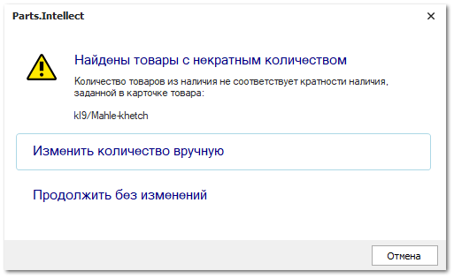
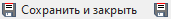

Документ **Списание товаров** позволяет списать неучтенный, потерянный или бракованный товар. Списанные товары не влияют на статистику продаж. Документ можно создать следующими способами:

- В разделе **Склад и закупки ► Списания товаров** нажатием на команду **Новый** на панели команд;

- На основании документов **Приходная накладная**, **Отказ клиента**, **Возврат от клиента** и **Корректировка расходных накладных** нажатием на команду **Создать на основании ► Списания товаров**. Созданный документ содержит товары из документа-основания;

- Из проценки по нажатию на команду **Создать**.** 

Рассмотрим создание списания на основании документа **Приходная накладная**. Для создания документа **Списание товаров** выполните следующие действия:

**»** В **Главном меню** выберите раздел **Склад и закупки ► Приходные накладные** отобразятся элементы выбранного пункта.

**»** Выберите документ **Приходная накладная**, на основании которого будет создано **Списание товаров**.

**»** На панели управления выполните команду **Создать на основании ► Списание товаров**. Откроется инспектор создания документа **Списание товаров**.

**»** В открывшемся инспекторе в блоке **Основные параметры** при необходимости заполните/отредактируйте поля:

 **Основные параметры** 

Блок содержит параметры:

- **Дата** – дата и время создания документа;

- **Номер** – порядковый номер документа (доступен ручной ввод). Формат и счетчик для формирования номера документа определяется правилом в разделе меню **Управление ► Справочники ► Счетчики номеров документов**;

- **Наша фирма** – наша фирма, от которой будет осуществляться списание товара;

::: warning Внимание!

Стоит учесть значение настройки **Контролировать движение товара по нашей фирме** в разделе меню **Управление ► Настройки программы ► Наши фирмы**, при активации которой запрещается списание товара по документу **Списание товаров**, если он оформлен на **Нашу фирму**, отличную от той, которая в приходе.

:::

- **Валюта** – валюта цен в документе. Если изменить валюту документа, программа предложит сконвертировать цены на позиции к валюте документа по текущему курсу для валют;

- **Отметка** – выберите отметку для документа из справочника.

 **Товары**

Блок содержит список товаров добавленных в документ.

::: info Примечание

Данные по позиции заполняются автоматически на основе информации из родительского документа, из которого происходило добавление. При необходимости, заполните/измените данные по позиции.

:::

 **Добавить**

Позволяет дополнительно добавить товары в списание товаров. Доступны следующие источники позиций:

- **Из справочника** – позиция будет добавлена в документ без цен из справочника **Товары**;

- **Из справочника через проценку** – позицию можно будет выбрать вначале в справочнике товаров, а затем она будет передана в **Проценку** для подбора предложений;

- **Из проценки** – программа откроет окно **Проценки** для подбора позиций в документ;

- **Из корзины** – позиции будут добавлены из корзины.

 **Удалить**

Позволяет удалить выбранные позиции из документа.

 **Количество**

Позволяет изменить количество списываемых товаров.

 **Общее**

Блок содержит поле **Комментарий** для указания примечания.

 **Сменить состояние**

Позволяет осуществить проводку документа или отменить ее, в случае необходимости.  А так же добавить документ в архив или извлечь его из архива.

::: info Примечание

Если количество товаров в документе **Списание товаров** превышает количество товаров, доступных к списанию, то проведение документа **Списание товаров** блокируется. В этом случае появляется окно с сообщением о нехватке товаров для списания.Если позиция товаров была оприходована несколькими приходными документами, то при проведении документа **Списание товаров** такая позиция будет поделена по приходам.

:::

 **Сохранить и закрыть/Сохранить**

Позволяет сохранить и закрыть/сохранить документ **Списание товаров** без проводки.

**»** В табличной части на вкладке **Товары** выберите необходимые для списания товары, используя команды **Добавить** и **Удалить**, либо скорректировав значение в колонке **Кол-во**

**»** При необходимости в блоке **Общее** заполните поле **Комментарий**.

**»** Чтобы документ **Списание товаров** вступил в силу, его необходимо провести. Для этого на панели действий выберите команду **Сменить состояние ► Провести**. Проведение документа **Списание товаров** ведет к уменьшению количества товаров на складе (поле **Общее наличие на складах**). Списание осуществляется с приоритетного склада.

**»** Для сохранения и закрытия документа на панели действий выберите команду **Сохранить и закрыть**.

