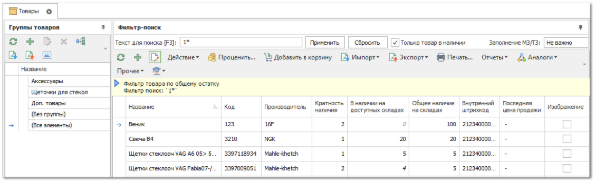
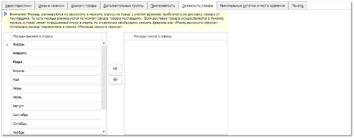
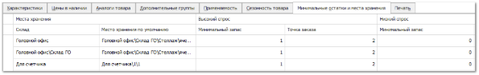

Для поддержания всегда актуального наличия товара на складе в программе можно установить значения минимальных запасов товара для конкретного склада/торговой точки/места хранения в зависимости от сезонности и спроса.

Минимальные запасы и точки заказа служат для того, чтобы автоматизировать заказ заканчивающихся товаров на складах с помощью **Мастера заказа по минимальным остаткам**. Значения **Минимального запаса** и **Точки заказа** заполняются в разрезе каждого склада для месяцев высокого и низкого спроса.

Определить календарные месяцы, которые относятся к сезону низкого или высокого спроса, а также установить значения **Минимального запаса** и **Точки заказа** можно для каждого товара индивидуально в карточке. Для этого необходимо:

**»** В **Главном меню** выберите раздел **Товары и цены ► Товары** отобразятся элементы выбранного пункта.

**»** Выберите в списке интересующий товар и откройте для редактирования двойным нажатием кнопки мыши на позицию либо выделив позицию и нажав кнопку **Править**. В карточке товара перейдите на вкладку **Сезонность товара** и распределите месяцы в соответствии с высоким и низким спросом на товар.

::: warning Внимание!

Месяцы ранжируются по высокому и низкому спросу на товар с учетом времени, требуемого на доставку от поставщика. То есть месяцы ранжируются на момент заказа поставщику. Если доставка товара осуществляется в течение месяца, а товар имеет повышенный спрос в марте, то в карточке товара необходимо указать февраль как "Месяц высокого спроса". Остальные месяцы переместить в список "Месяцев низкого спроса".

:::

**»** Для ввода значений **Минимально запаса** и **Точки заказа** перейдите на вкладку **Минимальные остатки и места хранения** на одноименной вкладке.

**»** Установите необходимые значения для разных **Мест хранения**:

- **Место хранения по умолчанию** – конкретно место на складе/тт для данного товара (используется для **Перемещения на места хранения по умолчанию**.

- **Минимальный запас** – минимальное количество товара на складе, которое требуется поддерживать.

- **Точка заказа** – минимальное значение количество товара на складе, при котором необходимо формировать заказ данного товара.

По умолчанию в **Мастере заказа по минимальным остаткам** рекомендуемое количество для заказа товара на склад будет высчитываться как число, равное значению минимального запаса минус текущее значение количества товара. 

Например:

::: note Пример

Если минимальный запас 100шт, точка заказа 33шт, а текущее состояние 32 (≤ точке заказа), то заказ будет формироваться на 100-32=68 единиц.

:::

**»** Для завершения редактирования и сохранения изменений нажмите кнопку **Сохранить и закрыть** (F2) на панели действий карточки товара.

