Документ **Задание на разбор товара** служит для автоматизации и учета результатов таких процессов, как:

- занесение информации по товару в документ, который ожидается к оприходованию;

- формирование очереди заданий по разбору грузов на складе;

- непосредственно разбор груза на складе с указанием количества и другой важной информации;

- использованию обработанных заданий для создания **Приходной накладной** с фактически пришедшим товаром;

- передачу информации о взвешивании и штрихкоде производителя в справочник **Товары**, используя команду **Передать в справочник**.

Возможные источники создания документа:

- **Создать на основании Приходной накладной**. Используется в случае, если обработку товара необходимо запустить после оформления документов;

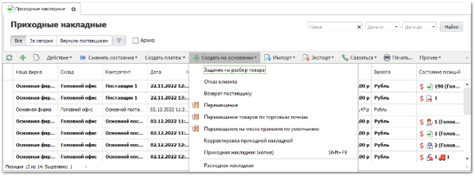

- Создать новое задание в разделе меню **Склад и закупки ► Задания на склад ► Разбор товара**. Такое задание имеет смысл в случае, если нет точного списка ожидаемых позиций по данному приходу и склад сам вносит, какого товара и сколько пришло;

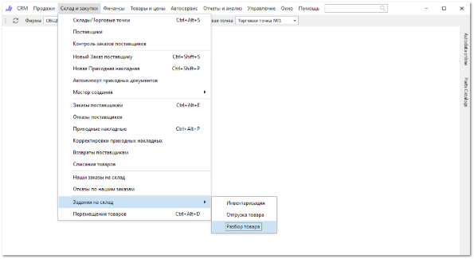

- Из **Мастера Приходной накладной**. Данный сценарий используется в случае, если необходимо передать на склад **Задание на разбор товара** с ожидаемыми программой позициями от поставщика. Команда **Создать** **► Задание на разбор товара** в **Мастере Приходной накладной**;

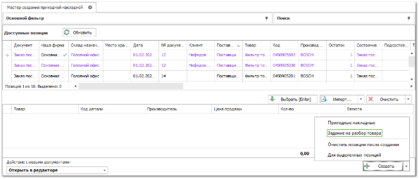

- Выполнить **Импорт из файла**. Если поставщик сразу после отгрузки товара шлет на почту файл с отгруженными позициями, то их можно загрузить непосредственно в самом документе задания через команду **Импорт** ► **Импорт** **с добавлением** или **Импорт с заменой** на панели действий табличной части и передать на склад для разбора;

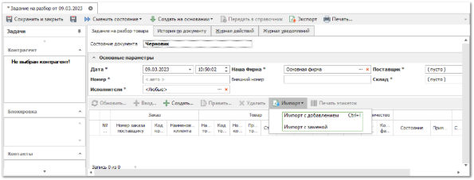

- **Создать на основании другого** **Задания на разбор товара***.* С помощью команды **Создать на основании** в списке заданий. В новый документ будут переданы позиции в состоянии **Товар не пришел** и **Товар пришел частично**, т.е. не оприходованный товар.

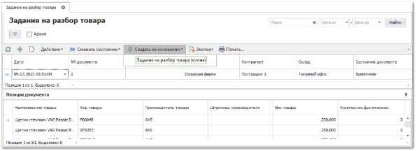

**»** Откройте документ **Задания на разбор товара**.

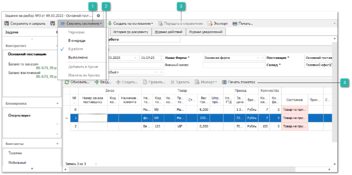

**Сменить состояние**

Для документа доступна возможность присваивать следующие состояния:

- **Черновик** – состояние присваивается при создании и первом сохранении документа. В нем доступна возможность полного редактирования документа, в том числе добавление нового товара по кнопке **Создать** на панели инструментов;

- **В очереди** – состояние служит для передачи задания на склад, формируя тем самым очередь на разбор для склада/ТТ. В этом состоянии отсутствует возможность изменять документ;

- **В работе** – состояние отражает то, что товар из задания в данный момент разбирается на складе. Ключевой особенностью задания в этом состоянии является возможность работы с документом одновременно нескольким пользователям. Разбор товара сводится к вводу информации о пришедших товарах на форме **Ввода**;

- **Выполнено** – перевод в это состояние означает, что разбор по заданию завершен, и выполненное задание можно использовать для создания **Приходной накладной**.

**Ввод**

Позволяет открыть форму **Ввода**, для указания фактического количества позиций.

**Передать в справочник**

Позволяет передать в справочник **Товары** информацию о **Все** и **Штрихкоде производителя**, которая указывается при приеме товара в окне **Ввода**.** Команда становится доступной после перевода документа в состояние **Выполнено**. После вызова команды необходимо указать свойства из позиций документа, которые необходимо передать в карточки товара справочника: вес и/или штрихкод производителя. Если у позиции документа не указан, например, вес, то вес в карточке товара останется в неизменном виде.

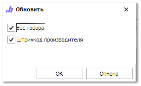

**Печать этикеток**

Для печати этикеток после разбора товара, необходимо воспользоваться командой **Печать этикеток** в инспекторе документа. Команда работает для выделенных позиций документа и оперирует фактическим количеством. Возможные стратегии печати:

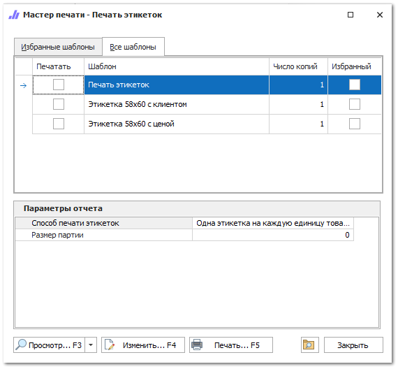

- **Одна этикетка на каждую единицу товара –** печатается одна этикетка на каждую единицу товара;

- **Одна этикетка на весь принимаемый товар** – позиции группируются по товару, количество складывается;

- **Пропорционально партии принимаемого товара** – печать осуществляется пропорционально партии, которая указывается в свойстве **Размер партии**;

- **Одна этикетка на товар под каждого контрагента** – позиция разбивается для каждого клиента, под которого пришел данный товар;

- **Способ печати из карточки товара** – в этом случае программа будет брать информацию о стратегии печати из карточки товара. Если товара нет в справочнике **Товары**, то будет использоваться стратегия **Одна этикетка на каждую единицу товара**.

Так же печать этикеток возможна при вводе товара.

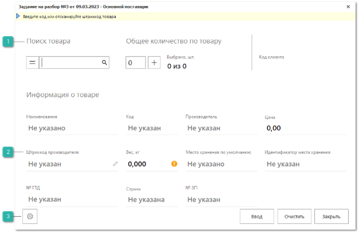

**Поиск товара**

Позволяет осуществить поиск товара в соответствии с выбранной стратегией:

- 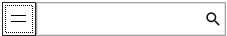 – используется преимущественно для поиска по коду товара или внутреннему штрихкоду;

- 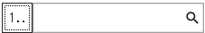 – используется преимущественно для поиска по штрихкоду производителя. Стратегия позволяет сканировать стикеры со штрихкодом, которые в начале содержат сам штрихкод товара, а затем служебную информацию (количество штук в упаковке и т.д.).

**Штрихкод производителя, Вес**

Поля доступные для редактирования, данная информация может быть передана в карточку товара, путем использования команды **Передать в справочник** на панели инструментов документа.

**Настройка действий, вызываемых после ввода**

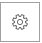

Позволяет открыть панель настроек которая содержит настройки для печати этикеток и действия с данными на форме:

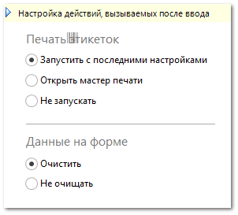

Доступные настройки для блока **Данный на форме**:

- **Очистить** – очищаются данные на форме после клика на кнопку **Ввод**;

- **Не очищать** – после клика на кнопку **Ввод** очищается только поле для ввода кода товара.

Доступные настройки для блока **Печать этикеток**:

- **Запустить с последними настройками** – программа отправит на печать последний выбранный шаблон с установленной стратегией печати;

- **Открыть мастер печати** – откроется мастер печати для выбора шаблона и стратегии печати;

- **Не печатать** – печать этикеток будет игнорироваться.

Товар, пришедший полностью или частично, принимает статус **Товар пришел полностью** и **Товар пришел частично**, соответственно. Если фактическое количество товара больше ожидаемого или в процессе разбора был найден новый товар, который не присутствует в текущем документе, то после ввода такой товар принимает состояние **Новый товар**. Если в документе содержится несколько позиций одного и того же товара, пользователь самостоятельно должен принять решение, по какой из позиций товар пришел в избытке, и внести фактическое количество в документ (кнопка **Править** на панели инструментов документа). Все расхождения по документу могут быть выведены на печать для проведения дальнейших действий по выявленным несоответствиям ожидаемого и фактического количества.

Если используется стратегия с группировкой позиций (например, по партиям), то, когда в группируемых позициях значение какого-либо свойства совпадает, то оно же будет передано в сгруппированную позицию. Иначе будет передано пустое значение

Выполненное задание используется для создания **Приходной накладной**. Это можно сделать через экспорт задания в файл и импорт полученного файла в новую **Приходную накладную**. Либо в **Мастере создания Приходной накладной** через команду **Импорт** ► **Из задания на разбор**;

Предлагаемые для импорта задания имеют состояние **Выполнено** и не помещены в архив. То есть, чтобы обработанное задание не предлагалось для импорта в мастер, оно должно быть помещено в архив.

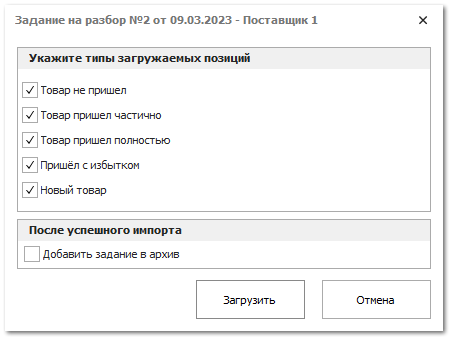
