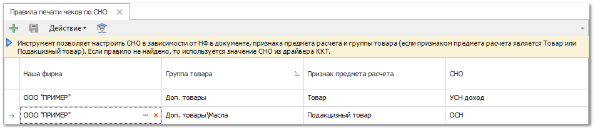
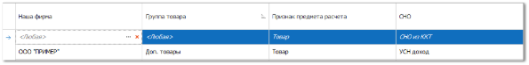
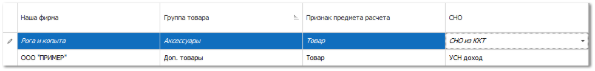

Если организация или предприниматель одновременно осуществляют несколько видов деятельности и совмещают разные системы налогообложения, то при фискализации онлайн-кассы необходимо указать все режимы налогообложения, для которых данная касса будет использоваться.

::: info Примечание

При совмещении нескольких систем налогообложения может применяться одна касса. В одном кассовом чеке может быть указана только одна система налогообложения.

:::

В данном разделе описан инструмент, который позволяет настроить правила распределения печати чеков по СНО, если онлайн-касса зарегистрирована на несколько режимов налогообложения. Инструмент позволяет настроить правила распределения печати чеков по СНО, в зависимости от **Нашей фирмы** в документе, **Признака предмета расчета**, а также **Группы товара**.

::: warning Внимание!

В первую очередь, необходимо убедиться, что устройство (онлайн-касса), а также ОФД, поддерживает ФФД версии 1.2.

:::

**»** После перейдите в раздел меню **Управление ► Торговое** **оборудование ► Правила** **печати** **чеков** **по** **СНО**.

**»** Создайте запись с помощью команды .

**»** Укажите **Нашу фирму**, необходимую **Группу товара**, для которой будет установлено значение СНО при печати чека, **Признак предмета расчета** для правила и **СНО**, которое будет печататься в чеке.

**»** Сохраните настроенные правила с помощью команды . 

::: note Замечание

Если правила были не сохранены они будут отображены *курсивным* шрифтом.

:::

::: info Примечание

При печати **итогового** чека по платежным документам (ПКО, ППвх, РКО, ПП, ОБК, ВБК) в правилах подбирается подходящая запись с **Нашей фирмой** из документа и с **Признаком предмета расчета** – "ПЛАТЕЖ".

При печати **авансового/итогового** чека по платежным документам (ППвх, ПП), которые были переданы из системы **Parts.Resource** в правилах подбирается подходящая запись с **Нашей фирмой** из документа и с **Признаком предмета расчета** – "ONLINE ТОРГОВЛЯ (ТОВАРЫ И ПЛАТЕЖИ)". На одну **Нашу фирму** может быть создано только одно правило с признаком "ONLINE ТОРГОВЛЯ (ТОВАРЫ И ПЛАТЕЖИ)". Если в правиле выбран данный признак, то возможность выбора **Группы товара** для данного правила становится недоступной.

При печати **детального** чека по **Расходной накладной**, **Возврату клиента** для каждого товара в правилах подбирается подходящая запись с **Нашей фирмой** из документа и с **Признаком предмета расчета** – "ТОВАР" или "ПОДАКЦИЗНЫЙ ТОВАР", данный признак выставляется в карточках товара, **с Группой товара** – группа товара самая ближайшая в иерархическом дереве, для которой создана запись в правилах. Если группа у товара не задана, то будет подобрано правило с группой <Любая>.

При печати **детального** чека по **Заказ-наряду** для каждого товара в правилах подбирается подходящая запись по аналогии с **Расходной накладной** **и Возвратом клиента**. Для работ с **Нашей фирмой** из документа и с **Признаком предмета расчета** – "УСЛУГА". Все товары группируются по значению СНО. На каждую СНО с товарами открывается отдельный чек, а при закрытии чека значение СНО передается в драйвер и печатается чек.

:::

::: note Замечание

При передаче реквизита в «Признак предмета расчета» чека для товаров:

- с признаком **Подакцизный товар** в карточке товара и кодом маркировки в соответствующем документе передается значение «31»;

- с признаком **Маркированный товар** в карточке товара и кодом маркировки в соответствующем документе передается значение «33».  

:::

Приоритет критериев при подборе следующий (в порядке убывания): **Наша Фирма** – **Тип предмета расчета** – **Группа товара**. Выбранное значение "побеждает" значение <Любая>, для каждого из критериев.

::: note Пример

Есть два правила:

- НФ – Основная фирма, Группа товара – <Любая>, Признак предмета расчета – Товар;

- НФ – <Любая>, Группа товара – <Любая>, Признак предмета расчета – Товар;

Первая запись "побеждает", так как для него указана конкретная фирма.|

:::

Если не подобрана ни одна запись, то для товара используем значение СНО, заданное в ККТ как значение по умолчанию.

::: details Читайте также

- [Правила печати чеков по СНО](../../specification/upravlenie/torgovoe_oborudovanie/pravila_pechati_chekov_po_sno.md)

- [Добавление карточки товара](../nomenklatura/tovary/dobavlenie_kartochki_tovara.md)

- [Журнал учета чеков](../../specification/finansy/zhurnal_ucheta_chekov.md)

:::