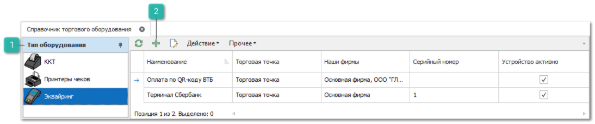
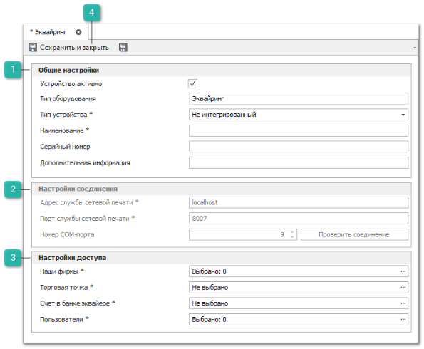
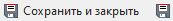

Прием платежей с помощью банковской карты через специальный терминал для оплаты называется эквайринг. Для проведения эквайринговых операций используется электронный терминал для оплаты картой – POS-терминал (POS – аббревиатура от англ. Point Of Sale, что переводится как "точка продажи").

Такая форма расчетов возможна после заключения договора с банком и получения от него специального оборудования для приема платежных карт. Используя терминал оплаты, торговая точка:

- ограничивает поступление в кассу фальшивых купюр;

- ограждает кассиров от возможных ошибок во время расчетов с покупателями;

- может пользоваться льготами от банка-эквайера.

Эквайринговый терминал работает с онлайн-кассой. Согласно ФЗ-54 кассовый аппарат передает чек оператору фискальных данных по интернету.

Терминал считывает данные с банковской карты и передает информацию в банк. Например, покупатель хочет оплатить товар картой. В этом случае кассир в программе создает соответствующий документ **Оплата по банковской карте** и предлагает покупателю вставить или приложить карту. Аппарат считывает карту и передает данные в банк, где обслуживается предприниматель, чтобы проверить, можно ли провести операцию.

После этого терминал отправляет запрос в банк, который выпустил карточку покупателя. Если карта не заблокирована и на ней достаточно денежных средств – оплата проходит. Терминал отправляет запрос на печать слип-чека (чек, который подтверждает оплату по карте) на ККТ. После продавец отдает товар и чек покупателю.

::: warning Внимание!

Подключение, а также последующая настройка драйверов POS-терминалов осуществляется исключительно специалистами банка, где приобреталось устройство.

:::

::: info Примечание

При создании документов **Оплаты по банковским картам/Возвраты по банковским картам**, используемый терминал подбирается по трем идентификаторам: **Активная Торговая точка, Наша Фирма документа, Пользователь.**

ККТ, которая будет использоваться для печати слип-чека, подбирается по трем идентификаторам: **Активная Торговая точка, Активная Наша Фирма, Пользователь**.

:::

Для добавления новой записи о используемом POS-терминале выполните следующие действия:

**»** В **Главном меню** выберите раздел **Управление ► Торговое оборудование ► Справочник Торгового оборудования**.

 **Тип оборудования**

Позволяет выбрать подходящий тип оборудования в зависимости от подключаемого устройства.

 **Новый**

Позволяет добавить новое устройство в выбранном типе оборудования.

**»** На панели **Тип оборудования** выберите **Эквайринг**.

**»** Нажмите кнопку **Новый** на панели управления для создания нового устройства. После чего откроется вкладка добавления нового эквайринга.

 **Общие настройки**

Содержит параметры:

- **Устройство** **активно** – признак активности оборудования. Если устройство не активно, то его использование в программе невозможно;

- **Тип оборудования** – не редактируемое поле для отображения типа данного оборудования;

- **Тип устройства** – указывается тип используемого терминала. Доступны следующие значения:

    - **Не интегрированный** – будет использоваться не интегрированный терминал. Такие устройства не взаимодействуют с Parts.Intellect и используются исключительно при создании документов **Оплата** **по** **банковской** **карте** / **Возврат** **по** **банковской** **карте**. Путем создания вышеуказанных документов пользователь может зафиксировать все выполненные операции в период работы с терминалом. При работе не поддерживается печать слип-чека;

    ::: warning Внимание!

    Печать слип-чеков при использовании не интегрированного POS-терминала не поддерживается.

    :::

    - **Сбербанк** – будет использоваться интегрированный терминал Сбербанка. При работе поддерживаются все этапы процесса взаимодействия терминала и Parts.Intellect при проведении документов **Оплата** **по** **банковской** **карте**/**Возврат** **по** **банковской** **карте**: передача суммы платежа на терминал, ввод пин-кода, получение результата выполнения операции, печать слип-чека;

    ::: warning Внимание!

    В случае использования не интегрированного терминала от Сбербанка следует обратиться к специалистам банка для замены на интегрированную модель.

    :::

    - **Оплата по QR-коду** – функционал данного типа устройства аналогичен типу **Не интегрированный** и подойдет для разграничения и последующей фиксации платежей с помощью QR-кодов в случае, если организация одновременно принимает оплаты как через интегрированный POS-терминал, так и с помощью QR-кодов (например, интегрированный терминал Сбербанка + услуга "Плати QR" от Сбербанка);

- **Наименование** – указывается наименование устройства для последующей идентификации в программе;

- **Серийный номер** – указывается серийный номер устройства;

- **Дополнительная информация** – указывается дополнительная справочная информация о устройстве.

 **Настройки соединения**

Содержит параметры:

- **Адрес службы сетевой печати** – IP-адрес компьютера, к которому локально подключено устройство и установлена **Служба сетевой печати чеков**;

- **Порт службы сетевой печати** – порт компьютера, по которому доступна Служба сетевой печати чеков;

- **Номер COM-порта** – COM-порт, к которому подключен эквайринговый терминал;

Для проверки подключения к POS-терминалу воспользуйтесь кнопкой **Проверить соединение**.

 **Настройки доступа**

Содержит параметры:

- **Наши фирмы** – указываются **Наши** **фирмы**, для которых будет доступна работа с данным терминалом;

- **Торговая точка** – указывается **Торговая** **точка**, для которой будет доступна работа с данными терминалом;

- **Счет в банке эквайере** – Счет из раздела Счета/Кассы с признаком Счет в банке эквайере;

- **Пользователи** – выбираются пользователи из раздела **Управление ► Настройки программы ►** вкладка **Пользователи**, для которого будет доступна работа с данными терминалом.

 **Сохранить и закрыть/Сохранить**

Позволяет добавить новое оборудование согласно указанным параметрам. 

**»** На вкладке заполните необходимые поля, обязательные для заполнения поля отмечены знаком "\*".

**»** Для сохранения нового оборудования нажмите кнопку **Сохранить и закрыть**. Окно инспектора закроется, и новая запись отобразится в таблице справочника.

::: details Читайте также

- [Оплаты по банковским картам](../../specification/finansy/oplaty_kontragentov/oplaty_po_bankovskim_kartam.md)

- [Возвраты по банковским картам](../../specification/finansy/vyplaty_kontragentam/vozvraty_po_bankovskim_kartam.md)

- [Справочник торгового оборудования](../../specification/upravlenie/torgovoe_oborudovanie/spravochnik_torgovogo_oborudovaniya.md)

- [Служба сетевой печати чеков](./sluzhba_setevoj_pechati_chekov.md)

- [Настройки программы - Роли пользователей](../../specification/upravlenie/nastrojki_programmy/roli_polzovatelej/README.md)

- [Создание Оплаты по банковской карте](../vzaimoraschety/tipy/sozdanie_oplaty_po_bankovskoj_karte.md)

:::