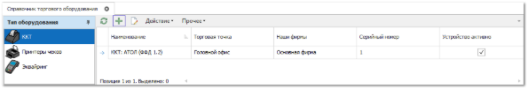
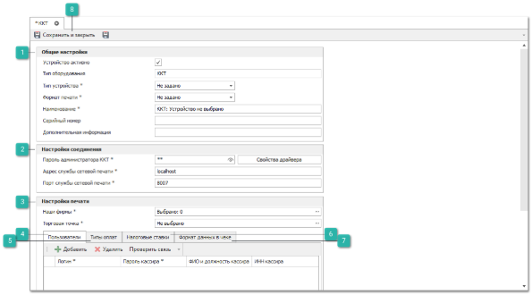
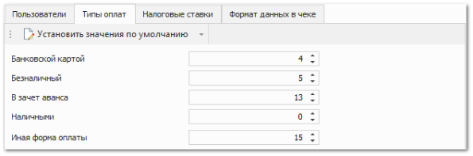
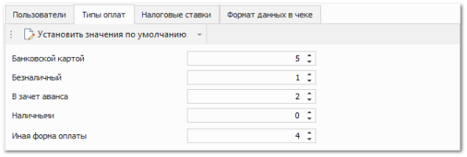
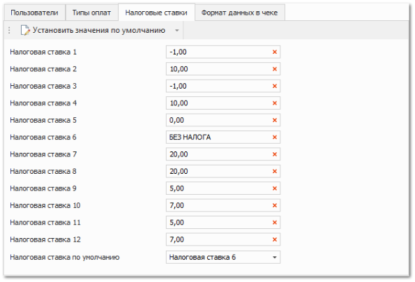
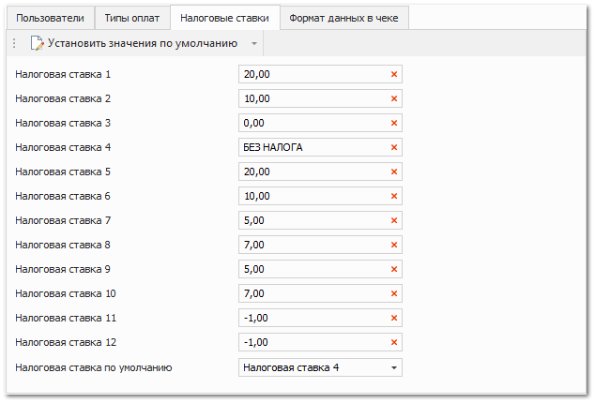
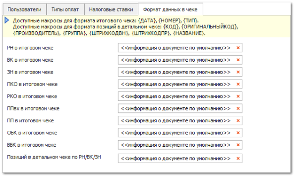
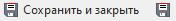

Перед настройкой подключения к программе следует убедиться, что ККТ физически подключена, драйвера установлены, устройство настроено.

::: warning Внимание!

При печати кассовых чеков используемое устройство определяется по трем уникальным идентификаторам: **Активная Торговая точка, Наша Фирма документа, Пользователь.**

:::

Для добавления новой записи о используемой ККТ выполните следующие действия:

**»** В **Главном меню** выберите раздел **Управление ► Торговое оборудование ► Справочник торгового оборудования**.

**»** На панели **Тип оборудования** выберите **ККТ**.

**»** Нажмите кнопку **Новый** на панели управления для создания нового устройства. После чего откроется вкладка добавления нового ККТ.

 **Общие настройки**

Содержит параметры:

- **Устройство активно** – признак активности оборудования. Если устройство не активно, то его использование в программе невозможно;

- **Тип оборудования** – не редактируемое поле для отображения типа данного оборудования;

- **Тип устройства** – указывается тип драйвера используемого устройства. Доступные значения поля:

    - **Штрих-М** (версии 4.10 и выше);

    - **Атол** (версии 6.х и выше);

- **Формат печати** – указывается ФФД (Формат Фискальных Данных), который будет использоваться при отправке информации на драйвер устройства. Доступные значения поля:

    - **ФФД 1.2** – будет печататься фискальный чек в формате фискальных данных 1.2;

    ::: note Замечание

    При печати в формате **ФФД 1.2**, поддерживаются **Коды маркировки** (криптохвост, разделители и сам код (первый 31 символ)) при печати чека. В зависимости от корректности кода маркировки возможны следующие обозначения маркировки в чеке:

    - М – код маркировки введен, но проверка не выполнена;

    - М+ – код маркировки введен и прошел проверку на корректность;

    - М- – код маркировки введен и не прошел проверку корректности.

    :::
    ::: warning Внимание!

    Для корректного считывания **Кода маркировки** обязателен ввод криптохвоста, а также разделителей. Криптохвост и разделители вводится автоматически при сканировании кода маркировки. В случае, если необходимые разделители не были введены – они будут указаны программой автоматически.

    :::

    - **ФФД 1.05** – будет печататься фискальный чек в формате фискальных данных 1.05;

    ::: note Замечание

    При печати в формате **ФФД 1.05**, поддерживается автоматическая отрезка копии слип-чека при соответствующей настройке в ККТ. Автоматический отрез предусмотрен в момент проведения **Оплата по банковской карте** и/или **Возврат по банковской карте**.

    :::

    - **Без ФФД** – будет печататься фискальный чек в формате устаревших драйверов АТОЛ / Штрих-М;

- **Наименование** – указывается наименование устройства для последующей идентификации в программе. Стандартно заполняется автоматически значениями полей **Тип устройства** и **Формат печати**;

- **Серийный номер** – указывается серийный номер устройства;

- **Дополнительная информация** – указывается дополнительная справочная информация о устройстве.

 **Настройки соединения**

Содержит параметры:

- **Пароль администратора ККТ** – пароль системного администратора согласно таблице драйвера устройства;

- **Адрес службы сетевой печати** – IP-адрес компьютера, к которому локально подключено устройство и установлена **Служба сетевой печати чеков**;

- **Порт службы сетевой печати** – порт компьютера, по которому доступна **Служба сетевой печати чеков**.

При необходимости проверки настроек соединения драйвера и локально подключенного устройства есть возможность с помощью кнопки **Свойства драйвера** открыть утилиту драйвера.

 **Настройки печати**

Содержит параметры:

- **Наши Фирмы** – указываются **Наши** **фирмы**, для которых будет доступна печать с данного устройства;

- **Торговая точка** – указывается Торговая точка, для которой будет доступна печать с данного устройства.

 **Пользователи**

Вкладка позволяет задать параметры для каждого пользователя:

- **Логин** – выбирается пользователь из раздела **Управление ► Настройки программы ►** **Пользователи**, для которого будет доступна печать с данного устройства;

- **Пароль кассира** – пароль кассира устройства печати чеков. По этому паролю драйвер определяет оператора, который печатает чек (таблица с паролями кассиров должна быть предварительно настроена в драйвере устройства);

- **ФИО и должность кассира** – ФИО и должность кассира, которые будут передаваться в драйвер ККТ;

- **ИНН кассира** – ИНН кассира, который будет передаваться в драйвер ККТ.

Вышеуказанные реквизиты кассира буду напечатаны на бумажном чеке. Кнопка **Проверить связь** служит для проверки корректности настройки соединения службы **Сетевой печати чеков** и драйвера устройства.

 **Типы оплат**

Вкладка содержит настройки печати чеков для типов оплаты и позволяет установить соответствие с таблицей типов оплат в драйвере. Каждому используемому типу оплаты: **Банковской** **картой**, **Безналичный**, **В** **зачет** **аванса**, **Наличными** и **Иная форма оплаты** требуется установить порядковый номер ряда (нумерация начинается с 0) типа оплат в драйвере.

Как правило, по умолчанию в таблице типов оплат в драйвере ноль 0 – это наличная оплата. Также и в программе: индекс 0 сопоставляется типу **Наличными**.

Для типов **В** **зачет** **аванса**, **Безналичный**, **Банковской** **картой, Иная форма оплаты** установите соответствующие индексы при необходимости печатать чеки при оплате электронными средствами платежей. В чеке будет напечатано наименование типа оплаты, заданное в драйвере.

::: warning Внимание!

Для типа **В зачет аванса** обязательно требуется установить значение, которое соответствует типу оплаты **ПРЕДВАРИТЕЛЬНАЯ ОПЛАТА (АВАНС)** в драйвере.

:::

::: note Пример задания типов оплат в программе

В соответствии с таблицей Тест драйвера ККТ v 5.17.0.x (**ШТРИХ-М**).

Пример задания индекса для типа оплаты **Банковской картой**. 

В таблице драйвера фискального устройства указано, что оплате по банковским картам соответствует тип оплаты с индексом "5" (нумерация идет с 0, а не с 1, как в номерах рядов). 

Необходимо для типа **Банковской картой** установить значение на единицу меньше, т.е. "4".|

В соответствии с таблицей Тест драйвера ККТ v 10.10.6.0 (**АТОЛ**)

:::

В момент печати чека определяется значение свойства **Тип оплаты** документа, по которому печатается чек, и соответствующий ему индекс передается в драйвер.

- В документах **Приходный кассовый ордер** и **Расходный кассовый ордер** свойство **Тип оплаты** по умолчанию принимает значение **Наличными** и недоступно для изменения.

- В документах **Платежное поручение входящее** и **Платежное поручение** свойство **Тип оплаты** по умолчанию принимает значение **Безналичными** и недоступно для изменения.

- В документах **Оплата по банковской карте** и **Возврат по банковской карте** свойство **Тип оплаты** по умолчанию принимает значение **Банковской картой** и недоступно для изменения.

- **Тип оплаты** в документах **Расходная накладная/Возврат клиента/Заказ-наряд** по умолчанию – **Наличными**. В момент закрытия долга по этим документам, свойство переопределяется в зависимости от выбранного типа оплаты при погашении долга.

::: warning Внимание!

Для документов **Расходная накладная/Возврат клиента/Заказ-наряд** **Тип оплаты** может быть смешанным. Суммы оплат определяются на основании платежных документов, а также встречных документов (например, ВК в РН) в разнесении, а также чеков по ним.

:::

При нажатии на кнопку **Установить** **значения** **по** **умолчанию** на панели действий вкладки **Тип оплат** произойдет заполнение полей значениями по умолчанию из таблицы драйвера выбранного **Типа устройства**.

 **Налоговые ставки**

На вкладке устанавливаются применяемые ставки НДС. Для **Налоговых ставок с 1 по 8** необходимо указать величины налогов (в процентах) в соответствии с таблицами налоговых ставок в драйвере фискального регистратора Штрих-М/АТОЛ.

::: note Замечание

Ставки, выставленные в таблицах драйвера **АТОЛ** и **ШТРИХ-М** по умолчанию, отличны друг от друга. Поэтому нужно убедиться, что в настройках драйвера и в программе выставлены одинаковые значения, в аналогичном порядке. При нажатии на кнопку **Установить** **значения** **по** **умолчанию** произойдет заполнение полей значениями по умолчанию из таблицы драйвера выбранного **Типа** **устройства**.

:::

::: note Пример задания ставок по умолчанию

В соответствии с типом устройства **АТОЛ** (версия драйверов – 10.10.6.0);

|

В соответствии с типом устройства **ШТРИХ-М** (версия драйверов – 5.17.0.989).

:::

::: warning Внимание!

Заполнять записи налоговых ставок необходимо в соответствии с тем, как заполнены налоговые ставки в вашем ККТ. Если вы не изменяли налоговые ставки в ККТ, то рекомендуется выбрать **Тип устройства** ККТ и нажать команду **Установить значения по умолчанию**.

:::

Если НДС для документа в программе не выделяется (в параметре документа **Выделять НДС** выбрано **Не выделять**), то при печати чека по документу осуществляется поиск ставки с названием **БЕЗ НАЛОГА** среди налоговых ставок вкладки **Налоговые ставки**. Если значение **БЕЗ НАЛОГА** не найдено, присвоится ставка драйвера по умолчанию.

Если НДС в документе выделяется (в параметрах документа **Выделять НДС** выбрано "Выделять"), то при печати детального чека по **Расходной накладной** или **Возврату клиента** осуществляется поиск ставки НДС каждой позиции (сверяется по значению ставки). При печати итогового чека по платежам, при поиске используется ставка НДС для документа в целом.

 **Формат данных в чеке**

Вкладка содержит опции, регулирующие формат вывода текста в итоговых чеках и формат строки с товаром при печати детального чека. Формат вывода строки при печати итогового чека может быть задан с использованием следующих макросов: {ДАТА}, {НОМЕР}, {ТИП}.

::: note Пример

При частичной наличной оплате: "Аванс {НОМЕР}".

:::

- **РН в итоговом чеке** – формат вывода строки при печати итогового чека из документа **Расходная накладная**;

- **ВК в итоговом чеке** – формат вывода строки при печати итогового чека из документа **Возврат клиента**;

- **ЗН в итоговом чеке** – формат вывода строки при печати итогового чека из документа **Заказ-наряд**;

- **ПКО в итоговом чеке** – формат вывода строки при печати итогового чека из документа **Приходный кассовый ордер**;

- **РКО в итоговом чеке** – формат вывода строки при печати итогового чека из документа **Расходный кассовый ордер**;

- **ППвх в итоговом чеке** – формат вывода строки при печати итогового чека из документа **Платежное поручение входящее**;

- **ПП в итоговом чеке** – формат вывода строки при печати итогового чека из документа **Платежное поручение**;

- **ОБК в итоговом чеке** – формат вывода строки при печати итогового чека из документа **Оплата по банковской карте**;

- **ВБК в итоговом чеке** – формат вывода строки при печати итогового чека из документа **Возврат по банковской карте**.

::: note Замечание

По умолчанию везде стоит формат *<информация о документе по умолчанию>*, в этом случае на чеке печатается следующая информация о документе: Тип документа, Номер, Дата и Контрагент.

:::

- **Позиций в детальном чеке по РН/ВК/ЗН** – определяет, какая информация будет напечатана в названии товара при печати детального чека. По умолчанию в чеке печатается **Наименование** из карточки товара или **Код/Производитель**, если **Наименование** не заполнено. Доступны следующие макросы: {КОД}, {ОРИГИНАЛЬНЫЙКОД}, {ПРОИЗВОДИТЕЛЬ}, {ГРУППА}, {ШТРИХКОДВН}, {ШТРИХКОДПР}.

::: info Примечание

Для поля **Позиций в детальном чеке по РН/ВК/ЗН** не поддерживается введение произвольного текста без использования макросов.

:::

 **Сохранить и закрыть/Сохранить**

Позволяет добавить новое оборудование согласно указанным параметрам. 

::: details Читайте также

- [Подключение устройства для печати чеков](./podkluchenie/podklyuchenie_ustrojstva_dlya_pechati_chekov.md)

- [Справочник торгового оборудования](../../specification/upravlenie/torgovoe_oborudovanie/spravochnik_torgovogo_oborudovaniya.md)

- [Оплаты по банковским картам](../../specification/finansy/oplaty_kontragentov/oplaty_po_bankovskim_kartam.md)

- [Возвраты по банковским картам](../../specification/finansy/vyplaty_kontragentam/vozvraty_po_bankovskim_kartam.md)

- [Служба сетевой печати чеков](./sluzhba_setevoj_pechati_chekov.md)

- [Настройки программы - Роли пользователей](../../specification/upravlenie/nastrojki_programmy/roli_polzovatelej/README.md)

:::