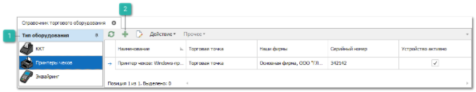
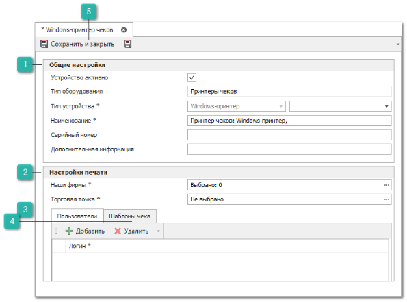
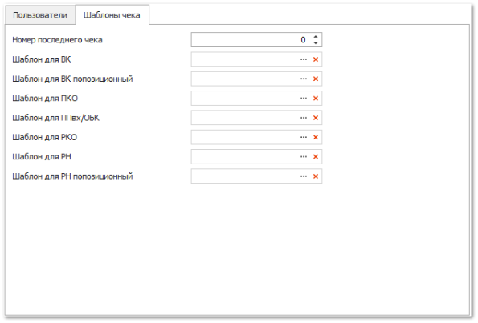

При использовании типа оборудования – **Принтер чеков** печать чеков осуществляется на обычный принтер, подключенный к компьютеру (как локальный, так и сетевой). После выбора этого источника печати необходимо указать конкретный принтер, на котором необходимо печатать чеки.

Для добавления новой записи о используемом принтере выполните следующие действия:

**»** В **Главном меню** выберите раздел **Управление ► Торговое оборудование ► Справочник торгового оборудования**.

 **Тип оборудования**

Позволяет выбрать подходящий тип оборудования в зависимости от подключаемого устройства.

 **Новый**

Позволяет добавить новое устройство в выбранном типе оборудования.

**»** На панели **Тип оборудования** выберите **Принтеры чеков**.

**»** Нажмите кнопку **Новый** на панели управления для создания нового устройства. После чего откроется вкладка добавления нового принтера чеков.

 **Общие настройки**

Содержит параметры:

- **Устройство активно** – признак активности оборудования. Если устройство не активно, то его использование в программе невозможно;

- **Тип оборудования** – не редактируемое поле для отображения типа данного оборудования;

- **Тип устройства** – указывается принтер, на котором будет осуществляться печать. В выпадающем списке будут отображены все устройства, подключенные к рабочему месту или найденные в сети;

- **Наименование** – указывается наименование устройства для последующей идентификации в программе. Стандартно заполняется автоматически значениями полей **Тип оборудования** и **Тип устройства**;

- **Серийный номер** – указывается серийный номер устройства;

- **Дополнительная информация** – указывается дополнительная справочная информация о устройстве.

 **Настройки печати**

Содержит параметры:

- **Наши Фирмы** – указываются **Наши** **фирмы**, для которых будет доступна печать с данного устройства;

- **Торговая точка** – указывается **Торговая** **точка**, для которой будет доступна печать с данного устройства.

 **Пользователи**

На вкладке содержится параметр **Логин**, в котором выбирается пользователь из раздела  **Управление ► Настройки программы ►** вкладка **Пользователи**, для которого будет доступна печать с данного устройства.

 **Шаблоны чека**

На вкладке содержатся параметры:

- **Номер последнего чека** – укажите текущее значение счетчика номеров чеков. Так как печать осуществляется на обычный принтер, то за нумерацию чеков отвечает программа, а не сам принтер. Один счетчик для всех устройств. Благодаря этому, все распечатанные чеки будут иметь уникальный номер;

- **Шаблон для ВК** – печатный шаблон для печати чеков по документу **Возврат клиента**. Доступен выбор шаблонов с типом **Чеки в возвратах от клиентов**;

- **Шаблон для ВК попозиционный** – печатный шаблон для печати чеков по документу **Возврат клиента** с перечнем позиций документа. Доступен выбор шаблонов с типом **Чеки в возвратах от клиентов**; 

- **Шаблон для ПКО** – печатный шаблон для печати чеков по документу **Приходный кассовый ордер**. Доступен выбор шаблонов с типом **Чеки в приходно-кассовых ордерах**;

- **Шаблон для ППвх** – печатный шаблон для печати чеков по документу **Платежное поручение входящее**. Доступен выбор шаблонов с типом **Чеки в платежных поручениях входящих**;

- **Шаблон для РКО** – печатный шаблон для печати чеков по документу **Расходный кассовый ордер**. Доступен выбор шаблонов с типом **Чеки в расходно-кассовых ордерах**;

- **Шаблон для РН** – печатный шаблон для печати чеков по документу **Расходная накладная**. Доступен выбор шаблонов с типом **Чеки в расходных накладных**;

- **Шаблон для РН попозиционный** – печатный шаблон для печати чеков по документу **Расходная накладная** с перечнем позиций документа. Доступен выбор шаблонов с типом **Чеки в расходных накладных**.

Команда  в настройках позволяет открыть форму **Мастера печати**.

Команда  в настройках позволяет очистить содержимое поля.

 **Сохранить и закрыть/Сохранить**

Позволяет добавить новое оборудование согласно указанным параметрам. 

**»** На вкладке заполните необходимые поля, обязательные для заполнения поля отмечены знаком "\*".

**»** Для сохранения нового оборудования нажмите кнопку **Сохранить и закрыть**. Окно инспектора закроется, и новая запись отобразится в таблице справочника.

::: details Читайте также

- [Справочник торгового оборудования](../../specification/upravlenie/torgovoe_oborudovanie/spravochnik_torgovogo_oborudovaniya.md)

- [Настройки программы - Роли пользователей](../../specification/upravlenie/nastrojki_programmy/roli_polzovatelej/README.md)

:::