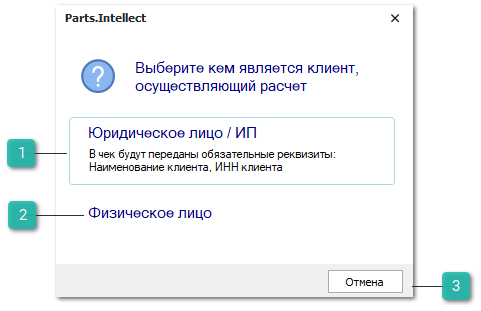
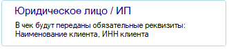
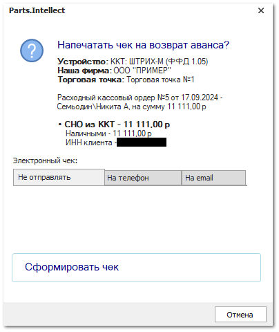
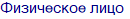
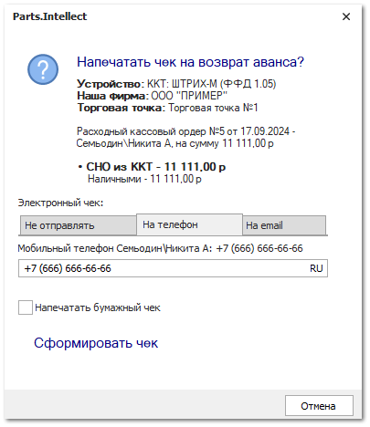
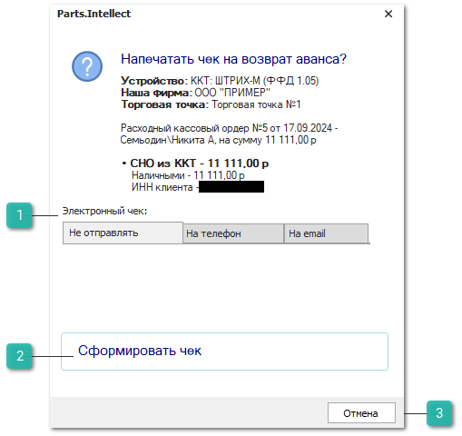
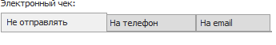
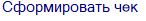
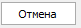

По **Расходному кассовому ордеру** могут быть напечатаны два типа чека:

- печать чека на возврат аванса;

- выдача наличных из кассы для собственных нужд, например, для покупки канцтоваров и т.п.

**»** Перед печатью, если чек фискальный, производятся следующие проверки:

- если по документам в разнесении платежа были ранее напечатаны чеки (вне зависимости от типа документа), то печатать чека запрещается;

- если по платежу уже печатался чек (с признаком Аванс, или в формате 1.0, или не фискальный), выведется соответствующее уведомление, возможность печати повторного чека не блокируется.

На следующем шаге определяется, является плательщик физическим лицом или организацией. Если в карточке контрагента **Вид контрагента** указан как **Юридическое лицо** или как **Физическое лицо** с **ОПФ** – ИП/Индивидуальный предприниматель, а также задан корректный ИНН, выводится диалоговое окно с выбором печати чека для физического или юридического лица. 

::: info Примечание

Корректность **ИНН** контрагента определяется по стандартным алгоритмам, с которыми можно ознакомиться в интернете.

:::

 **Юридическое лицо / ИП**

При нажатии на кнопку выведется окно на запрос печати чека на возврат аванса, при этом в чек будут переданы дополнительные обязательные реквизиты: **Наименование контрагента** и **ИНН** из его карточки.

 **Физическое лицо**

При нажатии на кнопку выведется окно на запрос печати чека на возврат аванса, чек будет напечатан без дополнительных реквизитов.

 **Отмена**

Позволяет отменить операцию печати чека.

**»** При нажатии на опцию **Юридическое лицо / ИП** или **Физическое лицо** выводится окно запроса печати чека на возврат аванса, с возможностью предоставления электронного чека.

 **Электронный чек**

Блок **Электронный чек** содержит вкладки:

- **Не отправлять** – позволяет не отправлять электронный чек клиенту;

- **На телефон** – позволяет отправить чек клиенту по SMS на номер телефона из карточки контрагента;

- **На email** –  позволяет отправить чек клиенту на его адрес электронной почты из карточки контрагента.

Вкладки **На телефон** и **На email** содержат:

- поле ввода номера телефона или email-адреса. Если в карточке выбранного контрагента заполнены поля **Мобильный телефон** и **Электронная почта**, то в поле ввода данные подставляются оттуда;

- чекбокс **Напечатать бумажный чек** –** позволяет выбрать печатать ли бумажный чек при отправке электронного чека. Опция доступна только на вкладках **На телефон** и **На email**.

 **Сформировать чек**

Позволяет сформировать чек в зависимости от выбранного способа. Возможно сформировать чек обоими способами: напечатать бумажную версию и отправить электронную.

 **Отмена**

Позволяет отменить операцию печати и отправки чека.

**»** Печать и отправка чека производится при нажатии на кнопку **Сформировать чек**, при этом:

- СНО определяется в соответствии с **Правилами печати чеков по СНО**. Если правило не найдено, используется значение из драйвера ККТ;

- передается признак расчета – "ВОЗВРАТ ПРИХОДА";

::: info Примечание

Передается признак расчета "РАСХОД" в случае, если платежный документ был разнесен только на документ **Приходная накладная**.

:::

- передается признак способа расчета – "АВАНС";

- передается признак предмета расчета – "ПЛАТЕЖ";

- передается признак типа оплаты **Наличными**;

- в **Журнале учета чеков** создается запись с результатами печати чека. Если чек печатался для юридического лица или ИП, в журнале будет зафиксирован ИНН контрагента из чека;

- если по платежу уже печатался чек, выведется соответствующее уведомление, возможность печати чека не блокируется;

- если в платеже есть разнесения, то печать чека с признаком расчета "ВЫПЛАТА" запрещается.

**»** Если проверки пройдены успешно, производится печать и отправка чека выдачи наличных с признаком расчета – "ВЫПЛАТА".

::: details Читайте также

- [Печать чеков по системам налогообложения (СНО)](../../nastrojka_pechati_chekov_po_sistemam_nalogooblozheniya_sno.md)

:::