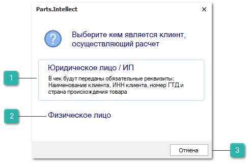
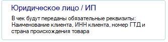
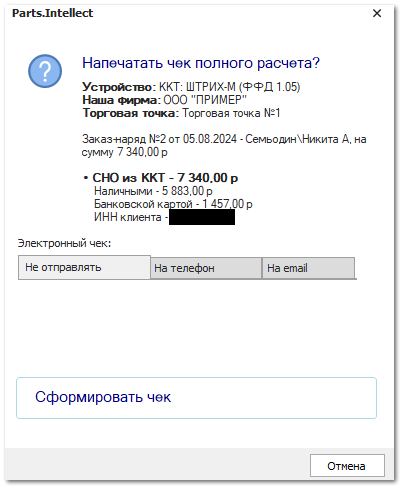
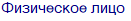
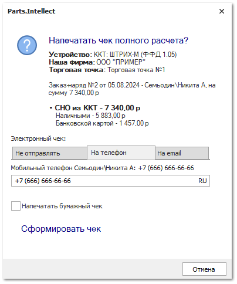
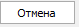
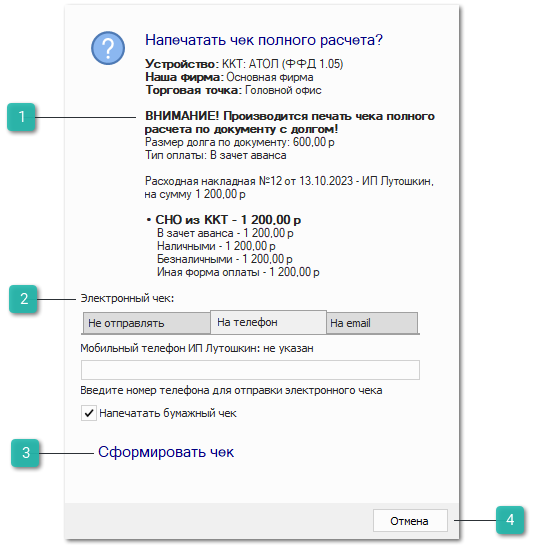
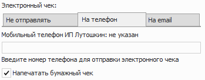
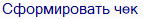
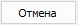

По документам **Расходная накладная** и **Заказ-наряд** печатается детальный чек полного расчета. Информация о типе оплаты и суммам оплаты передается в драйвер кассы в зависимости от платежей и встречных документов в разнесениях и чеков по ним. 

**»** Перед печатью чека по документу производятся следующие проверки:

- если долг по документу не равен нулю – проверяются разрешения в настройке **Печать чеков по РН с долгом** в разделе **Управление** **►** **Настройки программы ► Разрешения для роли пользователей ►** группа **Документы ► Расходные накладные**. Если печать чека с долгом разрешена – неоплаченному остатку будет присвоен тип оплаты, заданный в настройке;

::: info Примечание

При печати полного чека для документа **Расходная накладная** с долгом в окне запроса печати будет выведено уведомление:

**"ВНИМАНИЕ! Производится печать чека полного расчета по документу с долгом!**

Размер долга по документу: *сумма долга*

Тип оплаты: *значение, выбранное в параметре* ***Печать чеков по РН с долгом"***

Печать чека для **Заказ-наряда** производится только если долг по документу равен нулю.

:::

- если долг по документу равен нулю, то проверяется, была ли ранее печать чека по документу. Если чек уже печатался, выведется соответствующее уведомление, возможность печати повторного чека не блокируется;

- если в разнесении РН есть **Приходная накладная**, печать чека запрещается;

- если в разнесении РН есть платежи, по которым уже производилась печать чеков в формате 1.0 (нет признака "АВАНС"), или напечатан чек "ПОЛНЫЙ РАСЧЕТ" на предыдущем типе драйвера, то печать чека блокируется.

**»** На следующем шаге определяется, является плательщик физическим лицом или организацией. Если в карточке контрагента **Вид контрагента** указан как **Юридическое лицо** или как **Физическое лицо** с **ОПФ** – ИП/Индивидуальный предприниматель, а также задан корректный ИНН, выводится диалоговое окно с выбором печати чека для физического или юридического лица. 

::: info Примечание

Корректность ИНН в карточке контрагента определяется по стандартным алгоритмам, с которыми можно ознакомиться в интернете.

:::

::: info Примечание

Если в разнесении РН/ЗН есть платежи, по которым напечатаны авансовые чеки для физического лица, не выводится окно выбора вида контрагента, печатается чек для физического лица.

Если в разнесении есть платежи, по которым напечатаны авансовые чеки для юридического лица, не выводится окно выбора вида контрагента, печатается чек для юридического лица.

Если в разнесении РН/ЗН есть платежи, по которым напечатаны чеки как юридическому, так и физическому лицу, выводится окно выбора вида контрагента с предупреждением, что авансовые чеки печатались для физического и юридического лица.

:::

 **Юридическое лицо / ИП** 

При нажатии на кнопку выведется окно на запрос печати чека полного расчета, при этом в чек будут переданы дополнительные обязательные реквизиты: **Наименование контрагента** и **ИНН** из его карточки. Также в чек по каждой позиции будут переданы реквизиты **№ ГТД** и цифровой код **Страны**, если они указаны в документе и их значение корректно.

::: info Примечание

Код страны и № ГТД печатается в бумажной копии чека только при использовании касс ШТРИХ-М. В ОФД данные будут переданы при использовании любого из доступных типов касс.

:::

 **Физическое лицо**

При нажатии на кнопку выведется окно на запрос печати чека полного расчета, чек будет напечатан без дополнительных реквизитов.

 **Отмена**

Позволяет отменить операцию печати чека.

**»** Выводится окно запроса печати чека полного расчета, с возможностью предоставления электронного чека.

 **Уведомление при печати чека по Расходной накладной с долгом** 

Уведомление выводится, если по документу **Расходная накладная** есть долг и в параметре **Печать чеков по РН с долгом** стоит любое значение, кроме **Запретить**

 **Электронный чек**

Блок **Электронный чек** содержит вкладки:

- **Не отправлять** – позволяет не отправлять электронный чек клиенту;

- **На телефон** – позволяет отправить чек клиенту по SMS на номер телефона из карточки контрагента;

- **На email** –  позволяет отправить чек клиенту на его адрес электронной почты из карточки контрагента.

Вкладки **На телефон** и **На email** содержат:

- поле ввода номера телефона или email-адреса. Если в карточке выбранного контрагента заполнены поля **Мобильный телефон** и **Электронная почта**, то в поле ввода данные подставляются оттуда;

- чекбокс **Напечатать бумажный чек** –** позволяет выбрать печатать ли бумажный чек при отправке электронного чека. Опция доступна только на вкладках **На телефон** и **На email**.

 **Сформировать чек**

Позволяет сформировать чек в зависимости от выбранного способа. Возможно сформировать чек обоими способами: напечатать бумажную версию и отправить электронную.

 **Отмена**

Позволяет отменить операцию печати и отправки чека.

**»** Печать и отправка чека производится при нажатии на кнопку **Сформировать чек**, при этом:

- СНО определяется в соответствии с **Правилами печати чеков по СНО**. Если правило не найдено, используется значение из драйвера ККТ. Если в чеке присутствует товар и/или услуга по разным СНО, то товары/услуги группируются в один чек по каждой СНО, в итоге будет напечатано столько чеков, сколько СНО было определено по правилам. Типы и суммы оплат также группируются по СНО, если ранее были чеки в зачет аванса;

::: info Примечание

Если РН содержит позиции по одной СНО, а по авансовому платежу в разнесении был пробит чек по другой СНО, то выводится уведомление.

:::

- Сумма и тип оплаты определяются по документам в разнесении по РН:

    - платежи с признаком типа оплаты **АВАНС** (по документам уже была печать чека на прием аванса) образуют сумму оплаты **В зачет аванса**;

    - платежи, по которым не производилась печать чеков:

        - для ПКО передается признак типа оплаты **Наличными**;

        - для ОБК передается признак типа оплаты **Банковской картой**;

        - для ППвх передается признак типа оплаты **Безналичный**;

    - документы **Возврат клиента** образуют сумму оплаты **Иная форма оплаты**;

    - передается признак расчета – "ПРИХОД";

    - передается признак способа расчета – "ПОЛНЫЙ РАСЧЕТ";

    - передается признак предмета расчета – "ТОВАР" или "ПОДАКЦИЗНЫЙ ТОВАР", а также "УСЛУГА" для **Заказ-нарядов**;

в **Журнале учета чеков** создается запись с результатами печати чека. Если чек печатался для юридического лица или ИП, в журнале будет зафиксирован ИНН контрагента из чека.

При необходимости печати и отправки итогового чека по документу **Заказ-наряд** вызов печати осуществляется в инспекторе документа с помощью команды **Печать** **чека** – **Итого по документу** на панели управления, при этом:

- СНО определяется в соответствии с **Правилами печати чеков по СНО**. При печати итогового чека по ЗН система налогообложения в чеке будет установлена в соответствии с СНО выполненных услуг (**Признак предмета расчета** – **Услуга**);

::: warning Внимание!

Печать итогового чека по документу **Заказ-наряд** доступно только для кассовых устройств, поддерживающих ФФД 1.2 и 1.05.

:::

- Сумма и тип оплаты определяются по документам в разнесении по ЗН:

    - платежи с признаком типа оплаты **АВАНС** (по документам уже была печать чека на прием аванса) образуют сумму оплаты **В зачет аванса**;

    - платежи, по которым не производилась печать чеков:

        - для ПКО передается признак типа оплаты **Наличными**;

        - для ОБК передается признак типа оплаты **Банковской картой**;

        - для ППвх передается признак типа оплаты **Безналичный**.

    - документы **Возврат клиента** образуют сумму оплаты **Иная форма оплаты**;

- Наименование услуги, указанное в настройке **ЗН в итоговом чеке**;

- передается признак расчета – "УСЛУГА";

- передается признак способа расчета – "ПОЛНЫЙ РАСЧЕТ";

в **Журнале учета чеков** создается запись с результатами печати чека. Если чек печатался для юридического лица или ИП, в журнале будет зафиксирован ИНН контрагента из чека.

::: info Примечание

При печати чека с кодом маркировки, в зависимости от корректности кода, в чеке будет отображаться обозначения маркировки:

- М – код маркировки введен, но проверка не выполнена;

- М+ – код маркировки введен и прошел проверку на корректность;

- М- – код маркировки введен и не прошел проверку корректности. 

Для печати чека с кодом маркировки необходимо использовать ККТ с форматом печати ФФД 1.2.

:::

::: details Читайте также

- [Печать чеков по системам налогообложения (СНО)](../../nastrojka_pechati_chekov_po_sistemam_nalogooblozheniya_sno.md)

- [Настройки программы - Роли пользователей - Документы - Возвраты от клиентов](../../../../specification/upravlenie/nastrojki_programmy/roli_polzovatelej/dokumenty/raskhodnye_nakladnye.md)

- [Настройка подключения ККТ](../../nastrojka_podklyucheniya_kkt.md)

:::