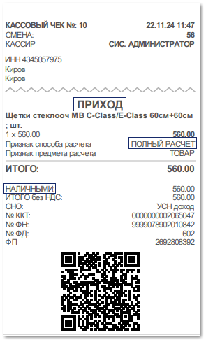

В магазине клиент покупает товар из наличия на сумму 560 рублей. Для выдачи товара менеджер оформляет документ **Расходная накладная**. Оплата производится наличными денежными средствами, создается ПКО.

После этого необходимо напечатать детальный чек с позициями товара, подтверждающий факт выдачи и оплаты товара клиентом.

В разнесении по документу **Расходная накладная** содержится ПКО. Чек печатается на основании **РН**. Для этого из списка документов **Расходные накладные** (меню **Продажи**) либо из самого документа на панели инструментов необходимо вызвать команду **Печать чека ► С детализацией**. Откроется окно с запросом на печать чека полного расчета.

В драйвер кассы будут переданы следующие реквизиты: 

- Признак расчета – **ПРИХОД**;

- Признак способа расчета – **ПОЛНЫЙ РАСЧЕТ**;

- Сумма – 560 рублей;

- Тип оплаты – **НАЛИЧНЫМИ**. 

