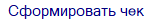

В магазине клиент оформляет заказ на общую сумму 3 000 рублей. Для работы по заказу необходимо внести предоплату в размере 20 % от общей суммы. Клиент вносит в кассу 600 рублей наличными денежными средствами. Менеджер в программе создает документ **Приходный кассовый ордер**, после чего ему необходимо напечатать чек, подтверждающий факт внесения предоплаты клиентом. Чек печатается на основании входящего платежного документа, в нашем примере это ПКО.

Из списка документов **Приходные кассовые ордера** (**Финансы ► Оплаты контрагентов**) либо из самого документа на панели инструментов необходимо вызвать команду **Печать чека** для печати чека.

На следующем шаге определяется, является плательщик физическим лицом или организацией. Если в карточке контрагента **Вид контрагента** указан как **Юридическое лицо** или как **Физическое лицо** с **ОПФ** – ИП/Индивидуальный предприниматель, а также задан корректный **ИНН**, выводится диалоговое окно с выбором печати чека для физического или юридического лица.

 **Юридическое лицо/ИП**

При нажатии на кнопку выведется окно на запрос печати чека на прием аванса, при этом в чек будут переданы дополнительные обязательные реквизиты: **Наименование контрагента** и **ИНН** из его карточки

 **Физическое лицо**

При нажатии на кнопку выведется окно на запрос печати чека на прием аванса, чек будет напечатан без дополнительных реквизитов.

**»** Откроется окно с запросом на печать чека на прием аванса. 

 **Электронный чек**

Блок **Электронный чек** содержит вкладки:

- **Не отправлять** – позволяет не отправлять электронный чек клиенту;

- **На телефон** – позволяет отправить чек клиенту по SMS на номер телефона из карточки контрагента;

- **На email** –  позволяет отправить чек клиенту на его адрес электронной почты из карточки контрагента.

Вкладки **На телефон** и **На email** содержат:

- поле ввода номера телефона или email-адреса. Если в карточке выбранного контрагента заполнены поля **Мобильный телефон** и **Электронная почта**, то в поле ввода данные подставляются оттуда;

- чекбокс **Напечатать бумажный чек** –** позволяет выбрать печатать ли бумажный чек при отправке электронного чека. Опция доступна только на вкладках **На телефон** и **На email**.

 **Сформировать чек**

Позволяет сформировать чек в зависимости от выбранного способа. Возможно сформировать чек обоими способами: напечатать бумажную версию и отправить электронную.

В драйвер кассы будут переданы следующие реквизиты: 

- Признак расчета – **ПРИХОД**;

- Признак способа расчета – **АВАНС**;

- Тип оплаты – **НАЛИЧНЫМИ**;

- Сумма – 600 рублей;

- СНО – значение драйвера ККТ. 

Для выдачи товара клиенту менеджер оформляет документ **Расходная накладная**, покупатель вносит оставшиеся денежные средства путем безналичного перевода денежных средств на расчетный счет. В этом случае на основании РН через команду **Создать платеж** менеджер создает **Платежное поручение входящее**, после чего ему необходимо напечатать детальный чек с позициями товара, подтверждающий факт выдачи и оплаты товара клиентом.

В разнесении по документу **Расходная накладная** содержится два платежа: **ППвх**, созданный при получении товара, и авансовый **ПКО** – предоплата по заказу. Чек печатается на основании **РН**.

Для этого из списка документов **Расходные накладные** (меню **Продажи**) либо из самого документа на панели инструментов необходимо вызвать команду **Печать чека ► С детализацией**.

Откроется окно с запросом на печать чека полного расчета.

В драйвер кассы будут переданы следующие реквизиты: 

- Признак расчета – **ПРИХОД**;

- Признак способа расчета – **ПОЛНЫЙ РАСЧЕТ**;

- Сумма – 3 000 рублей, из которых 2 400 рублей с типом оплаты **БЕЗНАЛИЧНЫМИ**, 600 рублей – **АВАНС**. 

В нашем примере применяется один режим налогообложения (УСН доход), в этом случае СНО в чеке определяется значением из драйвера ККТ.

