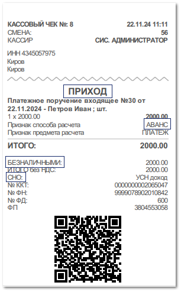
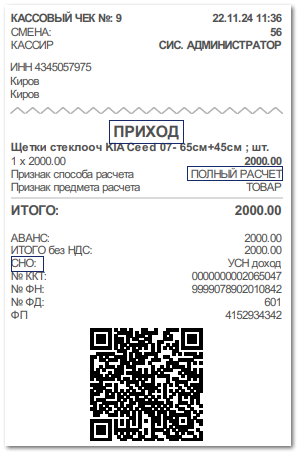

В магазине клиент оформляет заказ на общую сумму 2 000 рублей. По заказу вносится 100% предоплата путем безналичного перевода на расчетный счет. Менеджер в программе создает документ **Платежное поручение входящее**, после чего ему необходимо напечатать чек, подтверждающий факт внесения предоплаты клиентом. Для этого из списка документов **Платежные поручения входящие** (меню **Финансы ► Оплаты контрагентов**) либо из самого документа на панели инструментов необходимо вызвать команду **Печать чека**. Откроется окно с запросом на печать чека на прием аванса.

В драйвер кассы будут переданы следующие реквизиты: 

- Признак расчета – **ПРИХОД**;

- Признак способа расчета – **АВАНС**;

- Тип оплаты – **БЕЗНАЛИЧНЫМИ**;

- Сумма – 2000 рублей;

- СНО – значение драйвера ККТ.

В нашем примере применяется один режим налогообложения (УСН доход), в этом случае СНО в чеке определяется значением из драйвера ККТ.

Как только заказ готов к выдаче, клиент приходит в магазин для получения товара.

Для выдачи товара менеджер оформляет документ **Расходная накладная**, после чего ему необходимо напечатать детальный чек с позициями товара, подтверждающий факт выдачи товара.

В разнесении по документу **Расходная накладная** содержится авансовое **ППвх** (предоплата по заказу). Чек печатается на основании **РН**. Для этого из списка документов **Расходные накладные** (меню **Продажи**) либо из самого документа на панели инструментов необходимо вызвать команду **Печать чека ► С детализацией**. Откроется окно с запросом на печать чека полного расчета.

В драйвер кассы будут переданы следующие реквизиты: 

- Признак расчета – **ПРИХОД**;

- Признак способа расчета – **ПОЛНЫЙ РАСЧЕТ**;

- Сумма – 2 000 рублей;

- Тип оплаты – **АВАНС**. 

В нашем примере применяется один режим налогообложения (УСН доход), в этом случае СНО в чеке определяется значением из драйвера ККТ.