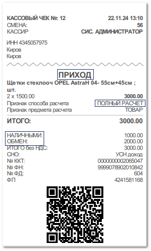

В магазине клиент оформляет заказ на общую сумму 3 000 рублей. По заказу не вносилась предоплата.

Ранее данный клиент возвращал товар в магазин (менеджером был сформирован документ **Возврат клиента**), но денежные средства по возврату ему не были выданы.

Как только заказ готов к выдаче, клиент приходит в магазин для получения товара.

Для выдачи товара менеджер оформляет документ **Расходная накладная**. В разнесение по документу **Расходная накладная** менеджер добавляет **Возврат клиента**, по которому числятся не возвращенные денежные средства в размере 2000 рублей. Покупатель вносит оставшиеся денежные средства наличными в кассу. В этом случае на основании **Расходной накладной** менеджер создает **Приходный кассовый ордер**, после чего ему необходимо напечатать детальный чек с позициями товара, подтверждающий факт выдачи и оплаты товара клиентом.

Чек печатается на основании **Расходной накладной**. Для этого из списка документов **Расходные накладные** (меню **Продажи**) либо из самого документа на панели инструментов необходимо вызвать команду **Печать чека ► С детализацией**. Откроется окно с запросом на печать чека полного расчета.

В драйвер кассы будут переданы следующие реквизиты: 

- Признак расчета – **ПРИХОД**;

- Признак способа расчета – **ПОЛНЫЙ РАСЧЕТ**;

- сумма – 3 000 рублей, из которых 2 000 рублей с типом оплаты **ОБМЕН**, 1000 рублей – **НАЛИЧНЫМИ**.

::: note Замечание

**Parts.Intellect** поддерживает печать чеков со следующими типами оплаты: **Наличными, Безналичными, Банковской картой**, **Аванс** и **Иная форма оплаты**. В данном случае при печати с типом **ОБМЕН** в чеке будет отображен тип **ИНАЯ ФОРМА ОПЛАТЫ**.

:::