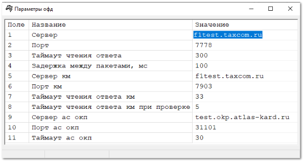
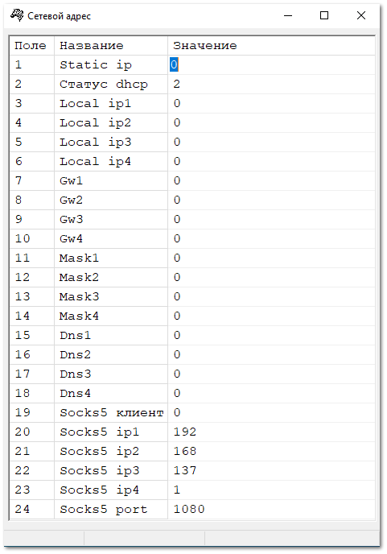
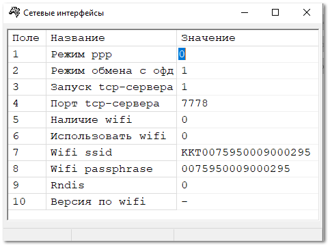
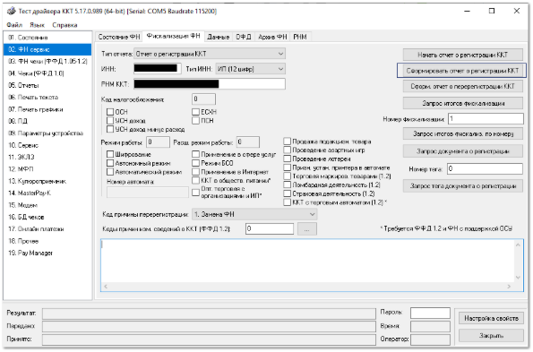

Для подключения ККТ с передачей данных необходимо выполнить предварительные действия – установить драйвер устройства и настроить доступ в интернет. Затем средствами драйвера произвести настройку связи с ОФД и зарегистрировать ККТ:

**»** Настройте обмен данными с сервером ОФД. Укажите **Параметры ОФД** (адрес сервера ОФД в виде URL, порт) перед регистрацией ККТ. Обратите внимание на правильность ввода данных.

**»** В зависимости от выбранного вида связи запрограммируйте соответствующие поля в таблицах **Сетевые интерфейсы** и **Сетевой адрес**.

::: info Примечание

Большинство ККТ может обеспечивать передачу данных на сервер ОФД с использованием следующих видов связи: Wi-Fi, Ethernet, USB (протокол RNDIS).

:::

 

**»** Выполните** регистрацию ККТ. ККТ формирует фискальные документы только после их регистрации в налоговом органе. В форме регистрации укажите РНМ ККТ, который был получен в ФНС при подаче заявления, ИНН, код налогообложения, адрес и место осуществления расчетов. Обратите внимание на правильность ввода данных. После заполнения необходимых полей нажмите на кнопку **Сформировать отчет о регистрации ККТ**. После чего на ККТ будет распечатан соответствующий документ. 

**»** Сведения, содержащиеся в сформированном отчете о регистрации, передайте в налоговый орган на бумажном носителе через кабинет контрольно-кассовой техники, либо через оператора фискальных данных в срок не позднее рабочего дня, следующего за днем получения от налогового органа регистрационного номера.

::: info Примечание

Более подробную информацию о правилах и особенностях подключения ККТ можно прочесть в Руководстве по эксплуатации кассового аппарата или обратиться за помощью в ЦТО ККТ.

:::

Подключение устройства к программе производится в разделе **Управление ► Торговое оборудование ► Справочник торгового оборудования**.

::: details Читайте также

- [Справочник торгового оборудования](../../../specification/upravlenie/torgovoe_oborudovanie/spravochnik_torgovogo_oborudovaniya.md)

:::