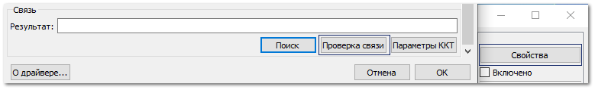
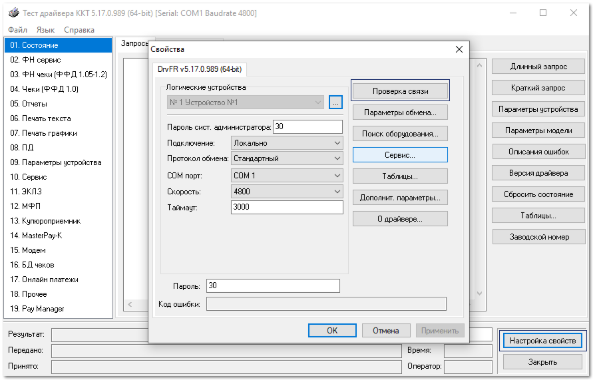
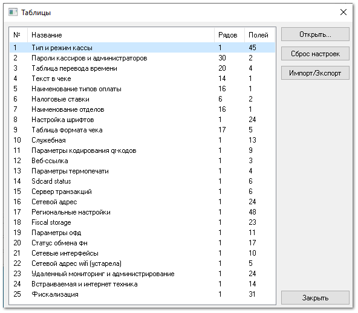

Перед началом работы с ККТ необходимо выполнить ряд действий и настроек:

**»** Подключите устройство к компьютеру/сети. В первую очередь, кассовый аппарат необходимо запитать от электросети и подключить к ПК по одному из доступных интерфейсов: USB, RS-232 (COM-порт), Ethernet. Включить кнопку питания на устройстве и убедиться, что индикатор на аппарате показывает включенное состояние.

**»** Установите драйвер устройства на ПК. Установите драйвер с компакт-диска, входящего в комплект поставки ККТ или скачайте его с сайта-производителя. Затем зарегистрируйте драйвер в операционной системе. При печати чеков программа Parts.Intellect передает управляющие команды драйверу и принимает от него ответы.

::: info Примечание

[Ссылка на драйвер](https://www.shtrih-m.ru/support/download/?section_id=all&product_id=all&type_id=156&searchDownloads=&PAGEN_1=7) фирмы ШТРИХ-М и [ссылка на драйвер](http://fs.atol.ru/SitePages/Центр%20загрузки.aspx) фирмы АТОЛ (раздел **Контрольно-кассовая техника**).

:::

**»** Настройте параметры подключения устройства. Настройка осуществляется с помощью утилиты **Тест драйвера**, поставляемой совместно с драйвером устройства. В окне **Свойства** указываются следующие параметры: номер COM-порта, скорость передачи данных, таймаут и т.д.

**»** Выполните проверку подключения. Указав параметры, нажмите кнопку **Проверка связи**. Убедитесь, что устройство подключено, распознано и ошибок нет.

**»** Отредактируйте необходимые таблицы устройства*.* Редактирование осуществляется с помощью утилиты **Тест драйвера**. Обратите внимание, что некоторые из таблиц ("Налоговые ставки", "Наименование типов оплат", "Наименование отделов", "Пароли кассиров и администраторов") должны быть отредактированы в соответствии с настройками программы Parts.Intellect.

::: note Замечание

Все настраиваемые параметры сведены в ККТ в так называемые таблицы – программируемые по интерфейсу (в частности с ПК) структурированные наборы данных, которые ККТ использует в процессе работы. Количество и названия таблиц могут отличаться в зависимости от устройства и версии драйвера.

:::

::: info Примечание

Более подробную информацию о правилах и особенностях подключения ККТ можно прочесть в Руководстве по эксплуатации кассового аппарата или обратиться за помощью в ЦТО ККТ.

:::