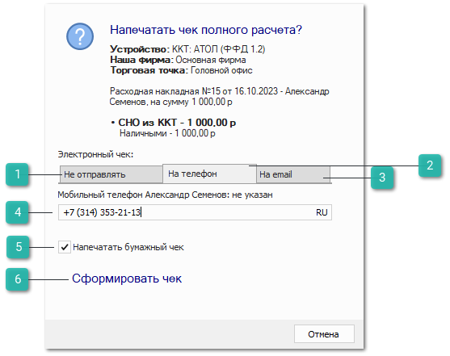
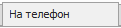
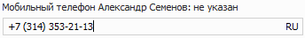
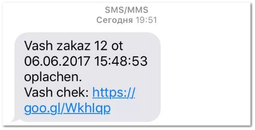

В программе поддерживаются варианты отправки электронных версий чеков на электронный адрес и мобильный номер телефона клиента.

При вызове команды **Печать чека** при работе с типами драйверов ФЗ-54 открывается диалоговое окно.

 **Не отправлять**

Чек будет отправлен на печать, но его электронная копия не будет отправлена клиенту. Вкладка выбрана по умолчанию.

 **На телефон**

Чек будет отправлен клиенту по SMS на номер телефона из карточки контрагента

 **На email**

Чек будет отправлен клиенту на его адрес электронной почты из карточки контрагента.

 **Поле ввода номера телефона или email-адреса**

Позволяет ввести значение реквизита вручную, если покупатель просит отправить данные на другой номер телефона/адрес электронной почты.

::: info Примечание

Ввод мобильного телефона осуществляется согласно заданной маске ввода по умолчанию, в разделе **Управление ► Настройки программы ►** **Настройки ►** **CRM ►** **Контрагенты**.

:::
Внешний вид электронного чека устанавливает ОФД, с которым Вы заключаете договор.

::: info Примечание

Об условиях отправки электронных версий чека необходимо уточнить у ОФД, с которым заключен договор.

:::

 **Напечатать бумажный чек**

Чекбокс позволяет выбрать печатать ли бумажный чек при отправке электронного чека. Опция доступна только на вкладках **На телефон** и **На email**.

 **Сформировать чек**

Позволяет сформировать чек в зависимости от выбранного способа. Возможно сформировать чек обоими способами: напечатать бумажную версию и отправить электронную.

**»** При необходимости выберете способ отправки электронного чека одним из способов и нажмите кнопку **Напечатать чек**, после чего будет распечатан бумажный чек и произведена отправка электронного чека, в зависимости от выбранного способа.

::: details Читайте также

- [Настройки программы - Настройки - CRM - Контрагенты](../../specification/upravlenie/nastrojki_programmy/nastrojki/crm/kontragenty.md)

:::