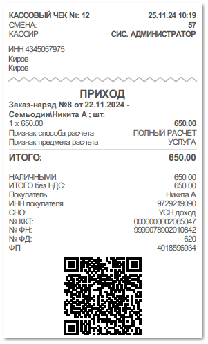

Работа с фискальной техникой делится на кассовые смены (в общем случае продолжительностью 24 часа). Перед началом осуществления расчетов с применением ККТ формируются отчет об открытии смены, а по окончании – отчет о закрытии смены. Открытие производится автоматически после закрытия последней смены при пробитии первого чека. На ККТ будет напечатан соответствующий чек. Специально команду вызывать не требуется.

Печать чеков из программы **Parts.Intellect** возможна по товарным документам **Расходная накладная**, **Возврат клиента**, **Заказ-наряд**, а также по платежным документам **ПКО**, **РКО**, **ППвх, ПП, ОБК, ВБК**.

Для печати чека, необходимо из инспектора открытого документа или из списка документов вызвать команду **Печать чека** на панели инструментов. Затем выбрать тип печатаемого чека – **Итого по документу** или **С детализацией**, нажав на соответствующую кнопку.

 **Итого по документу**

Позволяет напечатать итоговый чек по документу.

 **С детализацией**

Позволяет напечатать детализированный чек с позициями по документу.

::: info Примечание

Печать детального чека доступна только по документам **Расходная накладная**, **Возврат от клиента**, **Заказ-наряд**.

:::

::: note Замечание

При печати чека **С детализацией** по документам **Расходная накладная** и **Возврат клиента** доступна передача кодов маркировок товаров. Каждая единица товара с кодом маркировки выводится в чеке отдельной строкой с отметкой [М]:

- М – код маркировки введен, но проверка не выполнена;

- М+ – код маркировки введен и прошел проверку на корректность;

- М- – код маркировки введен и не прошел проверку корректности. 

- Для печати чека с кодом маркировки необходимо использовать ККТ с форматом печати ФФД 1.2.

- Печать чека может быть недоступна, если в документе присутствуют товары с заполненными кодами маркировки и без признака **Маркированный товар** (в карточке товара) или с признаком и без кодов маркировки (или отметки о перемаркировке для документа **Возврат клиента**).

:::

При вызове команды печати чека программа обращается к драйверу, который запускает печать чека на ККТ. В чеке фиксируется фактическое время его печати, а не дата документа в программе.

В случае печати чека по платежу, команда **Печать чека** вызывается из документов ОБК, ВБК, ПКО, РКО, ППвх или ПП.

Программа отслеживает повторную печать чека по документу, из которого ранее уже была печать чека.

Информация обо всех отправленных на печать чеках фиксируется в **Журнале учета чеков**.

В меню **Управление ► Торговое оборудование ► Справочник торгового оборудования** доступны некоторые сервисные команды, которые могут потребоваться в процессе работы с ФР/АСПД:

 **Снять отчет с гашением (Z-отчет)**

Позволяет снять Z-отчет по ФР/АСПД за смену с закрытием смены. В конце дня происходит закрытие кассовой смены. На ККТ снимается Z-отчет, который показывает сумму выручки за операционный день и фиксирует закрытие кассовой смены. На основании Z-отчета заполняется Журнал кассира.

 **Снять отчет без гашения (X-отчет)**

Позволяет снять X-отчет по ФР/АСПД за смену без закрытия смены. В течение дня, для контроля денежных средств, проведенных через кассовый аппарат, используется X-отчет. Он позволяет посмотреть сумму выручки, проведенную по кассе за смену на момент снятия. В течение смены снимать такой отчет можно неограниченное количество раз.

 **Повтор последнего чека**

Позволяет повторно распечатать последний чек (сделать его не фискальную копию) может понадобиться в случае, когда закончилась кассовая лента или по запросу покупателя

::: details Читайте также

- [Настройка подключения ККТ](./nastrojka_podklyucheniya_kkt.md)

:::