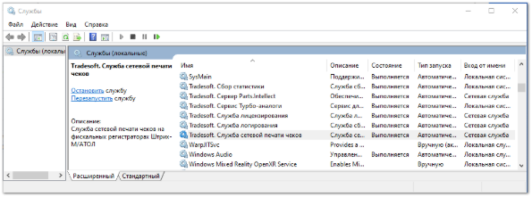
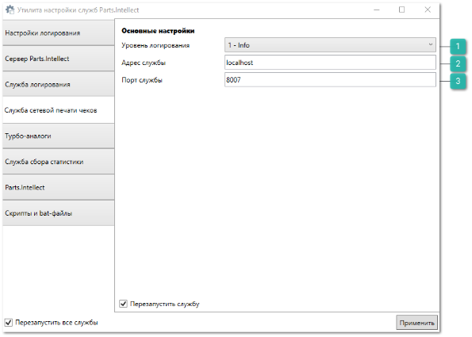
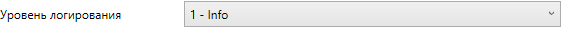
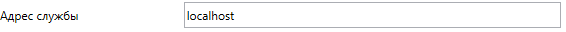

Если необходимо печатать чеки на ФР/АСПД, который подключен к другому компьютеру в сети, то в этом случае используется **Tradesoft.Служба сетевой печати чеков**:

**»** На компьютере, к которому подключена ККТ/Чековый принтер, необходимо запустить службу **Tradesoft.Служба сетевой печати чеков**. После установки программы **Parts.Intellect** служба автоматически регистрируется и запускается. Остается убедиться, что она запущена в списке служб системы **Windows**.

**»** Если необходимо печатать чеки на устройство в другом офисе (не в локальной сети), то в том офисе потребуется запустить и настроить службу сетевой печати чеков. А затем получить к ней доступ:

- Через VPN-подключение, организовав для офисов [VPN-сеть](https://ru.wikipedia.org/wiki/VPN) поверх сети Internet. Службу сетевой печати чеков необходимо запускать на ip-адресе компьютера в VPN-сети (прописав его в конфигурационном файле службы);

- Через проброс портов на маршрутизаторе. Для этого необходимо прописать правило проброса портов из внешнего порта (любой, например, 8888) на ip-адрес компьютера со службой сетевой печати чеков (например, 192.168.0.10) и порт службы (по умолчанию 8007). Маршрутизатор в офисе с ККТ должен иметь статический внешний ip-адрес (например, 173.8.112.59). После этого пользователи могут прописывать в качестве адреса службы сетевой печати чеков ip-адрес маршрутизатора офиса с ККТ и внешний порт проброса на нем (173.8.112.59:8888);

::: info Примечание

Служба работает с драйвером ФР ШТРИХ-М версии 4.10 и выше, либо с драйвером АТОЛ версии 6.х и выше.

Если на компьютере, к которому подключен ФР/АСПД, установлен драйвер ФР ШТРИХ-М версии ниже, чем 4.10, то необходимо остановить службу **Tradesoft.Служба сетевой печати чеков** и вручную запустить файл "NetFrPrintingService.exe" из папки с установленной программой **Parts.Intellect**.

:::

- Необходимо обязательно указать ip-адрес и порт компьютера, на котором запускается служба. Для редактирования настроек службы запустите **Утилиту настройки служб** **Parts.Intellect** и перейдите на вкладку **Сужба сетевой печати чеков**. Запуск **Утилиту настройки служб** **Parts.Intellect** осуществляется с помощью файла "*ConfigUtility.Wpf*", расположенного в папке с программой Parts.Intellect:* 

`\Program Files\Tradesoft\Parts.Intellect\ConfigUtility.Wpf`

 **Уровень логирования** 

Позволяет указать уровень детализации логов, по умолчанию задается значение – **1-Info**.

 **Адрес службы** 

Позволяет указать IP-адрес по которому запускается служба сетевой печати чеков, по умолчанию задается значение – **localhost**.

 **Порт службы** 

Позволяет указать порт службы сетевой печати чеков, по умолчанию задается значение – **8007**.

**»** Измените **Адрес службы**, вместо **localhost** укажите необходимый IP-адрес.

**»** Измените **Порт службы**, если это необходимо.

**»** Сохраните заданные параметры нажатием кнопки **Применить**, для применения настроек будет осуществлен перезапуск службы сетевой печати чеков*.*

::: details Читайте также

- [Утилита настройки службы Parts.Intellect](../../specification/upravlenie/utilita_nastrojki_sluzhby_partsintellect.md)

:::