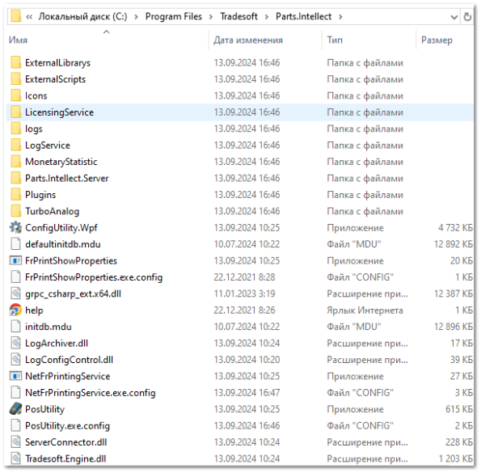
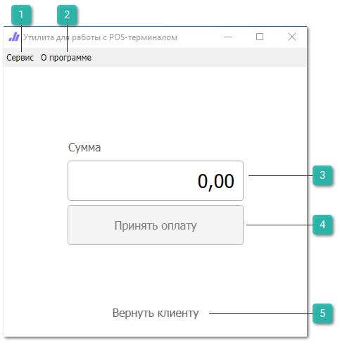
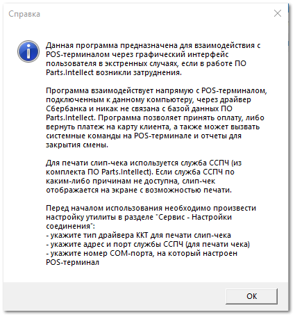
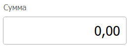
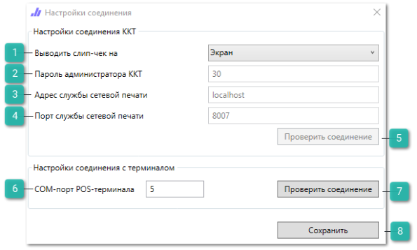
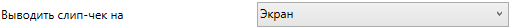
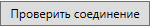
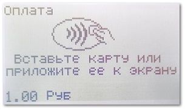
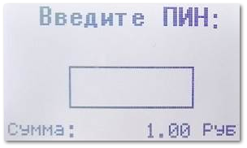
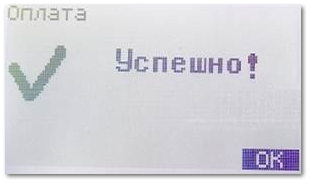

Во время работы с эквайринговым терминалом у пользователей могут возникнуть какие-либо сложности, связанные с интеграцией терминала или взаимодействием с программой.

Для того, чтобы принять оплату или выполнить какие-либо действия с терминалом без использования программы Parts.Intellect, существует отдельная утилита с интерфейсом оплаты для взаимодействия с эквайринговым терминалом.

Утилита взаимодействует напрямую с POS-терминалом, подключенным к данному компьютеру, через драйвер Сбербанка и никак не связана с базой данных ПО Parts.Intellect. Программа позволяет принять оплату, либо вернуть платеж на карту клиента, а также может вызвать системные команды на POS-терминале и отчеты для закрытия смены.

::: warning Внимание!

Утилита взаимодействует только с интегрированными терминалами от Сбербанка.

Для фиксации операций, проводимых через утилиту, в Parts.Intellect необходимо вручную создать соответствующие документы: **Оплата по банковской карте** / **Возврат по банковской карте**.

:::

Для печати слип-чека используется **Служба сетевой печати чеков**. Если служба по каким-либо причинам не доступна, слип-чек отображается на экране с возможностью печати.

**»** Запуск **Утилиты для работы с POS-терминалом** осуществляется с помощью файла "*PosUtility.exe*", расположенного в папке с программой Parts.Intellect:* `\Program Files\Tradesoft\Parts.Intellect\PosUtility.exe`.

**»** После запуска утилиты откроется окно с рабочей областью утилиты.

 **Сервис**

Позволяет использовать системные команды для работы с утилитой:

- **Отчет за текущую смену** – позволяет напечатать полный отчет по терминалу за текущую смену;

- **Закрыть смену** – позволяет вызвать команду закрытия смены на POS-терминале;

- **Открыть сервисное меню** – позволяет вызвать сервисное меню POS-терминала. Данное меню позволяет формировать отчеты по терминалу, повторять последний чек, менять системные настройки при необходимости;

- **Настройки соединения** – позволяет осуществить настройку подключения утилиты.

 **О программе**

Позволяет вызвать справочную информацию об утилите.

 **Сумма**

Позволяет ввести сумму принятия/возврата денежных средств.

 **Принять оплату**

Позволяет осуществить принятие денежных средств.

 **Вернуть клиенту**

Позволяет осуществить возврат денежных средств.

**»** Перед началом использования необходимо произвести настройку утилиты в разделе **Сервис ► Настройки соединения**.

 **Выводить слип-чек на**

Позволяет выбрать тип драйвера используемого оборудования для печати слип-чека. Значения данной опции дублируются из формы редактирования ККТ в разделе **Торговое оборудование**. Доступны следующие значения:

- **Атол 8х** – подключение будет осуществляться с параметрами **Тип устройства – Атол / Формат печати – Без ФФД**;

- **Атол 10х** – подключение будет осуществляться с параметрами **Тип устройства – Атол / Формат печати – ФФД 1.05**;

- **Штрих-М** – подключение будет осуществляться с параметрами **Тип устройства – Штрих / Формат печати – ФФД 1.05**;

- **Экран** – при выборе данного пункта чек будет выведен на экран с возможностью последующей печати через Windows-принтер.

 **Пароль администратора ККТ**

Позволяет указать пароль системного администратора, указанный в таблице драйвера ККТ.

 **Адрес службы сетевой печати**

Позволяет указать IP-адрес компьютера, к которому локально подключено устройство и установлена **Служба сетевой печати чеков**.

 **Порт службы сетевой печати**

Позволяет указать порт компьютера, по которому доступна Служба сетевой печати чеков.

 **Проверить соединение**

Позволяет проверить подключение к POS-терминалу.

 **СОМ-порт POS-терминала**

Позволяет указать COM-порт, к которому подключен эквайринговый терминал.

 **Проверить соединение**

Позволяет указать COM-порт, к которому подключен эквайринговый терминал.

 **Сохранить**

Позволяет сохранить заданные настройки подключения.

**»** После задания настроек проверьте соединение, в случае успешного подключения сохраните указанные параметры.

Процесс принятия / возврата денежных средств происходит путем ввода необходимого значения в поле **Сумма**, в рабочей области утилиты, и нажатия на кнопку **Принять оплату** или **Вернуть клиенту** в зависимости от выполняемой операции.

Рассмотрим на примере:

**»** После нажатия на кнопку **Принять оплату** в POS-терминале отобразится интерфейс оплаты, на котором будет указана сумма платежа.

**»** Приложите или вставьте банковскую карту и введите пин-код.

**»** Если оплата прошла успешно, то отобразится окно, уведомляющее о успешном завершении операции.

::: details Читайте также 

- [Служба сетевой печати чеков](./sluzhba_setevoj_pechati_chekov.md)

- [Настройка подключения ККТ](./nastrojka_podklyucheniya_kkt.md)

:::