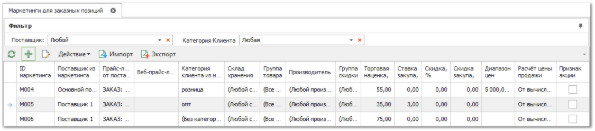
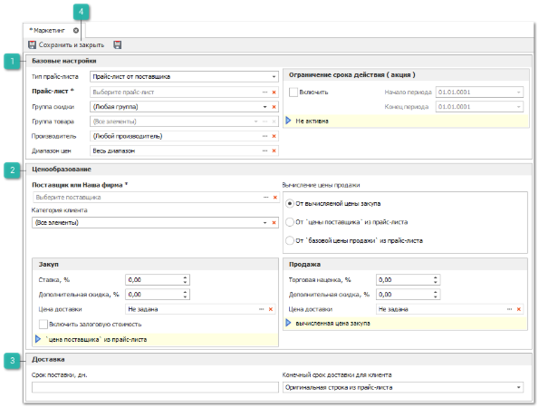
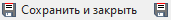

Добавление маркетингов для заказных позиций (из загруженных прайс-листов и веб-прайс-листов поставщиков) производится в меню **Товары и цены ► Правила ценообразования (маркетинги)**.

Маркетинги для товаров в наличии добавляются в меню **Товары и цены ► Прайс-листы наличия**, на вкладке **Ценообразование**.

Для добавления нового маркетинга необходимо выполнить следующие действия:

**»** Перейти в раздел меню **Товары и цены ► Правила ценообразования (маркетинги)** или в меню **Товары и цены ► Прайс-листы наличия** **►** вкладка **Ценообразование**.

**»** Нажать кнопку **Новый** на панели управления для создания маркетинга.

**»** В появившемся окне заполнить следующие поля (обязательные для заполнения поля выделены жирным шрифтом и отмечены знаком \*):

 **Базовые настройки**

Блок содержит настройки:

- **Тип прайс-листа** – выбирается тип прайс-листа: Веб-прайс-лист или Прайс-лист поставщика;

- **Прайс-лист \*** – указывается прайс-лист выбранного типа;

::: info Примечание

В схемах ценообразования с единственным прайс-листом из наличия при добавлении маркетинга открывается инспектор, где уже выбран тип и сам прайс-лист (без возможности сменить).

:::

- **Группа скидки** – указывается группа скидки, для которой будет действовать маркетинг. При значение **Не задана** он будет действовать на товары в прайс-листе без заданной группы скидки. При значении **Любая группа** он будет действовать на все товары прайс-листа;

- **Группа товара** – указывается группа товара, для которой будет действовать маркетинг. Маркетинг действует как для товаров выбранной группы, так и вложенных в нее. При значение **Без группы** он будет действовать на товары в прайс-листе без заданной группы. При значении **Все элементы** он будет действовать на все товары прайс-листа;

::: info Примечание

Использование данного параметра недоступно для веб-прайс-листов и прайс-листов поставщиков.

:::

- **Производитель** – указывается производитель, для которой будет действовать маркетинг. При значении **Любой производитель** маркетинг будет действовать на все товары прайс-листа;

::: info Примечание

Использование данного параметра недоступно для веб-прайс-листов поставщиков.

:::

- **Диапазон цен** – указывается диапазон цен в валюте выбранного прайс-листа (по умолчанию), для которого будет действовать маркетинг. При значении **Весь диапазон** он будет действовать на все товары прайс-листа;

- **Ограничение срока действия (Акция)** – указываются временные рамки действия маркетинга. Например, с 1 по 9 мая. В этом случае маркетинг (и, например, дополнительная скидка в честь Дня победы) будет действовать с 1 по 9 мая. 10 мая данный маркетинг применяться не будет;

::: warning Внимание!

Маркетинги с установленным **Ограничением срока действия (акции)** в проценке среди всех маркетингов занимают доминирующее положение. Т.е. если есть несколько маркетингов на товар, клиенту будет предложена цена по акции.

:::

 **Ценообразование**

Блок содержит настройки:

- **Поставщик или Наша фирма** – указывается поставщик деталей. Для прайс-листов из наличия данное поле можно не заполняется;

- **Категория клиента** – указывается категория клиента, для которой формируется данный маркетинг. Как правило, категории клиентов представляют собой уровень цен (в Проценке), т.е. РОЗНИЦА, ОПТ, VIP и другие. При значении **Все элементы** маркетинг будет действовать независимо от категории клиента. При значении **Без категории** он будет действовать для контрагентов, у которых не задана категория;

- **Склад хранения** – указывается склад хранения товаров из наличия, для которого будет действовать маркетинг. При значении **Любой склад** он будет действовать на все товары прайс-листа наличия;

::: info Примечание

Использование данного параметра недоступно для веб-прайс-листов и прайс-листов поставщиков.

:::

- **Закуп. Ставка, %** – указывается процент ставки по отношению к цене закупа от поставщика. Например, если действует наценка в 5% по отношению к ценам закупа, то необходимо ввести 5;

- **Закуп. Дополнительная скидка, %** – указывается процент скидки по отношению к закупочной цене. Например, по единому прайс-листу поставщик объявляет ставку закупа 10%, при этом на определенные товары по группам скидок действует снижение цен. В этом случае необходимо для каждой группы скидки создать маркетинг с идентичной ставкой закупа, но разными скидками закупа;

- **Закуп. Цена доставки** – указывается позиция из справочника **Стоимость доставки**;

- **Закуп. Включить залоговую стоимость** – если опция включена, то к вычисляемой цене закупа прибавляется залоговая стоимость из прайс-листа от поставщика;

- **Продажа. Торговая наценка, %** – указывается процент основной торговой наценки в процентах;

- **Продажа. Дополнительная скидка, %** – указывается процент скидки к цене продажи, например, для vip-клиентов. Скидка задается отрицательным числом;

- **Продажа. Цена доставки** – указывается позиция из справочника Стоимость доставки;

- **Вычисление цены продажи** – маркетинг позволяет очень гибко строить ценообразование в системе. Данный подраздел предлагает выбрать один из трех возможных сценариев расчета:

    - **От вычисляемой закупочной цены. Формула расчета цены клиента:**

    ::: note Пример

    Цена\_продажи = (((Цена\_поставщика + Ставка\_закупа – Скидка\_закупа) + Стоимость\_доставки\_закупа) + Торговая\_наценка) – Скидка\_продажи + Стоимость\_ доставки\_продажи

    :::

    - **От цены закупа из прайс-листа**. Формула расчета цены клиента:** 

    ::: note Пример

    Цена продажи = (Цена\_поставщика + Торговая\_наценка) – Скидка\_продажи + Стоимость\_ доставки\_продажи

    :::

    - **От базовой цены продажи из прайс-листа**. Формула расчета цены клиента:** 

    ::: note Пример

    Цена продажи = (Базовая\_цена\_продажи + Торговая\_наценка) – Скидка\_продажи + Стоимость\_доставки\_продажи

    :::

    Где:

        - ***Цена\_продажи*** – цена для клиента, отображается в **Проценке**.

        - ***Цена\_поставщика*** – цена закупа из прайс-листа.

        - ***Ставка\_закупа*** *–* ставка закупа на товар из прайс-листа от поставщика.

        - ***Скидка\_закупа*** *–* скидка на закуп.

        - ***Стоимость\_доставки\_закупа*** – стоимость доставки, входящая в цену поставщика. Если стоимость доставки выбрана на единицу массы, то она рассчитывается как произведение стоимости доставки за единицу массы на вес детали из прайс-листа от поставщика. Если стоимость доставки выбрана за количество товара, то она равна стоимости доставки единицы товара.

        - ***Торговая\_наценка*** *–* торговая наценка на товар для клиентов.

        - ***Скидка\_продажи*** *–* скидка для клиентов.

        - ***Стоимость\_ доставки\_продажи*** *–* стоимость доставки, входящая в цену для клиента. Если стоимость доставки выбрана на единицу массы, то она рассчитывается как произведение стоимости доставки за единицу массы на вес детали из прайс-листа от поставщика. Если стоимость доставки выбрана за количество товара, то она равна стоимости доставки единицы товара.

::: note Пример

Пример 1:
Цена поставщика 100руб, Ставка закупа 7% от цены поставщика, скидка закупа 1%, стоимость доставки на закуп 10р за кг, вес единицы товара 5кг, торговая наценка 33%, скидка для vip-клиента 3%, стоимость доставки для клиента 50р за шт.
**Цена продажи** = (((100+7%-1%)+10\*5)+33%)-3%+50\*1=251,17 руб.

Пример 2:
Цена поставщика 100руб, торговая наценка 50%, скидки нет, стоимость доставки для клиента 50р за шт.
**Цена продажи** = (100+50%)-0%+50\*1=200 руб.
Где: ***Базовая\_цена\_продаж*** – базовая цена продаж из прайс-листа.

Пример 3:
Базовая цена продаж 100руб, торговая наценка 20%, скидка -5%, доставка 20р за шт.
**Цена продажи** = (100+20%)-5%+20=134 руб.

:::

 **Доставка**

Блок содержит настройки:

- **Срок поставки, дн**. Указывается срок поставки в днях. Значение может быть использовано вместо срока поставщика или прибавляться к нему;

- **Конечный срок доставки для клиента**. Указывается стратегия вывода срока поставки в результатах поиска:

    - Оригинальная строка из прайс-листа. В поле **Срок доставки** будет передан срок в том виде, в котором он задан в прайс-листе. Например, "7 дней"; "от 5 до 7 дней" и т.д.;

    - Оригинальная строка из маркетинга. В поле **Срок доставки** будет передан срок в том виде, в котором он задан в Маркетинге. Например, "14 дней"; "от 1 и до 10 дней" и т.д.;

    - Обработанная строка из прайс-листа. В поле **Срок доставки** будет передан срок из прайс-листа в обработанном виде. Его формат будет приведен к виду 7, 5-7;

    - Обработанная строка из маркетинга. В поле **Срок доставки** будет передан срок из Маркетинга в обработанном виде. Его формат будет приведен к виду 14, 1-10;

    - Сумма сроков из прайс-листа и маркетинга. В поле **Срок доставки** будет передана сумма сроков по доставке из прайс-листа и маркетинга. Формат итогового срока доставки будет приведен к виду 21, 6-17.

::: info Примечание

Если используется обработанная строка, и срок доставки указан в виде текста ("неделя", "два дня", "месяц" и т.д.), то в поле **Срок доставки** будет передано пустое значение. Также, если в прайс-листе или маркетинге задан срок доставки "2 месяца", то он будет преобразован в "2", что повлечет искажение информации.

К данным срокам поставки может быть прибавлен срок, заданный в справочнике **Доставки по направлениям и складам**.

:::

**Сохранить и закрыть/Сохранить**

Позволяет сохранить и закрыть/сохранить заданные параметры маркетинга.

**»** Для сохранения карточки маркетинга нажмите кнопку **Сохранить и закрыть**.

::: info Примечание

В случае, если на одну позицию в одном и том же прайс-листе, для одной категории клиента существует два и более действующих маркетингов, то в **Проценке** по данной позиции будет представлена **максимальная цена** для клиента.

:::