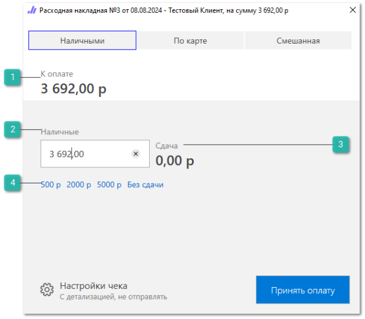
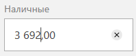
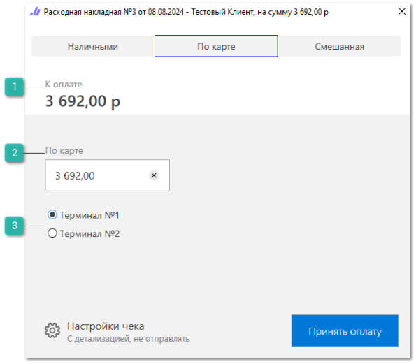
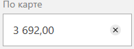
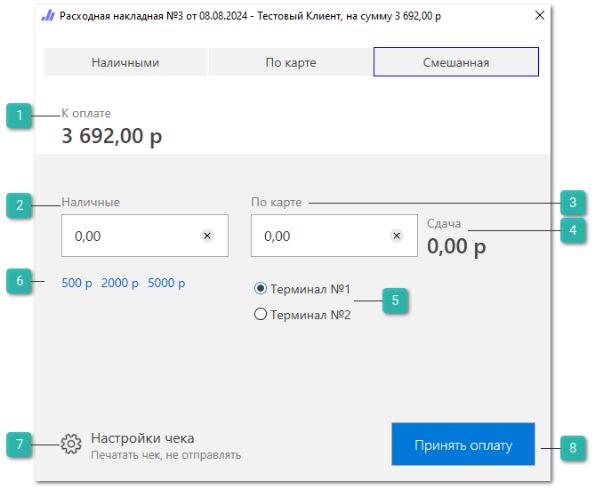
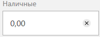
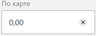
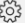
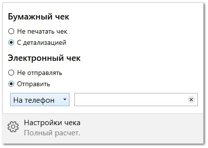
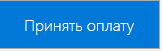

Интерфейс оплаты предоставляет возможность автоматического создания связанных платежных документов и печати чека из одного окна в проведенных товарных документах (РН, ЗН, ВК) из журнала или инспектора документов, что позволяет сократить время создания и разнесения платежей в системе.

Интерфейс оплаты используется в следующих документах:

- **Расходная накладная**;

- **Заказ-наряд**;

- **Заказ клиента**;

- **Возврат от клиента**.

Запуск интерфейса производится автоматически при проводке вышеуказанных документов в случае если у пользователя активировано разрешение **Предлагать оплатить документ при проводке** и выбраны доступные типы оплат в разрешении **Доступные типы оплат для проводки** в разделе меню **Управление ►** **Настройки программы ► Роли пользователей** **►** **Документы**.

Также доступен ручной запуск с помощью команд **Принять оплату**/**Возврат денежных средств** на панели команд в инспекторе документа / журнале документов при наличии долга по документу (горячая клавиша F10).

::: info Примечание

Кнопка доступна только для проведенных документов, по которым ранее не была внесена оплата.При попытке внести оплату по документу, долг по которому равен 0, пользователю будет выведено уведомление: *Данный документ уже оплачен*.

:::

В интерфейсе доступны следующие вкладки:

- **Наличными**;

- **По карте**;

- **Смешанная**.

Рассмотрим их подробнее.

## Наличными

 **К оплате**

Общая сумма к оплате по документу.

 **Наличные**

Поле для указания суммы платежа, полученной от клиента.

 **Сдача**

Сумма сдачи для клиента считается автоматически исходя из значения поля для указания суммы платежа.

 **Автоматическое заполнение поля**

Кнопки **500 х**, **2000 х**, **5000 х**, **Без сдачи**, где х – **Основная валюта** контрагента **Нашей** **фирмы** предназначены для автоматического заполнения поля исходя из номинала полученной от клиента купюры.

::: warning Внимание!

Кнопки автоматического заполнения поля недоступны при выполнении действия **Принять оплату** по документу **Заказ клиента**.

:::

## По карте

 **К оплате**

Общая сумма к оплате по документу.

 **По карте**

Поле для указания суммы платежа, полученной от клиента.

 **Эквайринг**

Перечень доступных пользователю эквайрингов для дальнейшего создания документа "Оплата по банковской карте".

## Смешанная

 **К оплате**

Общая сумма к оплате по документу.

 **Наличные**

Поле для указания суммы платежа "Наличными", полученной от клиента.

 **По карте**

Поле для указания суммы платежа "По карте", полученной от клиента.

 **Сдача**

Сумма сдачи для клиента считается автоматически исходя из значения поля для указания суммы платежа.

 **Эквайринг**

Перечень доступных пользователю эквайрингов для дальнейшего создания документа "Оплата по банковской карте".

 **Автоматическое заполнение поля**

Кнопки **500 х**, **2000 х**, **5000 х**, **Без сдачи**, где х – **Основная валюта** контрагента **Нашей** **фирмы** предназначены для автоматического заполнения поля исходя из номинала полученной от клиента купюры.

::: info Примечание

Кнопки автоматического заполнения поля недоступны при выполнении действия **Принять оплату** по документу **Заказ клиента**.

:::

 **Настройки чека** 

Позволяет настроить параметры печати чеков при принятии оплаты. Доступны следующие параметры:

Блок **Бумажный чек**:

- **Не печатать чек** – чек не будет напечатан;

- **С детализацией** – будет напечатан детализированный чек с позициями документа;

- **Итого по документу** – будет напечатан итоговый чек по документу. Отображается только в интерфейсе оплаты, вызванном из документа **Заказ-наряд** или **Расходная накладная**.

::: info Примечание

Для документа **Заказ клиента** в блоке **Бумажный чек** доступны параметры:
- **Не печатать чек** – чек не будет напечатан;
- **Авансовый чек** – чек будет напечатан в зачет аванса.

:::

Блок **Электронный чек**:

- **Не отправлять** – электронная копия чека не будет отправлена клиенту;

- **Отправить** – позволяет выбрать способ получения электронного чека покупателем: на email / телефон и поле для ввода необходимых данных.

::: info Примечание

При заполненном поле "ИНН" в карточке контрагента будет доступен блок выбор вида контрагента, для которого осуществляется расчет: **Физического лица** или **Юридического лица**.

Блоки выбора вида контрагента и "Электронный чек" доступны только при использовании устройства печати "ККТ" с форматом печати "ФФД 1.05" и "ФФД 1.2".

:::

 **Принять оплату**

В зависимости от указанных параметров будут созданы и автоматически проведены соответствующие платежные документы, а также осуществлена печать выбранных чеков:

- **Наличными** – Приходный кассовый ордер;

- **По карте** – Оплата по банковской карте;

- **Смешанная** – Приходный кассовый ордер + Оплата по банковской карте.

При нажатии на кнопку **Возврат денежных средств** (ВК) в зависимости от указанных параметров будут созданы и автоматически проведены соответствующие платежные документы, а также осуществлена печать выбранных чеков:

- **Наличными** – Расходный кассовый ордер;

- **По карте** – Возврат по банковской карте;

- **Смешанная** – Расходный кассовый ордер + Возврат по банковской карте.