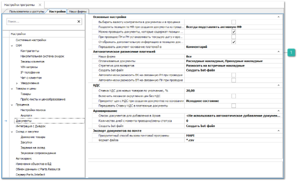
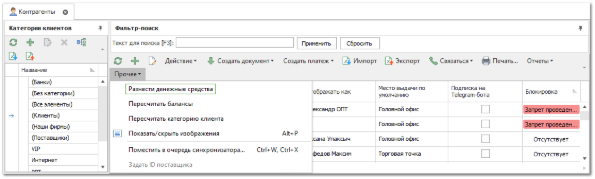
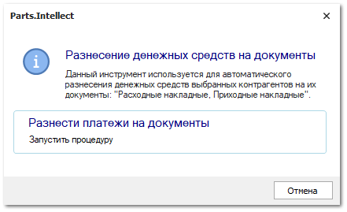
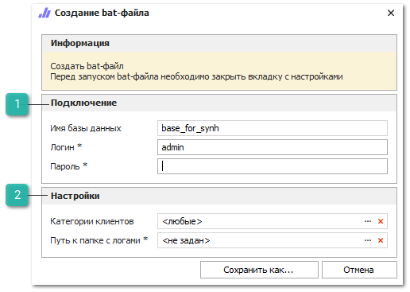

После импорта платежей из программ типа Клиент-банк встает вопрос разнесения вновь импортированных платежей на документы. Для максимального упрощения этой процедуры необходимо воспользоваться механизмом автоматического разнесения платежей на документы контрагентов.

**»** Для начала необходимо настроить механизм автоматического разнесения в разделе меню **Управление ► Настройки программы ► Настройки**, группа **Документы**.

 **Автоматическое разнесение платежей**

Блок содержит ряд параметров для настройки автоматического разнесения поступивших оплат в программе и параметры автоматического погашения долга при создании возвратных документов:

- **Наша фирма** – указывается по каким **Нашим фирмам** необходимо осуществлять автоматическое разнесение платежей;

- **Оплачиваемые документы** – в опции необходимо указать типы документов, на которые должны разноситься платежи;

- **Стратегия для возвратов** – если в опции **Оплачиваемые документы** выбран тип документов **Возврат от клиента**, то в опции **Стратегия для возвратов** необходимо выбрать требуемый способ разнесения: либо только **Разносить на встречные накладные**, либо **Разносить на встречные платежи**;

- **Создать bat-файл** – содержит команду для создания bat-файла, при запуске которого будет включаться механизм автоматического разнесения платежей по документам;

- **Автоматически разносить ВК на связанную РН** – сумма долга по **Расходной накладной** будет автоматически закрыта суммой по документу **Возврат клиента**;

- **Автоматически разносить ВП на связанный ПН** – сумма долга по **Приходной накладной** будет автоматически закрыта суммой по документу **Возврат поставщику**.

Запустить процедуру разнесения платежных документов можно двумя способами:

- **Из справочника Контрагенты**. 

**»** Для этого в справочнике **Контрагенты** необходимо выбрать одного или нескольких контрагентов и вызвать на панели инструментов команду **Прочее ► Разнести денежные средства**.

**»** В появившемся окне нажать на кнопку **Разнести платежи на документы**.

- **С помощью запуска bat-файла**. 

**»** В разделе меню **Управление ►** **Настройки программы ► Настройки**, группа **Документы**, в опции **Создать bat-файл** произвести настройку подключения к базе, заполнить параметры и сохранить bat-файл.

 **Подключение**

Содержит поля: **Имя базы данных**, **Логин** и **Пароль** – учетная запись, от лица которой будет выполняться импорт.

 **Настройки**

Позволяет задать: 

- **Категории клиентов** – категории клиентов для которых будут разноситься документы;

- **Путь к папке с логами** – директория, куда будут сохраняться лог процедур (файл в формате TXT с информацией о разнесенных документах за время выполнения процедуры).

::: info Примечание

Поле **Путь к папке с логами** является обязательным к заполнению.

:::

**»** Производить запуск bat-файла можно при необходимости вручную или поместить его в **Планировщик Windows** и выполнять по требуемому расписанию.

При запуске процедуры, по каждому выбранному контрагенту отбираются все его проведенные документы с долгом по документу больше нуля (т.е. не оплаченные полностью или частично), и платежи с остатком по накладным больше нуля (т.е. не разнесенные полностью или частично). Самые давние по дате оплачиваемые документы разносятся на подходящие платежи – от самых давних по дате, к самым ранним.

В первую очередь разносятся документы **Возвраты от клиента** и **Возвраты поставщику** в зависимости от выбранной в настройке **Стратегии для возврата**, а затем все остальные выбранные типы документов. Разнесение продолжается пока не закончатся либо остатки по платежам, либо документы, долг по которым необходимо закрыть.

Если в разнесении участвуют документы **Расходные накладные** или **Приходные накладные**, то платежи разносятся также на связанные с накладными заказами (**Заказ клиента** или **Заказ поставщику**), если хватает остатка по заказам у текущего платежа.

**»** По завершению процедуры, является окно с информацией об общей сумме разнесенных денежных средств.